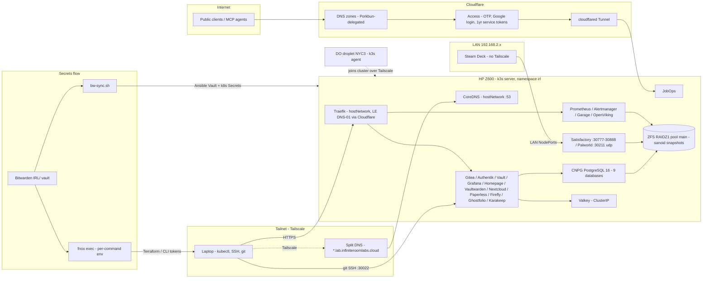

<div align="center">

# Infinite Room Labs Infrastructure

Multi-tool IaC monorepo for the IRL homelab: a k3s cluster on an HP Z600 plus one cloud agent node, managed end to end with Terraform, Ansible, and Helm.

[](https://github.com/InfiniteRoomLabs/infinite-room-labs-infra/actions/workflows/hygiene.yml)
[](https://github.com/InfiniteRoomLabs/infinite-room-labs-infra/actions/workflows/kubeconform.yml)
[](https://github.com/InfiniteRoomLabs/infinite-room-labs-infra/actions/workflows/conftest.yml)
[](https://github.com/InfiniteRoomLabs/infinite-room-labs-infra/actions/workflows/trivy.yml)
[](./LICENSE)

</div>


## Start Here

| I want to... | Read or run |
|---|---|
| Set up a new checkout | Follow [Quick Start](#quick-start) below |
| Add or change a homelab service | [Contributing guide](CONTRIBUTING.md#adding-a-new-service) |
| Run infrastructure tests | [Testing guide](TESTING.md) |
| Access the homelab | [Homelab access guide](docs/homelab-access-guide.md) |
| Respond to an outage | [Service-down runbook](ansible/docs/runbooks/service-down.md) |
| Deploy a new service | [Deployment SOP](ansible/docs/sops/deploy-new-service.md) |
| Add a DNS record | [DNS record SOP](ansible/docs/sops/add-dns-record.md) |
| Work on Terraform | [Terraform](#terraform) |
| Work on Ansible | [Ansible](#ansible) and [ansible/CLAUDE.md](ansible/CLAUDE.md) |

## Hardware

| Component | Spec |
|---|---|
| Server (on-prem) | HP Z600 workstation - dual Xeon (24 threads), 40GB RAM (4GB OS reserve, ZFS ARC capped at 8GB), k3s server + all stateful workloads |
| Storage | ZFS RAIDZ1 pool `main` at /media/root/storage1 - 13 quota'd datasets (garage-data 500G @ 1M recordsize, vms 300G @ 64K recordsize matching qcow2 clusters, paperless-media 500G, gitea-lfs 100G, ...), lz4 compression, sanoid snapshot automation |
| Cloud agent node | DigitalOcean droplet s-4vcpu-8gb (NYC3, ~$48/mo) - k3s agent joined to the on-prem server over Tailscale, provisioned by Terraform |
| Virtualization | KVM/libvirt on the Z600 - declarative VM inventory with a hard 12GB summed-RAM budget; ubuntu-vm-01 (4 vCPU / 8GB / 40GB) cloned from versioned Packer gold masters stored on `main/vms` |
| Network | Tailscale mesh (homelab node 100.86.213.22) for kubectl/SSH/DNS; LAN 192.168.2.2 exposes game-server NodePorts to devices without Tailscale (the Steam Deck); CoreDNS on hostNetwork port 53 |

## Stack

| Tool | Why |
|---|---|
| k3s | Single-server cluster on the Z600 with a DigitalOcean agent joined over Tailscale; every IRL service lives in the `irl` namespace, replacing the old per-service Docker Compose stacks |
| Terraform + Terragrunt | One leaf per resource group under `environments/{env}/{provider}/{rg}`; TFC workspace names derived from the path (e.g. `homelab-tailscale-acl`), so state layout mirrors the directory tree exactly |
| Terraform Cloud | Remote state for every non-bootstrap leaf; the chicken-and-egg bootstrap leaves (TFC workspace + scoped Cloudflare token minting) necessarily keep local state |
| Ansible | Flat playbooks (no roles) imported by a phase-tagged site.yml; the only sanctioned path for Helm deploys - charts are never installed by hand |
| Helm | Custom `irl-*` charts in a git-submodule repo (irl-gitea, irl-garage, irl-monitoring, irl-postgres, ...); environment overrides live in `ansible/helm/{name}/values.yaml`, applied by the helm-deploy playbook |
| mise | Pins exact versions of the core IaC toolchain (terraform/terragrunt/helm/kubectl/packer/fnox) and runs the task surface: `mise run bootstrap \| secrets:sync \| ansible \| test:smoke` |
| fnox | Bitwarden-backed secret injection per command via `fnox exec` / `with-secrets.sh` - there is no `.env` or `.envrc`, and entering the repo loads nothing into the shell |
| Bitwarden + bw-sync.sh | Single secret source of truth; one script syncs it to both Ansible Vault and Kubernetes Secrets and enforces a 180/365-day rotation policy (`--check-rotation`, `--verify-k8s`) |
| Traefik | In-cluster hostNetwork reverse proxy terminating TLS with Let's Encrypt DNS-01 via Cloudflare; services stay ClusterIP and get routed by IngressRoute CRDs - defined in the `irl-*` charts, or Ansible-templated standalone IngressRoutes for upstream charts |
| CloudNativePG (CNPG) | One PostgreSQL 16 cluster (`irl-postgres` chart) serving nine app databases - gitea, vault, authentik, grafana, vaultwarden, nextcloud, paperless, firefly, ghostfolio |
| Valkey | Redis-compatible key-value store as a shared ClusterIP-only cache/queue backend for the stack |
| Prometheus + Grafana + Loki | kube-prometheus-stack + single-binary Loki via the `irl-monitoring` chart, retention tuned to the box (30d / 15GB Prometheus, 30d Loki) |
| Tailscale | The transport for everything operational: kubectl and SSH from the laptop, the DO agent's cluster join, and split DNS routing for `*.lab.infiniteroomlabs.cloud` - no VPN server, no port-forwards |
| CoreDNS (split DNS) | Runs hostNetwork on port 53 serving zones generated from the `irl_services` dict by an Ansible template; Tailscale Split DNS points the tailnet at it so internal domains never leak to public resolvers |
| Cloudflare Tunnel + Access | The only public ingress: JobOps exposed through cloudflared with Access OTP + Google login for browsers and a 1-year service token (`non_identity` policy) so headless MCP agents pass with CF-Access headers |
| Cloudflare DNS | Porkbun-registered domains delegated to Terraform-managed Cloudflare zones; a module updates Porkbun nameservers from the zone outputs automatically |
| ZFS + sanoid | Per-service datasets with quotas and tuned recordsizes; sanoid templates give hourly snapshots to irreplaceable data like game saves ('point-in-time recovery for fat-fingered factories') and minimal retention to redownloadable model blobs |
| Packer + KVM/libvirt | Versioned Ubuntu 24.04 gold masters built on the laptop and published to the `main/vms` dataset; VMs are declared in host_vars and provisioned by `vms.yml` against a hard RAM-budget assertion |
| Goss + pytest + Task | Acceptance suite: `task smoke` (17 health checks), `task validate` (full Goss + pytest pipeline), plus repo-hygiene contract tests that run in a GitHub Actions workflow on every PR and push to master |
| usage | Declarative `#USAGE` arg specs give bootstrap.sh, bw-sync.sh, and run-ansible.sh real flag parsing and `--help` from a shebang, not hand-rolled getopts |

## Topology



## Repository Layout

```
terraform/          Terraform + Terragrunt (cloud resources, domains, DNS, compute)
ansible/            Ansible (homelab server config, Helm deployments, secrets)
helm-charts/        Helm charts (git submodule -> InfiniteRoomLabs/helm-charts)
scripts/            Bootstrap, secrets sync, and shared helpers
docs/               Architecture plans, access guides, research
tests/              Acceptance test suite (smoke, validate)
mise.toml           Tool versions + task runner (mise)
fnox.toml           Secret declarations (fnox, Bitwarden-backed)
```

See [CONTRIBUTING.md](CONTRIBUTING.md) for the full contributor guide. See [TESTING.md](TESTING.md) for the acceptance test suite.

## Quick Start

Prerequisites: Git, [mise](https://mise.jdx.dev/), Docker, an SSH key at `~/.ssh/id_ed25519`, and access to the IRL Bitwarden organization. Ansible runs in Docker; do not install it locally.

Clone and initialize the Helm chart submodule, then install the pinned tools:

```bash
git submodule update --init
mise install
```

Check that fnox can resolve the declared credentials. This validates references without printing secret values:

```bash
fnox check
```

List the available project tasks and run a non-mutating smoke test:

```bash
mise tasks
mise run test:smoke
```

Secrets are declared in `fnox.toml` and backed by Bitwarden. They are injected only for the duration of a command. There is no project `.env` or `.envrc`, and entering the directory does not load credentials into the shell.

Use a mise task when one exists. For an ad hoc command that needs credentials, use the wrapper:

```bash
mise run bootstrap
mise run secrets:sync
./scripts/with-secrets.sh terragrunt plan
```

`mise run bootstrap` and `mise run secrets:sync` change infrastructure or secret state. Review their help or plan output before running them. See [CONTRIBUTING.md](CONTRIBUTING.md#secrets-management) for the secret flow and [rotate-secrets.md](ansible/docs/sops/rotate-secrets.md) for rotation procedures.

## Safety Rules

- Run Ansible through `mise run ansible -- ...` or `ansible/run-ansible.sh`; do not run Helm deployments by hand.
- Run secret-bearing commands through mise tasks or `scripts/with-secrets.sh`; never print secret values.
- Run `terragrunt plan` before `terragrunt apply`, especially when removing resources.
- Treat `helm-charts/` as a separate Git repository: commit there first, then update the submodule pointer in this repository.
- Keep tool-specific files under their existing top-level directory; do not add IaC files at the repository root.


## Terraform

All Terraform and Terragrunt configuration lives under `terraform/`. Uses Terraform Cloud (HCP Terraform) as the remote state backend.

### Prerequisites

- [Terraform](https://developer.hashicorp.com/terraform/install) >= 1.5
- [Terragrunt](https://terragrunt.gruntwork.io/docs/getting-started/install/) >= 0.55
- A [Terraform Cloud](https://app.terraform.io/) account with org `infinite-room-labs`

### What it manages

- **Domain onboarding** (Porkbun to Cloudflare): Creates Cloudflare zones and updates Porkbun nameservers to match
- **DNS records**: Manages Cloudflare DNS records for homelab and production services
- **Compute**: DigitalOcean droplets (k3s agent nodes)
- **Networking**: Tailscale ACLs and split DNS configuration
- **Container registry**: Docker Hub repository management
- **Email**: SendGrid sender authentication and configuration
- **Bootstrap resources**: TFC workspaces and scoped Cloudflare API tokens

### Structure

```
terraform/
  root.hcl                                  # Global: TFC backend, provider versions
  modules/
    cloudflare-zone/                        # Creates Cloudflare zones for a list of domains
    cloudflare-dns-records/                 # Manages Cloudflare DNS records
    cloudflare-pages/                       # Cloudflare Pages deployments
    porkbun-nameservers/                    # Updates Porkbun NS to match Cloudflare
    tfc-workspace/                          # Creates a single TFC workspace
    dockerhub-repo/                         # Manages Docker Hub repositories
    do-droplet/                             # Creates DigitalOcean droplets
    sendgrid-config/                        # SendGrid sender authentication
    tailscale-acl/                          # Tailscale ACL policies
  environments/
    global/
      tfc/workspaces/                       # Bootstrap: creates all TFC workspaces (local state)
      cloudflare/tokens/                    # Bootstrap: creates scoped Cloudflare API token (local state)
      dockerhub/repos/                      # Manages Docker Hub repositories
    dev/
      env.hcl                               # Dev domain list + account config
      cloudflare/zones/                     # Cloudflare zones for dev domains
      porkbun/nameservers/                  # Porkbun NS for dev domains
    prod/
      env.hcl                               # Prod domain list + account config
      cloudflare/zones/                     # Cloudflare zones for prod domains
      cloudflare/dns-records/               # DNS records for prod services
      porkbun/nameservers/                  # Porkbun NS for prod domains
      sendgrid/config/                      # SendGrid email config
    homelab/
      env.hcl                               # Homelab config (Tailscale IP, etc.)
      cloudflare/dns-records/               # DNS records for homelab services
      digitalocean/k3s-agent/               # DO droplet for k3s agent node
      tailscale/acl/                        # Tailscale ACL policies
      tailscale/split-dns/                  # Tailscale split DNS for *.lab domains
scripts/
  bootstrap.sh                              # Orchestrates full bootstrap sequence
  includes/
    env.sh                                  # Shared env loading and validation helpers
```

### First-time setup

#### 1. Bootstrap (TFC workspaces + Cloudflare API token)

The bootstrap script creates Terraform Cloud workspaces and a scoped Cloudflare API token. It uses local state (chicken-and-egg problem with TFC). Only needed once.

```bash
scripts/bootstrap.sh
```

Preview what the bootstrap will do without applying:

```bash
scripts/bootstrap.sh --plan
```

Re-run only the Cloudflare token step (e.g., after changing token permissions):

```bash
scripts/bootstrap.sh --skip-tfc
```

Run `scripts/bootstrap.sh --help` for all options.

#### 2. Apply an environment

Terragrunt handles ordering automatically (Cloudflare zones first, then Porkbun nameservers). The zones layer reads the API token from the bootstrap state automatically.

```bash
cd terraform/environments/dev
terragrunt run-all apply
```

Verify nameserver delegation:

```bash
dig NS example.com
```

The Cloudflare zone will show as "Pending" until Cloudflare verifies nameserver propagation (minutes to 24 hours).

### Common operations

**Add a domain**: Add the domain name to `terraform/environments/{env}/env.hcl`, then run `terragrunt run-all apply` from the environment directory.

**Remove a domain**: Remove it from `env.hcl`, run `terragrunt run-all plan` to review the destruction plan, then `terragrunt run-all apply`.

**Check for drift**: Run `terragrunt run-all plan` from the environment directory.

**Apply a single resource group**:

```bash
cd terraform/environments/dev/cloudflare/zones
terragrunt apply
```

### How the pieces connect

Each leaf `terragrunt.hcl` does three things:

1. **Includes `root.hcl`** -- gets the TFC backend config (workspace name derived from its directory path) and provider version constraints
2. **Reads `env.hcl`** -- gets the environment's domain list and Cloudflare account ID
3. **Sources a module** -- points to a reusable module in `terraform/modules/` and passes inputs

The Porkbun nameservers leaf additionally declares a `dependency` on the Cloudflare zones leaf in the same environment, reading the `nameservers_map` output to know which nameservers to set for each domain.

### TFC workspace naming

Workspace names are derived from the directory path relative to `root.hcl`: `environments/dev/cloudflare/zones` becomes `dev-cloudflare-zones`.

| Workspace                        | Resource Group                                           |
|----------------------------------|----------------------------------------------------------|
| `dev-cloudflare-zones`           | `terraform/environments/dev/cloudflare/zones/`           |
| `dev-porkbun-nameservers`        | `terraform/environments/dev/porkbun/nameservers/`        |
| `prod-cloudflare-zones`          | `terraform/environments/prod/cloudflare/zones/`          |
| `prod-cloudflare-dns-records`    | `terraform/environments/prod/cloudflare/dns-records/`    |
| `prod-porkbun-nameservers`       | `terraform/environments/prod/porkbun/nameservers/`       |
| `prod-sendgrid-config`           | `terraform/environments/prod/sendgrid/config/`           |
| `homelab-cloudflare-dns-records` | `terraform/environments/homelab/cloudflare/dns-records/` |
| `homelab-digitalocean-k3s-agent` | `terraform/environments/homelab/digitalocean/k3s-agent/` |
| `homelab-tailscale-acl`          | `terraform/environments/homelab/tailscale/acl/`          |

### Credential management

All credentials are sourced from environment variables -- nothing is hardcoded. Both providers read their credentials from env vars automatically with zero provider-block configuration.

Those env vars are injected by **fnox** at command time (`fnox exec` / `scripts/with-secrets.sh`), never loaded ambiently. Run terragrunt under the wrapper: `./scripts/with-secrets.sh terragrunt plan`. Secret-to-Bitwarden mappings are declared in `fnox.toml`; `.env.example` is retained only as a reference list of variable names.

---

## Ansible

Ansible manages the homelab k3s cluster -- deploying Helm charts, configuring services, and managing secrets. All configuration lives under `ansible/`.

See `ansible/CLAUDE.md` for full documentation (layout, running, secrets, SSH access).

### Quick commands

```bash
# Deploy a specific service
./ansible/run-ansible.sh playbook playbooks/helm-deploy.yml --tags <service>

# Deploy all services
./ansible/run-ansible.sh playbook playbooks/helm-deploy.yml
```

---

## Helm Charts

`helm-charts/` is a git submodule pointing to `InfiniteRoomLabs/helm-charts`. Available charts:

| Chart             | Purpose                               |
|-------------------|---------------------------------------|
| `irl-caddy`       | Reverse proxy with ACME DNS-01        |
| `irl-garage`      | S3-compatible object storage          |
| `irl-gitea`       | Self-hosted Git                       |
| `irl-monitoring`  | Prometheus + Grafana + Loki stack     |
| `irl-openviking`  | Agent memory / RAG service            |
| `irl-postgres`    | PostgreSQL via CNPG                   |
| `irl-valkey`      | Redis-compatible key-value store      |
| `irl-vaultwarden` | Bitwarden-compatible password manager |

Charts are deployed via Ansible (`ansible/playbooks/helm-deploy.yml`), never manually. Values overrides live in `ansible/helm/{name}/values.yaml`.

---

## Secrets Sync

`scripts/bw-sync.sh` syncs secrets from Bitwarden to Ansible Vault and Kubernetes. See the parent org [CLAUDE.md](../CLAUDE.md) for the full secrets management workflow.

```bash
./scripts/bw-sync.sh --target both            # Sync to Ansible Vault + Kubernetes
./scripts/bw-sync.sh --dry-run --target both  # Preview without writing
./scripts/bw-sync.sh --check-rotation         # Check rotation policy compliance
./scripts/bw-sync.sh --verify-k8s             # Verify K8s secrets match Bitwarden
```

---

## Testing

See [TESTING.md](TESTING.md) for the full acceptance test suite. Quick: `cd tests/ && task smoke`.

---

## Troubleshooting

**`terragrunt init` fails with "Required token could not be found"**
`TF_TOKEN_app_terraform_io` isn't in the environment -- you ran terragrunt without fnox. Run it under the wrapper: `./scripts/with-secrets.sh terragrunt init`. Verify the mapping with `fnox check`.

**`terragrunt validate` fails with "could not read state version outputs: resource not found"**
The dependency workspace has no state yet. This happens when validating Porkbun nameservers before Cloudflare zones have been applied. Apply zones first, or use `terragrunt run-all` which handles ordering.

**Cloudflare zone stuck in "Pending" status**
Normal. Cloudflare needs to verify nameservers at the registrar match. Can take minutes to hours.

**`get_env` error for `CLOUDFLARE_ACCOUNT_ID`**
`CLOUDFLARE_ACCOUNT_ID` is a non-secret id set in `mise.toml [env]` -- make sure mise is active (`mise install` / shims on PATH). Secret vars instead come from `fnox exec`.

**Rate limiting on bulk zone creation**
Reduce Terraform parallelism:

```bash
terragrunt run-all apply -- -parallelism=2
```

## License

[MIT](LICENSE). Charts, playbooks, and patterns are free to lift; the infrastructure they describe is, regrettably, mine.
