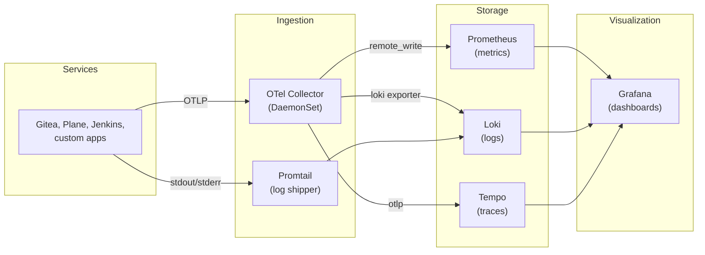

# Plan: IRL Helm Charts Meta Repository

## Context

Bitnami pulled all versioned Docker images from Docker Hub (Broadcom paywall, Sept 2025). Our homelab k3s deployment depends on Bitnami charts for PostgreSQL and Redis -- both are now broken. Rather than patching individual charts, the Chairman wants a proper chart repository that IRL owns, with subcharts for every service gap we identify in the ecosystem.

This repo serves double duty: (1) unblocks the homelab deployment immediately, and (2) becomes an open-source contribution back to the ecosystem (PostHog model -- open source everything).

## Architecture

```
helm-charts/                          # New repo: infinite-room-labs/helm-charts
  charts/
    irl-postgres/                     # CloudNativePG wrapper -- operator + Cluster CR
      Chart.yaml                      # depends on cnpg/cloudnative-pg
      values.yaml
      templates/
        cluster.yaml                  # CNPG Cluster custom resource
    irl-valkey/                       # Valkey (Redis replacement) with auth + tuning
      Chart.yaml                      # depends on valkey/valkey
      values.yaml
      templates/
    irl-platform/                     # Umbrella chart -- entire homelab stack
      Chart.yaml                      # depends on all service charts
      values.yaml                     # unified overrides
      templates/
        network-policies.yaml         # per-service NetworkPolicies
    irl-gitea/                        # Thin wrapper around gitea-charts/gitea
      Chart.yaml
      values.yaml
    irl-monitoring/                   # Umbrella: kube-prometheus-stack + loki
      Chart.yaml
      values.yaml
  .github/
    workflows/
      lint-test.yml                   # helm/chart-testing-action on PRs
      release.yml                     # chart-releaser-action on main push
  ct.yaml                            # chart-testing config
  renovate.json                       # auto-bump dependency versions
  CLAUDE.md
  CHANGELOG.md
```

### Chart Dependency Map

```mermaid
graph TD
    PLATFORM["irl-platform<br/>(umbrella)"]
    PG["irl-postgres<br/>(CNPG operator + Cluster CR)"]
    VK["irl-valkey<br/>(Valkey standalone)"]
    GITEA["irl-gitea<br/>(wrapper)"]
    AUTH["goauthentik/authentik<br/>(direct, no wrapper needed)"]
    MON["irl-monitoring<br/>(umbrella)"]
    JENKINS["jenkins/jenkins<br/>(direct, no wrapper needed)"]
    VAULT["hashicorp/vault<br/>(direct, no wrapper needed)"]
    PLANE["makeplane/plane-ce<br/>(direct, DO node)"]
    OLLAMA["ollama-helm/ollama<br/>(direct, no wrapper needed)"]
    GARAGE["Garage S3<br/>(direct, ZFS-backed)"]
    OPENVIKING["OpenViking<br/>(direct, context DB)"]
    COREDNS["CoreDNS Internal<br/>(Split DNS resolver)"]

    PLATFORM --> PG
    PLATFORM --> VK
    PLATFORM --> GITEA
    PLATFORM --> AUTH
    PLATFORM --> MON
    PLATFORM --> JENKINS
    PLATFORM --> VAULT
    PLATFORM --> PLANE
    PLATFORM --> OLLAMA
    PLATFORM --> GARAGE
    PLATFORM --> OPENVIKING
    PLATFORM --> COREDNS
    PLANE --> GARAGE

    PG --> CNPG["cnpg/cloudnative-pg<br/>(upstream)"]
    VK --> VALKEY["valkey/valkey<br/>(upstream)"]
    GITEA --> GITEACHART["gitea-charts/gitea<br/>(upstream)"]
    MON --> KPS["prometheus-community/<br/>kube-prometheus-stack"]
    MON --> LOKI["grafana/loki<br/>(upstream)"]
    MON --> TEMPO["grafana/tempo<br/>(traces)"]
    MON --> OTEL["open-telemetry/<br/>opentelemetry-collector"]
```



### What Gets Its Own IRL Chart vs Direct Upstream

| Service | Why IRL chart? | Chart name |
|---------|----------------|------------|
| PostgreSQL | Bitnami dead. CNPG operator needs a Cluster CR template. | `irl-postgres` |
| Redis/Valkey | Bitnami dead. Valkey chart needs auth + tuning defaults. | `irl-valkey` |
| Gitea | Needs external PG/Redis config + LFS PVC wiring. | `irl-gitea` |
| Monitoring | Umbrella: kube-prometheus-stack + Loki + dashboards. | `irl-monitoring` |
| Platform | Umbrella: entire stack as one release. | `irl-platform` |
| Authentik | Official chart works, just needs values. | Direct (values only) |
| Vault | Official chart works. | Direct (values only) |
| Jenkins | **SKIPPED** -- plugin version incompatibility, parking until needed. | Deferred |
| Plane | Official chart works. Runs on DO node (nodeSelector). | Direct (values only) |
| Ollama | Community chart works. | Direct (values only) |
| Garage | S3-compatible object storage for Plane files. ZFS-backed on homelab node. | Direct (PV + Deployment) |
| OpenViking | Agent memory/RAG context database. Phase 1 deployment. | Direct (PV + Deployment) |
| CoreDNS Internal | Tailscale Split DNS resolver. hostNetwork port 53. | Direct (Deployment) |

## File Changes

### New repository: `infinite-room-labs/helm-charts`

Create via `gh repo create infinite-room-labs/helm-charts --public` from the IRL template-repo.

**charts/irl-postgres/**
- `Chart.yaml` -- depends on `cnpg/cloudnative-pg` operator chart
- `values.yaml` -- defaults: PG 16, standalone, 2Gi mem, existingSecret pattern
- `templates/cluster.yaml` -- CNPG `Cluster` CR with configurable instances, storage, PG params
- `templates/scheduled-backup.yaml` -- optional CNPG `ScheduledBackup` CR

**charts/irl-valkey/**
- `Chart.yaml` -- depends on `valkey/valkey`
- `values.yaml` -- defaults: standalone, 256Mi, requirepass via existingSecret, allkeys-lru
- `templates/network-policy.yaml` -- allow ingress only from labeled consumers

**charts/irl-gitea/**
- `Chart.yaml` -- depends on `gitea-charts/gitea`
- `values.yaml` -- defaults: external PG + Valkey, LFS on ZFS PVC, metrics enabled, mirror config
- `templates/lfs-pvc.yaml` -- PVC for LFS storage on zfs-local StorageClass

**charts/irl-monitoring/**
- `Chart.yaml` -- depends on `prometheus-community/kube-prometheus-stack` + `grafana/loki` + `grafana/tempo`
- `values.yaml` -- unified monitoring config: retention, NodePorts, dashboards
- `templates/dashboards-configmap.yaml` -- pre-built Grafana dashboards
- `templates/otel-collector.yaml` -- OpenTelemetry Collector DaemonSet (OTLP ingestion)

**charts/irl-platform/**
- `Chart.yaml` -- depends on all IRL charts + direct upstream charts
- `values.yaml` -- global overrides (domain, namespace, storage class)
- `templates/network-policies.yaml` -- inter-service allow rules
- `templates/namespace.yaml` -- irl namespace with labels

**Root files:**
- `.github/workflows/lint-test.yml` -- `helm/chart-testing-action` on PRs
- `.github/workflows/release.yml` -- `helm/chart-releaser-action` on main merge
- `ct.yaml` -- chart-testing config (target-branch: main, chart-dirs: charts)
- `renovate.json` -- auto-bump `Chart.yaml` dependency versions
- `CLAUDE.md` -- chart conventions, values patterns, contribution guide

### Modified in `infinite-room-labs-infra`

| File | Change |
|------|--------|
| `ansible/playbooks/helm-deploy.yml` | Replace bitnami/postgresql + bitnami/redis with IRL chart repo references |
| `ansible/helm/postgres/values.yaml` | Rewrite for CNPG Cluster CR (not Bitnami) |
| `ansible/helm/redis/values.yaml` | Rewrite for Valkey (not Bitnami Redis) |
| `ansible/inventory/group_vars/all/main.yml` | Add `irl_helm_repo` URL |

### Modified in parent CLAUDE.md

Add `helm-charts/` repo entry to the Current Repositories section.

## Implementation Order

1. **Create the repo** from template-repo, add CLAUDE.md + CI workflows
2. **irl-postgres chart** -- CNPG operator + Cluster CR (unblocks PG deployment)
3. **irl-valkey chart** -- Valkey standalone with auth (unblocks Redis deployment)
4. **Update infra repo** -- swap Bitnami refs for IRL chart repo
5. **Test** -- `helm install` both charts on the live k3s cluster
6. **irl-gitea, irl-monitoring** -- wrapper charts (can be done after core data is running)
7. **irl-platform umbrella** -- last, once individual charts are proven

## Decisions Log

| Date | Decision | Rationale |
|------|----------|-----------|
| 2026-03-20 | Docker Compose -> k3s + Helm | Compose was reimplementing K8s poorly (shared networks, wait_for deps, hand-rolled health checks) |
| 2026-03-20 | Calico -> stock Flannel + kube-router | Single node doesn't need mesh CNI. Calico poisoned iptables state. Flannel just works. |
| 2026-03-20 | Bitnami -> CNPG + Valkey | Bitnami pulled all versioned images from Docker Hub (Broadcom paywall). CNPG is CNCF, Valkey is Linux Foundation. |
| 2026-03-20 | `--node-ip` uses LAN IP (192.168.2.2), not Tailscale | Tailscale IP on a different interface breaks pod-to-API routing (kernel can't route from cni0 to tailscale0). Tailscale IP added as `--tls-san` for external kubectl access. |
| 2026-03-20 | nftables must allow cni0 + flannel.1 in INPUT chain | Pod traffic arrives on cni0, not tailscale0. Default-deny INPUT was silently dropping all pod-to-API-server packets. Root cause of the entire k3s networking debug. |
| 2026-03-21 | CNPG manages its own superuser credentials | Can't use external secrets for postgres superuser. Database creation done via kubectl exec, not Helm Jobs. |
| 2026-03-21 | OpenTelemetry Collector + Tempo added to irl-monitoring | Complete the three pillars (metrics, logs, traces). Deploy monitoring stack first, layer OTel after services are generating traffic. Collector runs as DaemonSet, receives OTLP, routes to Prometheus/Loki/Tempo. |
| 2026-03-21 | NFS stays as home SAN | Chairman uses it as network storage for the household. Not moving to Tailscale-only access. |
| 2026-03-21 | Vault handles secrets + signing CA | HashiCorp Vault is the long-term secrets backend and certificate authority. Ansible Vault + bw-sync.sh is the bootstrap path. |
| 2026-03-21 | Jenkins skipped | Plugin version incompatibility (chart installs 2.479, plugins need 2.479.1+). Not critical for initial deployment. Revisit when CI/CD is needed -- may use Gitea Actions instead. |
| 2026-03-22 | Oracle Cloud abandoned, switched to DigitalOcean | ARM capacity unavailable on Oracle Cloud (Always Free tier perpetually out of stock) + Larry Ellison tax. DigitalOcean s-4vcpu-8gb in NYC3 at $48/mo selected instead. |
| 2026-03-22 | Flannel VXLAN over Tailscale networking | Requires `flannel-iface: tailscale0` on BOTH server and agent nodes + `flannel-mtu: 1230` to avoid encapsulation overhead. Without both settings, cross-node pod networking silently fails. |
| 2026-03-22 | Garage S3 replaces MinIO for Plane file storage | Garage runs on the homelab node (ZFS-backed), lightweight alternative to MinIO. Plane configured with external S3 credentials pointing to Garage. |
| 2026-03-22 | Tailscale Split DNS via CoreDNS | CoreDNS deployed with hostNetwork on port 53, registered as Tailscale Split DNS resolver. Eliminates /etc/hosts management for `*.lab.infiniteroomlabs.cloud` and `*.internal.lab.infiniteroomlabs.cloud`. |
| 2026-03-22 | OpenViking deployed for agent memory/RAG (Phase 1) | Context database for AI agent persistent memory and RAG retrieval. Deployed alongside nomic-embed-text model in Ollama. |
| 2026-03-22 | Node label taxonomy (irl.dev/*) for workload scheduling | Labels: provider, tier, storage, network, cost, persistence, gpu, memory-class. Enables nodeSelector-based scheduling across homelab and cloud nodes. |
| 2026-03-22 | Acceptance test suite added | Task + pytest + Goss framework. `task smoke` runs 17 smoke tests, `task validate` runs full suite with Goss system checks and HTML report generation. |

## Observability Architecture (Decided 2026-03-21)



**Phase 1 (deploy now)**: kube-prometheus-stack (Prometheus + Grafana + Alertmanager) + Loki + Promtail
**Phase 2 (after services running)**: OTel Collector (DaemonSet) + Tempo (traces backend)
**Phase 3 (app instrumentation)**: Add OTLP SDKs to IRL apps, trace Jenkins pipelines end-to-end

## Verification

1. `helm repo add irl https://infinite-room-labs.github.io/helm-charts/`
2. `helm install postgresql irl/irl-postgres -n irl` -- CNPG operator installs, Cluster CR creates a running PG 16 pod
3. `helm install valkey irl/irl-valkey -n irl` -- Valkey pod running, auth working
4. `kubectl exec` into a test pod and connect to both services
5. CI: push a chart version bump, chart-releaser-action creates a GitHub release and updates index.yaml
