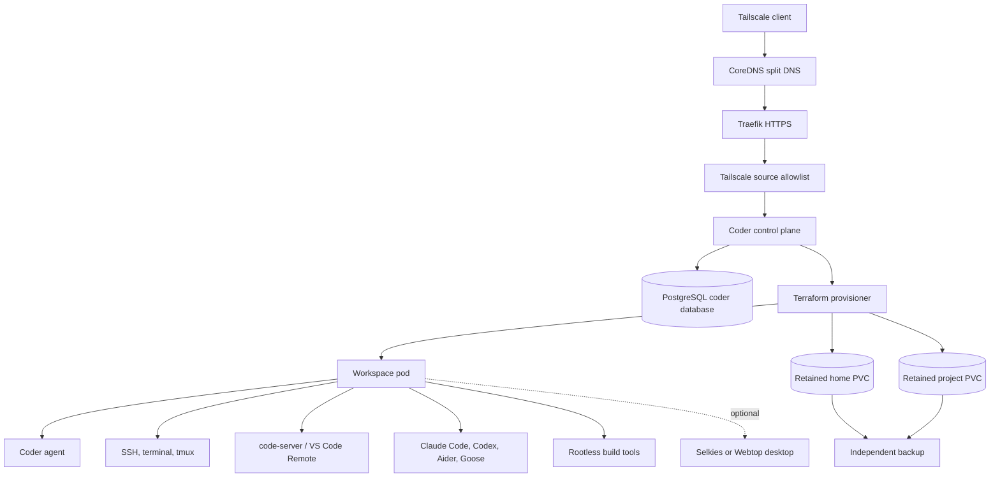

# Coder Agentic Workstations on Homelab k3s

**Date:** 2026-07-10
**Status:** Proposed
**Objective:** Provide efficient, fully capable Linux agentic workstations that are reproducible as code, managed through infrastructure-as-code workflows, and able to retain projects, tool state, and resumable agent context over long periods.
**Exposure scope:** Tailscale-only. Cloudflare Tunnel and public exposure are outside this plan and are covered by `2026-07-10-gitops-cloudflare-tunnel-exposure.md`.

## Executive Decision

Use Coder Community as the workstation control plane and provision workspaces as Kubernetes resources through versioned Coder Terraform templates.

Each workstation will consist of ephemeral compute around retained ZFS-backed storage:

- Coder control plane deployed to k3s with a pinned official Helm chart.
- Existing PostgreSQL service with a dedicated `coder` database and credential.
- Workspace pods created by Coder's Kubernetes provider templates.
- Retained per-workspace home and project PVCs backed by ZFS.
- A pinned IRL workstation image containing the standard toolchain.
- Claude Code, Codex, Aider, Goose, and other terminal agents available inside the workspace.
- SSH, browser terminal, code-server, VS Code Remote, and forwarded application access.
- `tmux` or `zellij` as the default long-running interactive session layer.
- Optional GUI desktop capability added as a separate template after the base platform is stable.

Do not use Kasm as the primary platform. Kasm is optimized for disposable streamed desktops and browsers, relies on a Docker-host architecture, and is not a Kubernetes-native workstation control plane. Keep Kasm in the alternatives record for future browser-isolation or application-streaming requirements.

Do not make the initial platform depend on Coder Tasks or Coder Agents. Coder Tasks is entering extended support and scheduled for removal from new releases; Coder Agents is currently beta. The stable phase-1 model is ordinary agent CLIs running inside persistent workspaces.

## Goals

- Express workstation infrastructure, image contents, resources, tools, and policy as reviewed code.
- Create equivalent workstations repeatedly from a pinned template.
- Preserve user data and agent state when compute is stopped, restarted, rescheduled, or upgraded.
- Support hours- or days-long agent operations while a workspace remains running.
- Provide a documented recovery path after pod or node failure.
- Avoid privileged pods and host filesystem mounts by default.
- Allow project-specific compute, storage, tool, and Kubernetes-access profiles.
- Keep secrets out of images, templates, Terraform state, logs, and committed values.
- Integrate with the existing PostgreSQL, Traefik, CoreDNS, Tailscale, ZFS, backup, and observability systems.
- Make deletion of long-term workspace data a separate, explicit action from ordinary workspace lifecycle operations.

## Non-Goals

- Guarantee uninterrupted Linux processes through node failure.
- Provide multi-node live migration of workspace pods or local ZFS volumes.
- Give every workspace privileged Docker or host access.
- Replace agent-native context, checkpoint, or resume mechanisms.
- Depend on Coder's beta agent UI for core workstation functionality.
- Provide a general streamed-desktop platform in phase 1.
- Expose Coder publicly.
- Move all existing Ansible-managed applications to GitOps.
- Build a custom workspace operator before Coder templates prove insufficient.

## Alternatives Considered

| Platform | Strength | Rejection or retained use |
|---|---|---|
| Kasm Workspaces | Polished streamed desktops, browsers, and GUI applications | Not Kubernetes-native; Docker-host model; weaker fit for durable IaC-defined development workstations. Retain for future browser isolation. |
| Eclipse Che | Fully Kubernetes-native development workspaces | Heavier control plane and more opinionated IDE workflow than needed for the initial homelab. |
| DevPod | FOSS and lightweight provider-driven dev environments | Client-driven and lacks the desired centralized multi-user lifecycle and policy plane. |
| Selkies | FOSS low-latency graphical streaming | A streaming primitive, not a workstation lifecycle control plane. Candidate for the optional GUI template. |
| LinuxServer Webtop | Simple browser-accessible Linux desktop | No multi-user template, policy, scheduling, or lifecycle control plane. Candidate only as a GUI component. |
| Apache Guacamole | Mature RDP, VNC, and SSH browser gateway | Connects to existing systems; does not provision agentic workstations. |
| KubeVirt plus streaming | Kubernetes-native VM workstations | Substantial platform-building and VM lifecycle overhead; defer unless container workstations prove insufficient. |

Coder wins because workspaces are created from Terraform templates, run naturally on Kubernetes, support persistent and ephemeral resource separation, and expose SSH, terminals, IDEs, and applications through the Coder agent.

## Architecture



## Persistence Model

### Persistent data

Persist at least:

- `/home/coder`
- Project repositories and worktrees.
- Agent transcripts, plans, checkpoints, and local configuration.
- Shell history and tmux or zellij configuration.
- Editor settings and extensions where appropriate.
- Tool caches selected for persistence.
- mise configuration and user-installed tool versions.
- MCP configuration that contains no raw credentials.
- Local application state intentionally owned by the workspace.

Separate home and project storage so backup, quotas, lifecycle, and future sharing policies can differ.

### Ephemeral data

Keep reproducible or high-churn data ephemeral unless measurements justify persistence:

- Container writable layer.
- `/tmp`.
- Build scratch space.
- Download caches that are cheap to recreate.
- Preview application data created only for tests.
- Kubernetes pods, Services, and Coder agent processes.

### Running-process persistence

A PVC preserves files, not processes. When a workspace pod is stopped or replaced, agents, dev servers, watchers, and terminal multiplexers stop.

The platform will provide:

- Workspaces with autostop disabled when explicitly designated long-running.
- `tmux` or `zellij` for disconnect-safe interactive sessions.
- `tini` or an equivalent init process.
- Supervised background processes where a project requires them.
- `preStop` hooks and sufficient termination grace to flush state.
- Startup scripts that detect incomplete work and present recovery information.
- Agent-native resume commands and persisted session directories.
- Alerts for unexpected pod restarts and node pressure.

The platform promises durable state and tested recovery, not uninterrupted execution through host failure.

## Data-Safety Boundary

Coder workspace deletion runs Terraform destroy and ordinarily destroys persistent resources declared by the template. This conflicts with the long-term-session objective.

The production template must not make ordinary workspace deletion the only guard protecting user data.

Use the following controls:

1. Name persistent resources from immutable `owner_id` and workspace ID values, never mutable usernames or workspace names.
2. Add Terraform lifecycle protection appropriate to the provider and resource.
3. Set Kubernetes PV reclaim policy to `Retain`.
4. Back up workspace datasets independently of their PVCs.
5. Disable automatic dormant-workspace deletion for long-term templates.
6. Require an explicit decommission workflow to delete PVCs, PVs, ZFS datasets, and backups.
7. Test workspace deletion in a disposable environment and prove retained data remains recoverable.

If Coder's Terraform workflow cannot keep the desired PVC safely while deleting a workspace record, use a two-layer ownership model:

- Ansible or a dedicated storage controller owns the retained PVC, PV, and dataset.
- The Coder template references an existing claim and owns only ephemeral compute.

Prefer this two-layer model for the initial long-term template because it separates workstation lifecycle from data destruction.

## Workspace Templates

### Standard agentic workstation

The default template:

- 2-4 vCPU request profile.
- 4-8 GiB memory request and limit profile.
- 50 GiB home dataset.
- 100 GiB project dataset.
- Pinned workstation image.
- SSH, terminal, code-server, and VS Code Remote access.
- tmux and zellij.
- Git, Git LFS, common compilers, and debugging tools.
- mise, fnox, usage, uv, pnpm, Node.js, Rust, Go, Java, Terraform, Terragrunt, Helm, kubectl, and supported cloud CLIs.
- Claude Code, Codex, Aider, and Goose installed at pinned or policy-controlled versions.
- No privileged container.
- No hostPath mounts.
- No host network.
- No default Kubernetes ServiceAccount token.
- Internet access with explicit private-network restrictions where the current cluster policy allows them.

### Heavy workstation

An opt-in profile for large builds and parallel agents:

- 6-12 vCPU.
- 12-24 GiB memory.
- Larger project and cache volumes.
- Higher file-descriptor and process limits.
- Optional browser-automation sidecar.
- Scheduling restricted to a node with sufficient capacity.
- Concurrency initially limited to one workspace on the 40 GiB homelab host.

### GUI workstation

Deferred until the standard template passes acceptance:

- Standard workstation capabilities.
- Selkies or Webtop desktop component.
- Browser and graphical Linux applications.
- Clipboard, upload, download, and optional audio validation.
- Separate resource profile and security review.
- No Kasm control plane.

### Privileged build workstation

Do not provide initially. If a demonstrated workload cannot use rootless BuildKit, Buildah, Kaniko, remote Docker, or Kubernetes-native build jobs, create a separate opt-in template with explicit risk acceptance and narrower credentials.

## Workstation Image

Build a pinned IRL image under `docker/`; do not install the complete toolchain on every startup.

The image must:

- Use a supported, pinned Ubuntu or Debian base by digest where practical.
- Run as a non-root user by default.
- Include a minimal init.
- Include CA certificates, SSH client, Git, shell tools, editors, build prerequisites, and diagnostics.
- Use mise for project-selectable language and tool versions.
- Use `uv` and `pnpm` according to IRL policy.
- Avoid embedding secrets, personal dotfiles, repository credentials, or cloud credentials.
- Include a software bill of materials and vulnerability scan in CI.
- Be built by the hardened package-manager rules.
- Be tagged immutably and promoted deliberately.

Keep fast-moving agent CLIs either in a thin derived image or in a controlled startup layer so agent updates do not require rebuilding the entire language toolchain image. Pin versions for reproducibility and make upgrades explicit.

## Build and Container Workflows

Avoid Docker-in-Docker and host Docker socket mounts in the standard template.

Preferred mechanisms:

1. Rootless BuildKit for OCI image builds.
2. Buildah where its user-namespace requirements are satisfied.
3. Kubernetes build Jobs for isolated heavy builds.
4. Remote Docker context to a dedicated builder for Docker-specific compatibility.
5. Sandbox SDK or another isolated runtime for untrusted code.

Workspace templates may create project-specific child pods or Jobs through a scoped ServiceAccount. Do not grant namespace-wide administrator or cluster-admin access.

## Kubernetes and Security Model

Use a dedicated `coder` namespace for the control plane. Workspace placement needs a deliberate namespace decision during WP1:

- Per-workspace namespaces provide stronger isolation and cleanup boundaries but require more RBAC and policy automation.
- A shared workspace namespace is simpler but inherits the same additive NetworkPolicy limitations already present in `irl`.

Prefer per-workspace namespaces if supported cleanly by the selected Coder template and Community feature set. Otherwise use a dedicated shared `coder-workspaces` namespace, not `irl`, with a fresh default-deny baseline.

Control-plane and workspace requirements:

- ClusterIP Services only.
- Traefik route protected by a Tailscale source allowlist.
- `automountServiceAccountToken: false` unless a template explicitly needs Kubernetes API access.
- `seccompProfile: RuntimeDefault`.
- Drop Linux capabilities by default.
- No privilege escalation.
- No host PID, IPC, network, or filesystem access.
- Resource requests and limits on every container.
- Pod and container security contexts rendered and tested.
- Scoped egress to DNS, source-control systems, package registries, model providers, and explicitly approved internal services.
- Private, LAN, tailnet, metadata, Kubernetes API, and unrelated Service access denied where enforceable.

The existing `irl` namespace-wide allow policy must not be copied into the workspace namespace.

## Secrets and Identity

Bitwarden remains the source of truth.

Separate these secret classes:

- Coder control-plane database URL.
- Coder OAuth or OIDC client credential.
- Workspace source-control credentials.
- Agent-provider API keys or OAuth tokens.
- Cloud-provider credentials.
- Kubernetes access credentials.

Do not inject every credential into every workspace.

Prefer short-lived, user-scoped credentials obtained after login. When static credentials are unavoidable:

- Map one Bitwarden item per value through `bw-sync-config.yaml`.
- Materialize only the Secret required by the control plane or template.
- Mount or inject it only into authorized workspaces.
- Mark secret-handling Ansible tasks `no_log: true`.
- Keep values out of Coder template variables if they would be stored in Terraform state.
- Test rotation without rebuilding the workstation image.

Use built-in Coder authentication for the proof of concept. Evaluate Authentik OIDC after the base control plane is stable, with a documented local break-glass administrator path.

## Coder Control Plane

Deploy the pinned official Coder Helm chart through Ansible.

Use:

- Dedicated `coder` namespace.
- ClusterIP Service.
- `CODER_ACCESS_URL=https://code.lab.infiniteroomlabs.cloud`.
- Existing PostgreSQL with a dedicated database and least-privilege user.
- External Secret for the database URL.
- Explicit stable release channel and chart version.
- One control-plane replica initially, with backup and recovery rather than pretend high availability on a single physical host.
- Data-node scheduling only if required; the control plane itself should remain lightweight.
- Existing Prometheus, Loki, and Grafana integration rather than deploying a duplicate observability stack.

Add to `irl_services` and standalone Traefik routing only after the control plane is healthy internally. Attach the same strict Tailscale route middleware pattern selected for other private services.

## Coder Agent Feature Strategy

Phase 1 uses agent CLIs inside the workspaces.

Do not use Coder Tasks as a foundation. Current Coder documentation states that Tasks moves to extended support in 2026 and is removed from new releases beginning with v2.37.

Coder Agents is the intended replacement but is beta. It runs the agent loop in the control plane and persists chat independently from workspace lifecycle, which is attractive for future use. Evaluate it only after:

- Base workspaces are stable.
- Control-plane database backup is tested.
- Provider-key storage is reviewed.
- Community versus paid feature boundaries are confirmed.
- Its workspace permissions and egress model are understood.
- A normal terminal-agent workflow remains available as fallback.

## Storage, Backup, and Recovery

Create ZFS datasets for:

- Coder control-plane supporting data if any lies outside PostgreSQL.
- Workspace home volumes.
- Workspace project volumes.
- Optional shared caches.

Use deterministic PV and PVC binding, node affinity, `ReadWriteOnce`, and `Retain` reclaim policy. Identify runtime UID and GID and provision ownership explicitly.

Back up:

- The Coder PostgreSQL database.
- Workspace Terraform state held by Coder.
- Home datasets.
- Project datasets.
- Template source repositories.
- Workstation image definitions and immutable image references.

Snapshots on the same ZFS pool are not sufficient. Define an independent destination, encryption, retention, RPO, RTO, and restore procedure.

Test these recovery cases:

1. Workspace pod deletion with intact PVCs.
2. Workspace stop and start.
3. Template update.
4. Coder control-plane loss with database restore.
5. Accidental Coder workspace deletion with retained storage recovery.
6. ZFS dataset restore into a replacement claim.
7. Workstation image rollback.
8. Agent session recovery from persisted state after process loss.

## Resource Budget

The homelab host has 40 GiB RAM and 24 logical CPU threads, with existing k3s workloads, an 8 GiB ZFS ARC cap, and an Ollama budget up to 8 GiB.

Before rollout:

- Measure current allocatable CPU and memory.
- Record existing requests, limits, and observed peaks.
- Reserve capacity for PostgreSQL, storage, ingress, monitoring, and Ollama.
- Set a hard initial concurrency limit.
- Disable automatic creation of unbounded workspaces.

Initial target:

- Coder control plane: 250m CPU request, 1 CPU limit, 512 MiB request, 1 GiB limit.
- One standard workspace: 2 CPU request, 4 GiB memory request, 4 CPU and 8 GiB limits.
- One optional heavy workspace only when the standard workspace is stopped or capacity preflight passes.

Community quota limitations must be verified. If platform-enforced quotas require a paid feature, enforce capacity through template parameters, admission policy, or a deliberately constrained single-user operating procedure.

## Repository Layout

Proposed additions:

```text
docker/
  coder-workstation/
    Dockerfile
    README.md
    scripts/
ansible/
  helm/coder/values.yaml
  docs/runbooks/coder-workspace-unhealthy.md
  docs/sops/coder-backup-and-restore.md
  docs/sops/coder-template-upgrade.md
coder/
  templates/
    agentic-standard/
      main.tf
      versions.tf
      README.md
    agentic-heavy/
      main.tf
      versions.tf
      README.md
    agentic-gui/
      README.md
  images/
    README.md
```

The new top-level `coder/` directory is justified as a tool-specific IaC area, consistent with the repository's top-level-by-tool structure. Confirm this convention in both `AGENTS.md` and `CLAUDE.md` before implementation and update both together.

Expected modifications:

| File | Change |
|---|---|
| `ansible/inventory/group_vars/all/main.yml` | Add Coder service, database, datasets, and route metadata |
| `scripts/bw-sync-config.yaml` | Add Coder database and later identity-provider secret mappings |
| `ansible/playbooks/k8s-secrets.yml` | Materialize Coder Secrets for rebuild reproducibility |
| `ansible/playbooks/k3s.yml` | Add retained storage primitives if statically managed there |
| `ansible/playbooks/zfs.yml` | Add dataset ownership and backup prerequisites |
| `ansible/playbooks/helm-deploy.yml` | Add pinned Coder repository, values, deployment, and rollout checks |
| Traefik middleware and route templates | Add Tailscale-only Coder access |
| `ansible/helm/homepage/values.yaml` | Add Coder after acceptance |
| Monitoring configuration | Add control-plane and workspace health coverage |
| `tests/` | Add render, access, lifecycle, persistence, and recovery tests |
| `docs/homelab-access-guide.md` | Document Coder access and workstation use |
| `CHANGELOG.md` | Record platform adoption |

## Work Packages

### WP0: Product and feature-boundary gate

1. Confirm the objective remains agentic Linux development workstations rather than streamed disposable desktops.
2. Verify Coder Community licensing and feature boundaries for templates, Kubernetes workspaces, authentication, scheduling, quotas, audit, and agent features.
3. Confirm the supported stable release and chart versions.
4. Compare Coder and Eclipse Che once more against the concrete template and persistence requirements.
5. Record why Kasm, DevPod, and custom KubeVirt are deferred.

**Gate:** Coder Community supports the required base workflow without relying on Coder Tasks, Coder Agents, or a paid lifecycle feature.

### WP1: Render-prove the Coder control plane

1. Pin the official stable Coder chart.
2. Render proposed values.
3. Verify ClusterIP-only exposure, security context, ServiceAccount, resources, probes, and database Secret references.
4. Verify PostgreSQL version compatibility and create the dedicated database design.
5. Confirm the access URL and WebSocket behavior through Traefik.
6. Confirm upgrade and rollback procedures.

**Gate:** Rendered resources match the repository's security and exposure model.

### WP2: Build the workstation image

1. Create the pinned Dockerfile and tool manifest.
2. Install the standard IRL runtime and IaC toolchain.
3. Add agent CLIs without credentials.
4. Add tmux, zellij, code-server, diagnostics, and init behavior.
5. Build with pnpm, uv, and other hardened policies intact.
6. Produce SBOM, vulnerability results, and image digest.
7. Test non-root operation and writable paths.

**Gate:** The image can clone, build, test, and inspect representative IRL projects without privileged execution.

### WP3: Prove the workspace template and data boundary

1. Create the standard Kubernetes template.
2. Select per-workspace or shared workspace namespaces.
3. Define ephemeral compute with persistent existing claims.
4. Name resources using immutable IDs.
5. Add Coder agent, SSH, terminal, code-server, and app definitions.
6. Add resource parameters with safe bounds.
7. Add shutdown grace, startup recovery, and session tooling.
8. Render and inspect Terraform plans for create, stop, start, update, and delete.
9. Prove workspace deletion cannot silently destroy the only copy of long-term data.

**Gate:** Stop/start, pod replacement, template update, and controlled delete tests preserve recoverable data.

### WP4: Integrate secrets and scoped access

1. Add the Coder database credential to Bitwarden.
2. Add synchronization mapping and guarded Ansible Secret task.
3. Create scoped source-control and Kubernetes credential patterns.
4. Verify no secret enters image layers or Terraform state.
5. Test credential rotation.
6. Define opt-in agent-provider credential injection.

**Gate:** A standard workspace receives only its approved credentials and rotation does not require image rebuild.

### WP5: Deploy the control plane privately

1. Deploy PostgreSQL database and Secret prerequisites.
2. Deploy the pinned Coder chart internally.
3. Verify control-plane database migrations and health.
4. Add split DNS and Traefik route.
5. Attach the strict Tailscale source allowlist.
6. Test direct-IP Host-header access from tailnet and non-tailnet clients.
7. Bootstrap the initial administrator without an open public registration window.

**Gate:** Coder works through Tailscale, rejects non-tailnet sources, and has no public, NodePort, LoadBalancer, Funnel, or Serve exposure.

### WP6: Validate long-term workstation behavior

1. Create a standard workstation.
2. Clone representative repositories.
3. Run Claude Code and Codex sessions and persist their state.
4. Start tmux-managed long-running jobs.
5. Disconnect the client and verify jobs continue.
6. Restart the Coder control plane and verify workspace processes continue.
7. Delete the workspace pod and verify data persists while processes recover according to the documented model.
8. Stop and start the workspace and exercise agent-native resume.
9. Update the template and confirm retained data survives.
10. Run a multi-hour agent workload and monitor resource pressure.

**Gate:** Files and agent context survive all declared lifecycle operations; process-loss behavior matches the documented recovery contract.

### WP7: Backup and disaster recovery

1. Back up Coder PostgreSQL and workspace datasets to the independent destination.
2. Restore the control plane into an isolated validation target.
3. Reattach restored workspace storage.
4. Recover a deleted workspace record or create a replacement workspace around retained data.
5. Verify repositories, tool state, and agent resume data.
6. Record actual RPO and RTO.

**Gate:** Recovery succeeds from independent backups, not only same-pool snapshots.

### WP8: Operations and documentation

1. Add monitoring for Coder, provisioners, workspace health, pod restarts, node pressure, PVC usage, and backup failures.
2. Add runbooks for unhealthy workspaces, failed Terraform builds, storage binding, and credential failures.
3. Add SOPs for image, template, chart, and toolchain upgrades.
4. Add access and onboarding documentation.
5. Add lifecycle and recovery tests to the repository suite.
6. Update Homepage and changelog after acceptance.

**Gate:** A maintainer can provision, use, diagnose, recover, upgrade, and decommission the platform from repository documentation alone.

### WP9: Optional GUI workstation

1. Compare Selkies and Webtop for a workspace-local desktop.
2. Add the selected component to a separate template.
3. Validate browser, clipboard, upload, download, audio, WebSocket, and latency behavior.
4. Apply a separate resource and security profile.
5. Confirm GUI addition does not become required for headless agent workstations.

### WP10: Optional Coder Agents evaluation

1. Recheck product status and Community availability.
2. Test provider-key handling and control-plane database persistence.
3. Compare built-in Coder Agents with installed Claude Code and Codex workflows.
4. Test sub-agents, computer use, workspace selection, and chat recovery.
5. Retain terminal agents as fallback.

## Acceptance Matrix

### Reproducibility

- A clean deployment can recreate the Coder control plane from Ansible, Helm values, Bitwarden references, and PostgreSQL restore.
- A new workstation created from the same template has the expected image, tools, resources, access, and mounts.
- Chart, template provider, modules, and image references are pinned.
- Terraform plans contain no raw secrets.

### Access and security

- Tailnet client access succeeds.
- Non-tailnet direct-IP access with correct SNI and Host header fails.
- No public DNS record, NodePort, LoadBalancer, Funnel, or Serve endpoint exists.
- Workspace pods are non-root and unprivileged by default.
- Host namespaces and filesystems are unavailable.
- Default ServiceAccount tokens are not mounted.
- Kubernetes access is scoped to the intended namespace and verbs.
- A workspace cannot read another workspace's Secret or PVC.

### Capability

- Git clone, branch, worktree, commit, and signed-auth workflows operate as designed.
- Representative Python, Node.js, Rust, Go, Java, Terraform, Helm, and kubectl workflows pass.
- code-server, SSH, and terminal access work.
- Claude Code and Codex can operate on a representative repository.
- Rootless image build and a Kubernetes integration test work without host Docker access.

### Persistence

- Disconnecting the client does not stop tmux-managed work.
- Coder control-plane restart does not stop a healthy workspace pod.
- Workspace pod replacement preserves files but predictably terminates processes.
- Stop/start preserves home, projects, tool configuration, and agent resume state.
- Template update preserves retained data.
- Workspace deletion cannot remove the only recoverable copy of long-term data.
- Independent backup restore recreates a usable workstation.

### Operations

- Resource exhaustion prevents unsafe scheduling rather than destabilizing the node.
- PVC capacity, pod restart, unhealthy agent, failed build, and backup failure alerts work.
- Upgrade and rollback drills pass for chart, template, and image changes.
- Decommission requires an explicit data-retention decision.

## Rollback

### Control-plane failure

1. Keep workspace pods and PVCs intact.
2. Disable the Coder route through desired state if authentication or routing is unsafe.
3. Roll back the pinned Helm chart or restore PostgreSQL as appropriate.
4. Reconnect existing workspace agents after control-plane recovery.
5. Run access and lifecycle tests before restoring normal use.

### Template or image failure

1. Stop new workspace creation and automatic template updates.
2. Restore the previously pinned template version or image digest.
3. Do not destroy retained PVCs.
4. Create a disposable validation workspace before updating existing workspaces.
5. Reattach retained data to a replacement workspace if the original Terraform state is broken.

### Decommission

Coder workspace deletion, control-plane removal, PVC deletion, ZFS dataset deletion, and backup expiry are separate actions. Never combine them in one default playbook or button-driven workflow.

## Deferred Research

- Whether Coder Community provides sufficient quota and scheduling controls for safe multi-workspace use.
- Per-workspace namespace automation versus a shared isolated namespace.
- Best rootless OCI build strategy under this k3s kernel and storage configuration.
- Agent credential brokerage that avoids long-lived provider keys in workspaces.
- Shared dependency caches without cross-workspace poisoning.
- Remote or cloud burst agents when the Z600 lacks capacity.
- GPU scheduling for local model inference or computer-use workloads.
- Selkies versus Webtop for optional GUI access.
- Coder Agents after beta and Community boundaries stabilize.
- GitOps ownership of Coder templates and releases after the broader GitOps platform exists.

## Definition of Done

The platform is complete when a pinned, Tailscale-only Coder control plane can create an unprivileged Kubernetes workstation from a versioned Terraform template; that workstation can build and operate representative IRL projects and agent CLIs; retained home and project data plus agent resume state survive stop, restart, pod replacement, template update, and control-plane recovery; independent backup restoration succeeds; running-process limitations are documented honestly; and deployment, operation, upgrade, rollback, and decommission are fully represented in repository code and documentation.

## Sources

- [Coder Kubernetes installation](https://coder.com/docs/install/kubernetes)
- [Coder workspace lifecycle](https://coder.com/docs/user-guides/workspace-lifecycle)
- [Coder workspace management](https://coder.com/docs/user-guides/workspace-management)
- [Coder resource persistence](https://coder.com/docs/admin/templates/extending-templates/resource-persistence)
- [Coder Tasks](https://coder.com/docs/ai-coder/tasks)
- [Coder Agents](https://coder.com/docs/ai-coder/agents)
- [Eclipse Che](https://www.eclipse.org/che/)
- [Selkies](https://github.com/selkies-project/selkies)
- [LinuxServer Webtop](https://github.com/linuxserver/docker-webtop)
- [Kasm system requirements](https://docs.kasm.com/docs/explanations/system-requirements)
- [Kasm single-server installation](https://docs.kasm.com/docs/tutorials/install/single-server-install)
