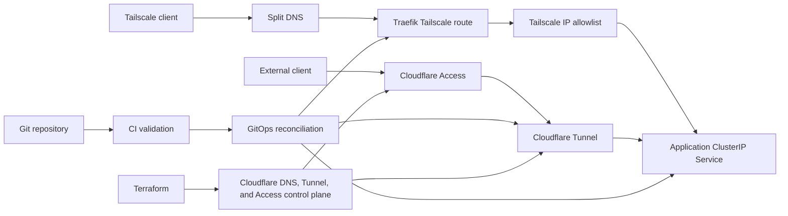

# Future Plan: GitOps-Managed Cloudflare Tunnel Exposure

**Date:** 2026-07-10
**Status:** Parked -- future platform work
**Trigger:** Revisit when an internal Kubernetes service needs controlled access from outside the Tailscale network, or when two or more services need the same Cloudflare exposure pattern.
**Related:** `2026-07-10-karakeep-tailscale-only-deployment-final.gpt.md`, `2026-07-10-karakeep-tailscale-only-deployment-final.claude.md`

## Objective

Create a reusable, GitOps-driven path for selectively exposing internal Kubernetes Services through Cloudflare Tunnel and Cloudflare Access without coupling application images to networking agents or weakening existing Tailscale-only routes.

The platform must support two independent exposure paths to the same application Service:

- Tailscale clients use split DNS, Traefik, and a route-specific Tailscale source-address allowlist.
- Approved external clients use Cloudflare Access and Cloudflare Tunnel.

Applications remain behind ClusterIP Services and do not need to know which transport delivered a request.

## Architecture



## Design Principles

### Keep application and connector lifecycles separate

Do not bake `cloudflared` into Karakeep or any other application image.

Use the official `cloudflared` image in a separate Deployment. This allows the connector to be scaled, upgraded, restarted, and diagnosed independently of applications. Tunnel configuration changes must not require application image rebuilds.

### Use a shared cluster connector first

Start with one cluster-level, remotely managed Cloudflare Tunnel and a separate `cloudflared` Deployment with at least two replicas when node capacity and availability requirements justify it.

The connector can reach approved ClusterIP Services through Kubernetes DNS. Do not create one tunnel or sidecar per application without a demonstrated isolation or ownership requirement.

### Keep exposure adapters route-specific

The Tailscale source-address middleware belongs only to the Tailscale IngressRoute. Do not attach it to the application Service or application-level middleware shared by every route.

Cloudflare Tunnel traffic will originate from `cloudflared`, not from the end user's Tailscale address. A global Tailscale allowlist would block the tunnel.

Prefer routing the tunnel directly to the application ClusterIP Service:

```text
http://<service>.<namespace>.svc.cluster.local:<port>
```

If a future application requires Traefik-specific middleware on the Cloudflare path, create a separate origin route with its own protection and never reuse the Tailscale-only route blindly.

### Deny by default at Cloudflare Access

Every externally published hostname must have a Cloudflare Access application and an explicit Allow policy. No policy match means denial.

Support:

- Identity-provider authentication.
- Optional device posture requirements.
- Optional independent MFA.
- Service tokens for approved machine clients.
- Short, deliberate session lifetimes based on application sensitivity.

Validate the Cloudflare Access token at the origin or configure the tunnel to validate it. Edge authentication without origin validation leaves bypass risk if another origin path appears later.

Application authentication remains enabled as defense in depth unless the application has an explicitly reviewed trusted-header or identity integration.

### Never embed credentials

Tunnel tokens and service tokens must never appear in:

- Container images or image layers.
- Dockerfiles.
- Helm values committed to Git.
- Terraform state when an alternative reference mechanism is supported.
- CI logs or artifacts.
- Rendered diagnostics.

Bitwarden remains the source of truth. Credentials flow through the existing `bw-sync.sh` and Kubernetes Secret path or a future external-secrets mechanism selected by a separate design.

## Ownership Boundaries

| Resource | Owner |
|---|---|
| Cloudflare Tunnel object | Terraform |
| Published application routes | Terraform |
| Cloudflare DNS records | Terraform |
| Cloudflare Access applications and policies | Terraform |
| Tunnel and service-token source credentials | Bitwarden |
| Kubernetes Secret materialization | `bw-sync.sh` and the cluster secret workflow |
| `cloudflared` Deployment | GitOps-managed Helm release |
| Application Deployment and Service | Application Helm release through GitOps |
| Host, k3s, storage, firewall, and bootstrap | Ansible |
| Validation and promotion gates | CI |

Terraform, Ansible, and the GitOps controller must not reconcile the same Kubernetes or Cloudflare object. Migration between owners requires an explicit state-adoption procedure.

## Recommended Delivery Model

### Cloudflare control plane

Create reusable Terraform modules for:

- Remotely managed Tunnel creation.
- Public hostname and route configuration.
- DNS record management.
- Cloudflare Access application creation.
- Access policies and service-token references.
- Optional WAF, rate-limit, or bot rules scoped to the hostname.

Keep application-specific inputs small:

```hcl
hostname       = "bookmarks.example.com"
origin_service = "http://karakeep.irl.svc.cluster.local:3000"
access_policy  = "irl-members"
```

Do not place tunnel token values in Terraform variables or committed configuration.

### Kubernetes connector

Deploy `cloudflared` using a pinned official image and a reviewed Helm chart or a small IRL-owned chart if no suitable maintained chart exists.

The release must include:

- Runtime Secret reference for the tunnel token.
- At least one connector replica initially; two for availability after resource validation.
- Pod anti-affinity or topology spread when multiple suitable nodes exist.
- Resource requests and limits.
- Readiness and liveness checks.
- `automountServiceAccountToken: false` unless required.
- Restricted security context.
- Logs and connector-health monitoring.
- Explicit egress allowance to Cloudflare endpoints under the cluster's policy model.
- No inbound LoadBalancer or NodePort.

### GitOps reconciliation

Adopt GitOps in phases rather than moving every resource at once:

1. GitOps owns the `cloudflared` connector release.
2. GitOps owns application Helm releases selected for migration.
3. Ansible stops reconciling each migrated release.
4. Ansible continues to own node configuration, k3s bootstrap, storage, firewall, and prerequisite controllers.

The Git repository is the desired-state source for non-secret Kubernetes resources. CI validates changes before merge; the GitOps controller reconciles only merged desired state.

## CI and Promotion Requirements

Before reconciliation, CI must:

- Validate Terraform formatting and configuration.
- Generate and review Terraform plans without printing secrets.
- Pin and render Helm charts.
- Reject LoadBalancer and NodePort Services unless explicitly allowed.
- Reject embedded tunnel tokens, service tokens, and secret values.
- Validate Kubernetes schemas.
- Run policy checks for privileged containers, host networking, token automounting, and mutable image tags.
- Verify application routes target approved namespaces and Services.
- Confirm every public hostname has a corresponding Access application and deny-by-default policy.
- Confirm Tailscale and Cloudflare routes use different exposure policies.

Promotion should be pull-request driven. Production reconciliation begins only after validation and review pass.

## Phased Work Plan

### Phase 0: Trigger and requirements

Start this work only when a real external-access requirement exists.

For the first candidate application, document:

- Intended users.
- Human versus machine access.
- Identity provider.
- Device posture and MFA requirements.
- Public hostname.
- Application authentication behavior.
- Data sensitivity.
- Expected traffic.
- Availability target.
- Required callback, WebSocket, streaming, upload, and mobile-client behavior.

**Exit criteria:** The external-access requirement cannot be met adequately through Tailscale alone and has an approved identity and risk model.

### Phase 1: Research and proof of concept

1. Review current Cloudflare Tunnel, Access, Terraform provider, and Kubernetes deployment documentation.
2. Evaluate maintained Helm charts for `cloudflared` before creating an IRL chart.
3. Create a non-production remotely managed tunnel.
4. Deploy a single connector replica in Kubernetes.
5. Route to a disposable ClusterIP test Service.
6. Protect the hostname with a deny-by-default Access application.
7. Validate human login, denial, logout, session expiry, and service-token access.
8. Confirm the origin is unreachable without the tunnel path.

**Exit criteria:** A disposable application is accessible only through the intended Access policy, and no credential is committed or embedded in an image.

### Phase 2: Terraform modules

1. Add Terraform modules for Tunnel, route, DNS, Access application, and policy resources.
2. Define naming and workspace conventions.
3. Define deletion protection and teardown ordering.
4. Import proof-of-concept resources into Terraform state or recreate them deliberately.
5. Add plan-time validation for missing Access protection.
6. Document credential bootstrapping without exposing token values.

**Exit criteria:** The complete Cloudflare control plane is reproducible from reviewed Terraform configuration.

### Phase 3: Production connector

1. Select and pin the connector chart and image.
2. Add the tunnel token to Bitwarden.
3. Add the secret synchronization mapping.
4. Deploy the connector through the selected GitOps controller.
5. Add a second replica if capacity and topology support useful redundancy.
6. Add health, restart, connection-count, and authentication-failure monitoring.
7. Document rotation and tunnel-revocation procedures.

**Exit criteria:** The connector is reproducible, observable, credential-safe, and survives a pod restart without application changes.

### Phase 4: First application exposure

1. Select an existing ClusterIP Service without changing its application image.
2. Create the public hostname, Tunnel route, DNS record, Access application, and policies through Terraform.
3. Route the tunnel directly to the ClusterIP Service where possible.
4. Retain the Tailscale route as a separate path if still required.
5. Validate application base URLs, cookies, callback URLs, CSRF behavior, WebSockets, uploads, and redirects through both hostnames.
6. Validate Access-token enforcement at the origin.
7. Verify direct origin bypass fails.
8. Add application-specific runbook and rollback instructions.

**Exit criteria:** External users can use the application through Access, unauthorized clients are denied, and the Tailscale path remains independently functional.

### Phase 5: GitOps migration

1. Select the GitOps controller through a separate comparison if none is already adopted.
2. Move connector desired state from transitional Ansible ownership to GitOps.
3. Move selected application Helm releases one at a time.
4. Remove the corresponding Ansible reconciliation only after GitOps health is proven.
5. Add drift, reconciliation-failure, and stale-release alerts.
6. Test disaster recovery from Git plus Bitwarden plus Terraform state.

**Exit criteria:** Each migrated object has exactly one reconciler, and a clean-cluster recovery can restore the connector and application without manual configuration drift.

### Phase 6: Reusable exposure abstraction

After at least two or three applications demonstrate the same inputs and lifecycle, decide whether to add a higher-level abstraction.

Start with a reusable Terraform module and shared Helm values. Consider an operator or CRD only if repetition still creates significant operational cost.

A possible future interface is:

```yaml
apiVersion: networking.irl.dev/v1alpha1
kind: ExternalExposure
metadata:
  name: karakeep
spec:
  service:
    name: karakeep
    namespace: irl
    port: 3000
  hostname: bookmarks.example.com
  accessPolicy: irl-members
```

An operator would introduce controller credentials, reconciliation semantics, finalizers, deletion safety, CRD upgrades, status reporting, and cross-control-plane drift. Do not build it before the simpler module approach proves inadequate.

## Karakeep Extension Point

The current Karakeep deployment must preserve these future capabilities:

- Keep Karakeep behind a stable ClusterIP Service.
- Keep the Tailscale source allowlist attached only to its Tailscale IngressRoute.
- Do not embed `cloudflared` in the Karakeep image or pod.
- Keep exposure resources separate from application resources.
- Keep application authentication enabled.
- Test configuration that depends on canonical origin or base URL before adding a second hostname.
- Keep storage, backup, Secrets, and application rollout independent of exposure changes.

When external exposure is enabled, the tunnel should target the Karakeep ClusterIP Service directly unless a reviewed requirement makes Traefik part of that path.

## Security Validation

For every exposed application, test:

- An allowed identity succeeds.
- A denied identity fails.
- An unauthenticated request fails.
- An expired session fails or reauthenticates as configured.
- A valid service token succeeds only for its intended path and policy.
- A missing or invalid service token fails.
- Direct origin access fails.
- Forged Cloudflare or forwarding headers do not bypass Access validation.
- The Tunnel route cannot reach unrelated Services.
- The connector Secret is not readable by application ServiceAccounts.
- Revoking the Tunnel credential disconnects the connector.
- Rotating the Tunnel credential does not rebuild application images.
- Removing an application route does not remove retained application data.

## Rollback

Application exposure rollback must not roll back the application itself:

1. Disable the Cloudflare Access application or Tunnel route through Terraform.
2. Confirm the public hostname no longer reaches the origin.
3. Preserve the Tailscale route if it remains approved.
4. Preserve application Deployments, Services, storage, and Secrets.
5. Roll back the connector release only for connector-specific failures.
6. Revoke compromised Tunnel or service-token credentials through the approved secret-rotation procedure.

Do not destroy the Tunnel, DNS, Access application, or credential source until rollback verification is complete.

## Non-Goals

- Baking `cloudflared` into application images.
- One tunnel sidecar per application by default.
- Anonymous publication without Access review.
- Replacing application authentication automatically.
- Building a custom operator before repeated use proves the need.
- Moving host and k3s bootstrap ownership from Ansible to GitOps.
- Allowing Terraform, Ansible, and GitOps to reconcile the same object.

## Definition of Done

The future exposure platform is complete when a reviewed Git change can create a Cloudflare Access-protected public hostname, route it through a shared observable Kubernetes `cloudflared` connector to an approved ClusterIP Service, keep all credential values out of Git and images, coexist with a separate Tailscale-only route, reject direct-origin bypass, and recover from Git, Terraform state, and Bitwarden without manual configuration drift.

## References

- [Cloudflare Tunnel Kubernetes deployment guide](https://developers.cloudflare.com/cloudflare-one/networks/connectors/cloudflare-tunnel/deployment-guides/kubernetes/)
- [Cloudflare Access self-hosted application guide](https://developers.cloudflare.com/cloudflare-one/access-controls/applications/http-apps/self-hosted-public-app/)
