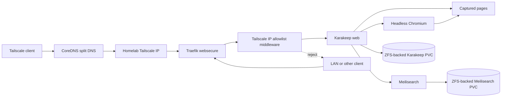

# Final Plan: Karakeep on Homelab k3s with Tailscale-Only Access

**Date:** 2026-07-10
**Status:** Proposed final plan
**Synthesizes:** The primary and alternate plans, both independent reviews of each plan, and the GPT and Claude comparison documents
**Goal:** Deploy Karakeep reproducibly through Ansible, preserve its data on ZFS, and reject user access unless the client source address belongs to the IRL tailnet.

## Executive Decision

Deploy the official Karakeep Helm chart through the existing Ansible Helm workflow. Pin the chart version and render-test its complete output before deployment. Do not create an `irl-karakeep` wrapper chart unless the pinned official chart cannot express one of the hard requirements below.

Use the official chart for the web, Chromium, and Meilisearch workloads, with IRL overrides for:

- Stable Bitwarden-backed Secrets.
- Disabled upstream Ingress.
- A standalone Traefik IngressRoute.
- A Karakeep-specific Tailscale source-address allowlist.
- ZFS-backed retained persistence.
- Data-node scheduling.
- Resource controls and health checks.
- Alpine/musl DNS mitigation.
- Registration closure.

Use `bookmarks.lab.infiniteroomlabs.cloud` as the canonical hostname. It follows the current service naming convention and remains discoverable only through the split-DNS view. DNS is not the security boundary: the Traefik route must also reject source addresses outside Tailscale's address ranges.

For phase 1, explicitly accept the cluster's existing namespace-wide pod reachability. Do not claim that Karakeep-specific NetworkPolicies isolate Chromium or Meilisearch while `allow-intra-namespace` remains in effect. Refactoring the namespace policy is a separate homelab-wide project.

## Success Criteria

The deployment is complete only when:

- Karakeep, Chromium, and Meilisearch are healthy on the homelab data node.
- The official chart and all relevant image versions are pinned and recorded.
- Application and search data use deterministic ZFS-backed storage with retained PVs.
- A tested independent backup can restore bookmarks, archived content, and authentication state.
- The upstream chart cannot regenerate authentication or Meilisearch secrets during an upgrade.
- Karakeep is reachable at `https://bookmarks.lab.infiniteroomlabs.cloud` from a Tailscale client.
- The same route rejects LAN and other non-tailnet clients even when they use the correct SNI and Host header.
- No Karakeep LoadBalancer, NodePort, public Ingress, Tailscale Funnel, or Tailscale Serve endpoint exists.
- Open signup is closed after the controlled initial-account procedure.
- A page can be captured through Chromium, indexed by Meilisearch, found after restart, and restored from backup.
- Monitoring, acceptance tests, access documentation, and a service-down runbook exist.

## Architecture



## Settled Design Decisions

### Packaging

Use `karakeep-app/karakeep` from `https://karakeep-app.github.io/helm-charts`.

Pin `chart_version` to the version selected during implementation. Version `0.32.0` was current during the reviews, but implementation must confirm the current hardened package-manager age policy, chart contents, application version, dependencies, and release notes before selecting the actual pin.

The official chart is preferred because its bjw-s values paths, Service names, bundled Chromium workload, and Meilisearch dependency were verified by the independent reviews. A custom chart would duplicate this behavior and add a chart publication lifecycle.

Create an IRL chart only if render-time validation proves that the pinned official chart cannot support deterministic retained storage, stable external Secrets, required pod DNS configuration, or security settings. Record that finding before changing packaging direction.

### Namespace

Use the existing `irl` namespace.

The cluster's `allow-intra-namespace` policy already permits all same-namespace pod traffic. Kubernetes NetworkPolicy rules are additive, so new Karakeep policies cannot subtract that access. Phase 1 will not pretend otherwise.

The deployment may add egress policy for internet access if it meaningfully constrains traffic not already allowed, but the acceptance criteria must not claim pod-to-pod isolation. A later homelab-wide policy project must either replace the blanket allowance with label-based rules or intentionally retain namespace-wide trust.

### Hostname and DNS

Use:

```text
https://bookmarks.lab.infiniteroomlabs.cloud
```

Add Karakeep to `irl_services` with:

```yaml
karakeep:
  subdomain: "bookmarks"
  internal: false
  cluster_svc: "karakeep"
  cluster_port: 3000
  health_path: "/api/health"
```

Add the matching entry to `irl_traefik_standalone_services`.

The current CoreDNS zone contains a wildcard, so the hostname may resolve even if the explicit record is not reloaded. The zone serial is hardcoded, which is a pre-existing defect. Fix the serial behavior as part of this implementation by choosing one of these repository-owned mechanisms:

1. Render a monotonically increasing SOA serial from Ansible-managed data; or
2. Roll out CoreDNS after the ConfigMap changes and document the wildcard dependency.

Prefer a real serial update. DNS verification must distinguish the explicit record from wildcard resolution by inspecting the rendered zone and querying the configured internal resolver directly.

No public Cloudflare record will be created for Karakeep.

### Strict Tailscale-only route enforcement

The existing nftables configuration accepts ports 80 and 443 on every interface, and Traefik uses `hostNetwork`. Split DNS alone therefore does not provide Tailscale-only access.

Do not globally restrict shared Traefik ports to `tailscale0` as part of this service deployment. That would change every existing HTTP service and requires its own blast-radius analysis.

Instead, create a Karakeep-specific Traefik `IPAllowList` middleware and attach it only to the Karakeep IngressRoute. Allow:

```text
100.64.0.0/10
fd7a:115c:a1e0::/48
```

These are the Tailscale IPv4 CGNAT and Tailscale ULA ranges. At implementation time, verify the actual client source address observed by Traefik and the current `forwardedHeaders` trust configuration. The middleware must evaluate the direct client address, not an attacker-controlled forwarding header.

If source-address preservation or Traefik trust behavior prevents reliable enforcement, stop before enabling ingress and use a dedicated Tailscale-bound ingress controller or entrypoint instead. Do not downgrade silently to split-DNS-only access.

Acceptance must include direct-IP requests with the correct SNI and Host header from both tailnet and non-tailnet clients.

### Workloads

The pinned chart must render:

| Workload | Purpose | Port | Persistence |
|---|---|---:|---|
| Karakeep | UI, API, SQLite state, assets, and capture orchestration | 3000 | `/data` |
| Chromium | Browser rendering and screenshots | 9222 | None |
| Meilisearch | Full-text index | 7700 | `/meili_data` |

All workloads must use:

```yaml
nodeSelector:
  irl.dev/tier: data
```

Set `automountServiceAccountToken: false` unless a rendered workload proves it needs Kubernetes API access.

### Versions and rendered contract

WP1 must select and record:

- Official chart version.
- Karakeep image tag and digest where practical.
- Meilisearch image tag and digest where practical.
- Chromium image tag and digest where practical.
- bjw-s library version.
- Meilisearch subchart version.
- Application database format and migration behavior.
- Supported health endpoints.
- Registration-disable setting.
- Supported AI-provider variables, even though AI remains disabled.

The values contract depends on an upstream typo, `secrets.meilesearch`. Pinning is mandatory because a future correction of that typo could silently invalidate the override.

Render the complete chart before deployment and assert that:

- No chart-generated credentials remain.
- No upstream Ingress remains.
- All Services are ClusterIP.
- The expected external Secrets are referenced.
- The expected PVC strategy is rendered.
- All images and chart dependencies match the compatibility record.
- The `envFrom` and `volumeClaimTemplates` list replacements retain all required entries.

### Secrets

Use one Bitwarden item per secret value because `bw-sync-config.yaml` does not select arbitrary fields from one item.

Create:

- `karakeep-nextauth-secret`
- `karakeep-meili-master-key`

Verify whether the pinned official chart requires `NEXT_PUBLIC_SECRET`. The upstream Kustomize sample contains it, but the official chart and documented configuration may not. Do not create it unless the pinned deployment consumes it.

Use two Kubernetes Secrets for least privilege:

| Secret | Key | Consumers |
|---|---|---|
| `karakeep-secrets` | `NEXTAUTH_SECRET` | Karakeep only |
| `karakeep-meili-secrets` | `MEILI_MASTER_KEY` | Karakeep and Meilisearch |

Add the Bitwarden mappings to `scripts/bw-sync-config.yaml`.

Add explicit `no_log: true` tasks to `ansible/playbooks/k8s-secrets.yml` so a full `site.yml` rebuild can recreate both Secrets from the encrypted vault. Guard each task on every value it interpolates, not only one value.

The repository intentionally has two delivery paths:

- `bw-sync.sh` writes from Bitwarden to the encrypted Ansible vault and can write directly to Kubernetes.
- `k8s-secrets.yml` recreates Kubernetes Secrets from vault variables during a full site deployment.

Bitwarden remains authoritative. The Ansible task exists for rebuild reproducibility, not as a second source of truth.

Disable both chart-generated secrets. Document beside the values overrides that the `envFrom` list replaces the chart default and is a paired invariant with `secrets.*.enabled: false`. A future editor must not change one side without reviewing the other.

Never place secret values in committed values, rendered diagnostics, Ansible output, or documentation.

### Persistence

Create two ZFS datasets:

| Dataset | Mountpoint | Initial quota | Purpose |
|---|---|---:|---|
| `main/karakeep-data` | `/media/root/storage1/karakeep-data` | 50G | SQLite database, archived content, assets, and application state |
| `main/karakeep-meilisearch` | `/media/root/storage1/karakeep-meilisearch` | 20G | Search index |

Use `compression=lz4` and `atime=off`.

Create retained static PVs with unique labels, node affinity, and deterministic PVC binding:

- `pv-karakeep-data`
- `pv-karakeep-meilisearch`

Use `zfs-local`, `ReadWriteOnce`, and `persistentVolumeReclaimPolicy: Retain`.

During WP1, render the pinned chart and select one supported binding method:

1. Set unique PVC selectors in the StatefulSet volume claim templates to match unique PV labels; or
2. Precreate PVCs with explicit `volumeName` and configure the chart to mount them as existing claims.

Prefer precreated PVCs with explicit `volumeName` if the chart supports existing claims cleanly. Do not rely only on class and capacity matching.

Identify the runtime UID and GID of Karakeep and Meilisearch before provisioning. Add idempotent ownership and mode tasks to `ansible/playbooks/zfs.yml`. Do not recursively chown a populated dataset during every normal run.

### Backup and consistency

A snapshot on the same ZFS pool is not an independent backup.

Before ingress is enabled, define:

- Independent backup destination.
- Encryption and transport.
- Retention.
- RPO and RTO.
- Sanoid or equivalent dataset coverage.
- Backup-failure visibility.
- Restore host and path.

Confirm the Karakeep database format for the pinned release. If it is SQLite, use an upstream-supported consistent backup method or quiesce Karakeep before the ZFS snapshot so the database and WAL state are recoverable. Decide whether Meilisearch will be backed up consistently or rebuilt from Karakeep state.

Acceptance requires restoration from the independent backup artifact into an isolated validation target or controlled maintenance window. A same-pool snapshot rollback does not satisfy this criterion.

### Chromium and DNS

The reviewed upstream Chromium image is Alpine-based and the cluster has a known musl plus Kubernetes `ndots:5` external-resolution failure.

Set `dnsConfig` with `ndots: "1"` on the Karakeep and Chromium pods if validation confirms the pinned images are affected. Test external DNS from inside both workloads before testing page capture.

Evaluate a maintained Chromium image during WP1. The reviewed Zenika Chrome 124 image appears old. Record required capabilities and flags for the selected image.

Choose one shared-memory strategy:

- Keep `--disable-dev-shm-usage` and do not add a `/dev/shm` memory volume; or
- Remove the flag and mount a size-limited memory-backed `emptyDir` at `/dev/shm`.

Do not configure both.

Review and minimize Chromium's `SYS_ADMIN`, sandbox-disabling flags, root use, writable filesystem, and other capabilities. Document every exception that remains.

### Resources and probes

Start with these upper bounds, subject to a node-capacity preflight:

| Workload | CPU request | CPU limit | Memory request | Memory limit |
|---|---:|---:|---:|---:|
| Karakeep | 200m | 1000m | 512Mi | 2Gi |
| Chromium | 250m | 1500m | 512Mi | 2Gi |
| Meilisearch | 200m | 1000m | 512Mi | 2Gi |

Before deployment, compare existing allocatable capacity, requests, limits, and observed peak use on the data node. Adjust these values before scheduling if the additional approximately 1.5 GiB of requests or 6 GiB of limits would create unacceptable pressure.

Use `/api/health` for the external Karakeep health check if confirmed by the pinned release. Define probes so that:

- Liveness measures process health and does not restart Karakeep merely because Meilisearch or the internet is unavailable.
- Readiness blocks ingress until Karakeep can safely serve requests.
- Startup allows migrations and initialization to complete.
- Meilisearch uses `/health`.
- Chromium uses a supported endpoint or TCP readiness check.

Record expected status codes and failure semantics during WP1.

### Authentication and signup

Deploy with no public registration window.

WP1 must confirm the pinned release's supported bootstrap and signup controls. Prefer one of:

1. Create the initial account while ingress is withheld, then set `DISABLE_SIGNUPS=true` before enabling the route; or
2. Use a supported bootstrap-admin mechanism with signups disabled from the first externally reachable deployment.

Acceptance must include a failed unauthenticated registration attempt after ingress is enabled.

Authentik OIDC and Ollama integration are deferred. Preserve a documented local break-glass login if OIDC is added later.

## Repository Changes

| File | Required change |
|---|---|
| `scripts/bw-sync-config.yaml` | Add one mapping per Karakeep secret value |
| `ansible/playbooks/k8s-secrets.yml` | Create the two external Secrets with complete guards and `no_log` |
| `ansible/inventory/group_vars/all/main.yml` | Add datasets, service metadata, health path, and standalone route metadata |
| `ansible/playbooks/zfs.yml` | Provision dataset ownership and modes |
| `ansible/playbooks/k3s.yml` | Add deterministic retained PVs and precreated PVCs if that binding method is selected |
| `ansible/helm/karakeep/values.yaml` | Add the pinned-chart overrides and document list-replacement invariants |
| `ansible/playbooks/helm-deploy.yml` | Add Karakeep to the values-directory loop, Helm repository list, values copy, pinned Helm deployment, and rollout checks |
| `ansible/templates/ingressroute-standalone.yaml.j2` or a Karakeep-specific template | Attach the Tailscale allowlist middleware |
| New Traefik middleware template | Define the IPv4 and IPv6 Tailscale source ranges |
| `ansible/templates/coredns-internal-zone.db.j2` | Correct SOA serial handling or pair changes with an explicit rollout mechanism |
| `ansible/helm/homepage/values.yaml` | Add Karakeep only after acceptance |
| Monitoring configuration | Add workload availability, restart, backup, and PVC usage coverage |
| `tests/` | Add render, DNS, HTTPS, exposure, persistence, upgrade, and restore tests |
| `docs/homelab-access-guide.md` | Add access and client requirements |
| `ansible/docs/runbooks/karakeep-service-down.md` | Add component and route diagnostics |
| `ansible/docs/sops/backup-and-restore.md` | Add consistent backup and restore steps |
| `CHANGELOG.md` | Record the integration |

Do not modify `vault.yml` manually. Do not deploy the chart directly with Helm or apply desired-state resources by hand with kubectl.

## Work Packages

### WP1: Pin and validate the upstream contract

1. Select the exact official chart version.
2. Record all chart, dependency, and image versions.
3. Render the chart with proposed IRL overrides.
4. Verify Service names, ports, probes, environment variables, database format, migrations, signup controls, and Secret references.
5. Verify the `meilesearch` key behavior and bjw-s list replacement semantics.
6. Determine supported storage override and deterministic binding method.
7. Determine runtime UIDs and GIDs.
8. Evaluate Chromium maintenance status, capabilities, flags, and shared-memory strategy.
9. Test image architecture support for the data node.
10. Record the compatibility matrix in the plan or chart values comments.

**Gate:** No storage, Secret, or workload implementation begins until the rendered contract is reviewed.

### WP2: Implement durable storage and backup

1. Add the two ZFS datasets and quotas.
2. Add ownership and mode tasks for the selected runtime IDs.
3. Add retained PVs with unique labels and node affinity.
4. Add deterministic PVC binding using the method selected in WP1.
5. Add the datasets to the backup system.
6. Define independent destination, encryption, retention, RPO, and RTO.
7. Document the SQLite-consistent snapshot or quiesce procedure.
8. Define whether Meilisearch is restored or rebuilt.

**Gate:** Do not deploy Karakeep until storage binds deterministically and an independent backup path exists.

### WP3: Implement stable Secrets

1. Create one Bitwarden item per required value.
2. Add bw-sync mappings into the two Kubernetes Secrets.
3. Add guarded `k8s-secrets.yml` tasks with `no_log`.
4. Synchronize through the approved wrapper.
5. Verify Secret names and key names without printing values.
6. Render the chart and prove that no generated credentials remain.
7. Record hashes before deployment without exposing Secret data so upgrade stability can be tested later.

**Gate:** Both direct synchronization and a full-site rebuild path must reproduce the same Secret objects.

### WP4: Integrate the pinned chart

1. Add `karakeep` to the values-directory creation loop.
2. Add the official Helm repository.
3. Copy the static values file through Ansible.
4. Add the pinned `kubernetes.core.helm` task in Phase 3.
5. Apply data-node scheduling, DNS mitigation, resources, probes, security contexts, and persistence overrides.
6. Disable chart-generated Secrets and upstream Ingress.
7. Add rollout checks for Karakeep, Chromium, and Meilisearch.
8. Run Helm lint or the supported validation for the pinned package.

**Gate:** The rendered release contains only ClusterIP Services, no upstream Ingress, no generated credentials, and the intended storage references.

### WP5: Add DNS and strict tailnet route enforcement

1. Add Karakeep to `irl_services` and `irl_traefik_standalone_services`.
2. Fix or explicitly reload the CoreDNS zone serial.
3. Create the Tailscale IP allowlist middleware.
4. Attach the middleware to only the Karakeep IngressRoute.
5. Verify Traefik observes the expected Tailscale source address.
6. Verify forwarded headers cannot bypass the middleware.
7. Keep ingress withheld until the initial account exists and signups are disabled.
8. Enable the route and execute tailnet and non-tailnet tests.

**Gate:** A non-tailnet client using direct IP, correct SNI, and correct Host header must receive rejection while a tailnet client succeeds.

### WP6: Validate application behavior and persistence

1. Confirm external DNS from inside Karakeep and Chromium.
2. Save a static page and a JavaScript-heavy page.
3. Confirm screenshots and archived content exist.
4. Confirm both pages are searchable.
5. Restart each workload independently.
6. Restart the complete release.
7. Confirm authentication, captured data, and search remain intact.
8. Rerun the Helm deployment and confirm Secret hashes and login sessions remain stable.
9. Test normal upgrade and rollback behavior with the pinned version contract.

**Gate:** Capture, rendering, search, restart, and idempotent Helm upgrade tests all pass.

### WP7: Test backup and recovery

1. Create representative bookmarks, archived content, and an attachment.
2. Produce an independent backup using the defined consistency procedure.
3. Restore into an isolated validation target or controlled maintenance window.
4. Confirm authentication, bookmarks, assets, and archived content.
5. Restore or rebuild Meilisearch and confirm search.
6. Record actual recovery time and compare it with the RTO.
7. Confirm backup-failure monitoring is visible.

**Gate:** Recovery from the independent backup artifact succeeds. Same-pool snapshot rollback alone does not pass.

### WP8: Add operations and documentation

1. Add Homepage only after the service passes acceptance.
2. Add deployment, restart, PVC usage, and backup alerts.
3. Add repository smoke and validation tests.
4. Add the access guide entry.
5. Add the service-down runbook.
6. Add backup, restore, upgrade, rollback, and decommission instructions.
7. Update the changelog.

**Gate:** A maintainer can deploy, access, diagnose, back up, restore, upgrade, roll back, and decommission Karakeep from repository documentation alone.

## Validation Matrix

### Static and render checks

- The chart version is explicitly pinned.
- All expected dependency and image versions match the compatibility record.
- No rendered Secret contains chart-generated credentials.
- The Karakeep pod imports both external Secrets.
- Meilisearch imports only `karakeep-meili-secrets`.
- The upstream Ingress is disabled.
- Every Service is ClusterIP.
- PVCs bind deterministically to the intended retained PVs.
- All workloads schedule on the data node.
- Service-account token automounting is disabled unless justified.
- Resource settings and probes render as intended.
- Markdown and repository encoding checks pass.

### DNS and ingress checks

- Query the internal CoreDNS resolver directly and receive the intended record.
- Query public recursive resolvers directly and receive NXDOMAIN or NODATA for the unpublished name.
- Verify the explicit zone record rather than relying only on the wildcard.
- From a Tailscale client, verify HTTPS certificate hostname and `/api/health` response content.
- From a LAN client, use `curl --resolve` with the homelab LAN address and correct hostname; access must be rejected.
- From another non-tailnet routed client, repeat the direct-IP and Host-header test where possible.
- Verify forged `X-Forwarded-For` headers cannot bypass the allowlist.
- Confirm no LoadBalancer, NodePort, Funnel, Serve rule, or public DNS record exists.

### Application checks

- Initial administrative account works.
- Unauthenticated signup fails after route enablement.
- Static and JavaScript-heavy page capture succeeds.
- Chromium produces the expected archived representation.
- Meilisearch returns saved content.
- Dependency failure does not trigger inappropriate liveness restarts.
- Recovery after dependency restoration is automatic or documented.

### Persistence and lifecycle checks

- Both PVCs remain bound after pod and release restarts.
- Data survives a Helm rerun.
- Secret hashes do not change during an idempotent upgrade.
- The active session remains valid after an idempotent upgrade.
- The backup restores SQLite state and archived assets consistently.
- Search is restored or rebuilt successfully.
- Helm uninstall behavior does not delete retained data.
- Rollback does not run an older application against incompatible migrated data without an explicit data restore.

## Rollback

Before user data exists:

1. Disable or remove the Karakeep IngressRoute through Ansible.
2. Roll back or uninstall the Helm release through desired state.
3. Preserve Bitwarden items, Kubernetes Secrets, PVCs, PVs, and ZFS datasets for diagnosis.
4. Confirm the route is gone and non-tailnet rejection remains unaffected for other services.

After user data exists:

1. Disable ingress to stop writes.
2. Take a consistency-safe snapshot.
3. Identify whether the application migration is backward compatible.
4. Roll back the chart and images only if the existing data format is compatible.
5. Otherwise restore application data from the pre-upgrade independent backup or snapshot according to the documented procedure.
6. Restore or rebuild Meilisearch.
7. Run the complete acceptance matrix before restoring ingress.

Never delete retained storage or Bitwarden items as part of application rollback. Data destruction requires an explicit decommission action.

## Deferred Homelab-Wide Work

These issues were exposed by the Karakeep review but affect every service and should be tracked separately:

1. Refactor nftables listener policy so shared HTTP services can express interface-specific exposure without relying only on application middleware.
2. Replace or explicitly accept the namespace-wide `allow-intra-namespace` trust model.
3. Make CoreDNS SOA serial updates reliable for every generated record.
4. Standardize pinned upstream Helm chart versions and render-contract tests across existing services.
5. Standardize independent ZFS backup coverage and recovery objectives for stateful applications.

The CoreDNS serial correction is included in this deployment because it directly affects the new hostname. The larger firewall and namespace-policy refactors are not required for Karakeep if the route-specific Tailscale middleware passes the negative access tests.

## Definition of Done

Karakeep is integrated when the pinned official chart is reproducibly deployed by Ansible, stable Bitwarden-backed Secrets survive upgrades, state resides on deterministic retained ZFS storage, an independent backup restores successfully, the route accepts verified tailnet source addresses and rejects non-tailnet clients even with direct-IP Host-header access, signups are closed, capture and search survive restarts, and all operational tests and documentation are complete.
