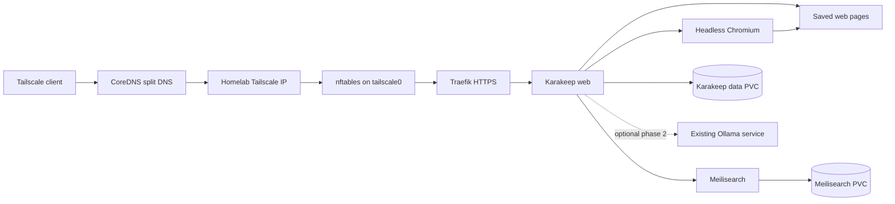

# Karakeep Tailscale-Only Kubernetes Deployment Plan

**Date:** 2026-07-10
**Status:** Proposed
**Scope:** Deploy Karakeep to the homelab k3s cluster with user access restricted to the Tailscale network.
**Upstream references:** [Karakeep Kubernetes installation](https://docs.karakeep.app/installation/kubernetes/), [Karakeep Kubernetes manifests](https://github.com/karakeep-app/karakeep/tree/main/kubernetes)

## Objective

Deploy Karakeep as a persistent, backed-up service in the existing `irl` Kubernetes namespace. Users will reach it at `https://keep.internal.lab.infiniteroomlabs.cloud` only while connected to the IRL tailnet. Karakeep may make controlled outbound internet connections to capture pages, but it must not expose a public ingress, LoadBalancer, NodePort, Tailscale Funnel, or Tailscale Serve endpoint.

The deployment must use the repository's established ownership boundaries:

- Ansible is the deployment orchestrator.
- An IRL-owned Helm chart defines the Kubernetes resources.
- Bitwarden is the source of truth for secrets.
- `bw-sync.sh` is the only write path from Bitwarden to the Ansible vault and Kubernetes Secrets.
- CoreDNS provides split DNS for the internal hostname.
- Traefik terminates HTTPS and routes to a ClusterIP Service.
- ZFS-backed retained PersistentVolumes hold application data.
- The existing nftables and Tailscale controls form the external access boundary.

## Upstream Workload Model

The upstream Kubernetes manifests deploy three workloads:

| Workload | Purpose | Internal port | Persistent data |
|---|---|---:|---|
| Karakeep web | UI, API, background jobs, and page capture orchestration | 3000 | `/data` |
| Chromium | Headless browser used to render captured pages | 9222 | None |
| Meilisearch | Full-text search index | 7700 | `/meili_data` |

The upstream configuration connects the web workload to Chromium with `BROWSER_WEB_URL` and to Meilisearch with `MEILI_ADDR`. It creates separate PVCs for Karakeep data and the Meilisearch index.

The upstream guide defaults to a separate `karakeep` namespace and demonstrates LoadBalancer or generic Ingress exposure. Those defaults will not be used because they do not match the homelab's shared namespace, Traefik, NetworkPolicy, DNS, or deployment model.

## Architecture



## Packaging Decision

### Options considered

1. Vendor the upstream Kustomize directory and maintain an IRL overlay.
2. Model the workloads with a generic application Helm chart.
3. Create an `irl-karakeep` chart in the existing `helm-charts` submodule.

### Decision

Create `helm-charts/charts/irl-karakeep/` and use the upstream manifests as the workload specification.

This adds some chart maintenance, but it fits the existing Ansible and Helm deployment path, provides first-class `existingSecret` support, makes persistence and scheduling explicit, and avoids brittle patches against upstream Kustomize files. The chart must remain small and Karakeep-specific rather than becoming a generic application framework.

Chart changes must be committed and pushed in the `helm-charts` submodule first. The parent infrastructure repository then records the updated submodule pointer.

## Design Decisions

### Namespace

Use the existing `irl` namespace. This preserves the current secret synchronization, monitoring, DNS, and deployment conventions.

The namespace already has default-deny policies and broad intra-namespace communication. Karakeep-specific NetworkPolicies should narrow access around the three Karakeep workloads without breaking existing namespace-wide policies.

### Hostname and ingress

Use:

```text
https://keep.internal.lab.infiniteroomlabs.cloud
```

The hostname will be added to `irl_services` with `internal: true`. CoreDNS will resolve it to the homelab Tailscale address for tailnet clients. No public Cloudflare DNS record will be created.

The chart will create a Traefik `IngressRoute` with:

- The `websecure` entrypoint only.
- Host match `keep.internal.lab.infiniteroomlabs.cloud`.
- Backend Service `karakeep` on port 3000.
- The existing `letsencrypt` DNS-01 certificate resolver.
- No HTTP-only route.
- No LoadBalancer or NodePort Service.

The existing wildcard certificate configuration includes `*.internal.lab.infiniteroomlabs.cloud`.

An internal hostname is not itself an access-control boundary. Tailscale-only access depends on all of the following remaining true:

1. The hostname is served by split DNS rather than public DNS.
2. The only Kubernetes Service exposed to Traefik is a ClusterIP.
3. nftables accepts the Traefik listener through `tailscale0` and rejects access through untrusted interfaces.
4. No Funnel, Serve, public reverse proxy, port-forward, or cloud load balancer is added.

### Image versioning

Pin all images to explicit versions. Do not use Karakeep's `release` tag and do not rely on `imagePullPolicy: Always` for upgrades.

Initial image values will include:

- A reviewed Karakeep release version current at implementation time.
- The Chromium version used by the reviewed upstream manifest, unless a more current supported image is selected during implementation.
- The Meilisearch version used by the reviewed upstream manifest.

Record the exact image tags and, where practical, digests in chart values. Upgrades must be deliberate chart changes followed by backup, rollout, and smoke testing.

### Scheduling

Schedule all three workloads on the homelab data node:

```yaml
nodeSelector:
  irl.dev/tier: data
```

The retained hostPath PVs are node-local. The workloads must not fail over to the DigitalOcean agent without a separate storage replication design.

### Persistence

Create two ZFS datasets:

| Dataset | Mountpoint | Initial quota | Purpose |
|---|---|---:|---|
| `main/karakeep-data` | `/media/root/storage1/karakeep-data` | 50G | Database, assets, archived pages, and application state |
| `main/karakeep-meilisearch` | `/media/root/storage1/karakeep-meilisearch` | 20G | Search index |

Use `compression=lz4` and `atime=off`. Confirm whether a workload-specific record size improves the actual data format before setting one; otherwise retain the ZFS default.

Create two static PersistentVolumes:

| PersistentVolume | StorageClass | Access mode | Reclaim policy |
|---|---|---|---|
| `pv-karakeep-data` | `zfs-local` | `ReadWriteOnce` | `Retain` |
| `pv-karakeep-meilisearch` | `zfs-local` | `ReadWriteOnce` | `Retain` |

The chart will create or bind claims named `karakeep-data` and `karakeep-meilisearch`. Use a `Recreate` deployment strategy for any workload that mounts a `ReadWriteOnce` claim to prevent rollout deadlocks.

The Karakeep data dataset is authoritative and must be backed up. The Meilisearch index is reconstructable in principle, but it should also be backed up to reduce recovery time. The restore procedure must document how to rebuild the index if it is intentionally omitted from a backup.

### Secrets and configuration

Create a Bitwarden item under `IRL/Services/Karakeep`. Generate independent high-entropy values for:

- `NEXTAUTH_SECRET`
- `MEILI_MASTER_KEY`
- `NEXT_PUBLIC_SECRET`

Add the item fields to `scripts/bw-sync-config.yaml`. Extend `ansible/playbooks/k8s-secrets.yml` only if the current generic synchronization path cannot create the required `karakeep-secrets` Secret.

The chart must reference the Secret by name. Secret values must not appear in chart defaults, environment-specific values, rendered debug output, Ansible logs, or documentation.

Non-secret configuration belongs in `ansible/helm/karakeep/values.yaml`:

```yaml
config:
  nextauthUrl: "https://keep.internal.lab.infiniteroomlabs.cloud"
  meiliAddr: "http://karakeep-meilisearch:7700"
  browserWebUrl: "http://karakeep-chrome:9222"
  dataDir: "/data"

existingSecret: karakeep-secrets
```

Map these values to the environment variables expected by the pinned Karakeep release. Verify the current variable names against the upstream configuration documentation during implementation.

### Authentication

Start with Karakeep's built-in authentication and disable open registration after the initial administrative account is created, if the pinned release supports that configuration.

Authentik integration is out of scope for the initial deployment. Treat OIDC as a follow-up after persistence, capture, search, and client integrations are stable. If OIDC is added, preserve a documented break-glass local login path.

### AI provider

Deploy phase 1 without an AI provider. Page capture, indexing, persistence, and Tailscale-only access must work independently of automatic tagging.

Evaluate the existing Ollama service in phase 2. Before enabling it, confirm:

- The exact provider variables supported by the pinned Karakeep release.
- Whether the available Ollama models support Karakeep's tagging and embedding workflows.
- Expected memory and CPU contention with Chromium and Meilisearch.
- Required NetworkPolicy access from the Karakeep web pod to Ollama.
- Behavior when Ollama is unavailable.

Use an external API provider only through a separately managed Bitwarden credential and Kubernetes Secret. Do not add an API key to a ConfigMap or committed Helm values.

### Resources

Use conservative initial resource settings and tune them from observed metrics:

| Workload | CPU request | CPU limit | Memory request | Memory limit |
|---|---:|---:|---:|---:|
| Karakeep web | 200m | 1000m | 512Mi | 2Gi |
| Chromium | 250m | 1500m | 512Mi | 2Gi |
| Meilisearch | 200m | 1000m | 512Mi | 2Gi |

Mount an in-memory `emptyDir` at `/dev/shm` for Chromium with an explicit size limit. The upstream manifest uses sandbox-disabling flags. Preserve only the flags required by the selected image, then document why each remaining flag is necessary. Prefer a non-root container and a restricted security context if the image supports them.

### Health checks

Add startup, readiness, and liveness probes based on endpoints supported by the pinned images:

- Karakeep web: HTTP health or root endpoint on port 3000.
- Chromium: TCP socket or supported health endpoint on port 9222.
- Meilisearch: `/health` on port 7700.

Startup probes must allow for migrations and index initialization without causing restart loops. Readiness must prevent Traefik from routing to an unready web pod.

### Network policy

The current namespace policies allow intra-namespace communication. Add workload labels and Karakeep-specific policies that express the intended traffic:

| Source | Destination | Ports | Reason |
|---|---|---|---|
| Traefik | Karakeep web | TCP 3000 | User ingress |
| Karakeep web | Chromium | TCP 9222 | Render captured pages |
| Karakeep web | Meilisearch | TCP 7700 | Search and indexing |
| Karakeep web | DNS | UDP/TCP 53 | Name resolution |
| Chromium | DNS | UDP/TCP 53 | Name resolution |
| Karakeep web | Internet | TCP 80/443 | Fetch pages and metadata |
| Chromium | Internet | TCP 80/443 | Render captured pages |

Meilisearch should not have general internet egress. Chromium and Meilisearch must not accept ingress from unrelated workloads.

Because Kubernetes NetworkPolicy cannot reliably express arbitrary internet destinations without also accounting for local and private ranges, implementation must test the actual CNI behavior. If broad `0.0.0.0/0` egress is required for the web and Chromium pods, exclude the cluster, service, LAN, and tailnet CIDRs where supported, then add explicit allowances for required internal destinations.

Tailscale-only applies to inbound user access. Outbound web access is an application requirement and must remain controlled but functional.

### Observability

At minimum, collect:

- Container logs through the existing Loki pipeline.
- CPU, memory, restart, and filesystem metrics through the existing Kubernetes monitoring stack.
- PVC usage alerts for both claims.
- Deployment availability alerts for the web, Chromium, and Meilisearch workloads.
- An HTTPS blackbox or smoke check against the final hostname from a Tailscale-connected runner.

Do not log secret-bearing environment variables or captured private page contents. Review Karakeep logging controls before enabling debug logging.

## Repository Changes

### Helm charts submodule

Create:

```text
helm-charts/charts/irl-karakeep/
  Chart.yaml
  values.yaml
  templates/
    _helpers.tpl
    deployment-web.yaml
    deployment-chrome.yaml
    deployment-meilisearch.yaml
    service-web.yaml
    service-chrome.yaml
    service-meilisearch.yaml
    pvc.yaml
    ingressroute.yaml
    networkpolicy.yaml
    NOTES.txt
```

Add chart linting and rendering tests consistent with the other IRL charts. Commit and push the chart in the submodule, then update the submodule pointer in this repository.

### Infrastructure repository

Modify:

| File | Change |
|---|---|
| `ansible/inventory/group_vars/all/main.yml` | Add ZFS datasets and the Karakeep service definition |
| `ansible/playbooks/k3s.yml` | Add retained ZFS-backed PVs |
| `scripts/bw-sync-config.yaml` | Map Karakeep Bitwarden fields to the Kubernetes Secret |
| `ansible/playbooks/k8s-secrets.yml` | Add explicit Secret handling only if the sync configuration is insufficient |
| `ansible/helm/karakeep/values.yaml` | Add environment-specific chart values |
| `ansible/playbooks/helm-deploy.yml` | Add the tagged Karakeep Helm release and rollout checks |
| `ansible/templates/coredns-internal-zone.db.j2` | No change expected; verify generation from `irl_services` |
| `tests/` | Add DNS, HTTPS, Kubernetes, persistence, and exposure tests |
| `docs/homelab-access-guide.md` | Add access and client setup information |
| `ansible/docs/runbooks/karakeep-service-down.md` | Add diagnosis and recovery steps |
| `ansible/docs/sops/backup-and-restore.md` | Add Karakeep datasets and restore ordering |
| `CHANGELOG.md` | Record the service deployment |
| `helm-charts` | Update the submodule pointer |

Do not modify `vault.yml` manually. Do not create secret-bearing temporary values files.

## Implementation Work Packages

### WP1: Validate upstream and reserve names

1. Record the Karakeep release selected for deployment.
2. Compare its environment-variable documentation with the upstream Kubernetes samples.
3. Confirm the required secret keys, migration behavior, and supported health endpoints.
4. Confirm `keep` is unused in `irl_services`, CoreDNS, Traefik routes, Homepage, and certificates.
5. Confirm the initial storage quotas fit the ZFS pool's free space.
6. Confirm no existing Service, PV, PVC, or Secret uses the proposed names.

**Exit criteria:** A pinned compatibility matrix lists the Karakeep, Chromium, and Meilisearch versions plus their required configuration.

### WP2: Implement the Helm chart

1. Create `irl-karakeep` in the Helm chart submodule.
2. Implement the three Deployments and ClusterIP Services.
3. Add existing-Secret configuration without secret defaults.
4. Add existing-claim persistence support.
5. Add the Traefik IngressRoute.
6. Add probes, resource controls, security contexts, labels, and NetworkPolicies.
7. Render and lint the chart with representative IRL values.
8. Inspect rendered YAML for accidental secret values, LoadBalancers, NodePorts, and unsafe defaults.

**Exit criteria:** Chart lint and template tests pass, and rendered resources match the design.

### WP3: Provision storage and secrets

1. Add the two ZFS datasets to Ansible.
2. Add the retained PV definitions.
3. Create the Bitwarden item and generated secret fields.
4. Add the sync mappings.
5. Run the secret synchronization through the authorized wrapper.
6. Verify only Secret names and keys, never values.
7. Confirm PVs are available before deploying the chart.

**Exit criteria:** Datasets exist with the intended properties, PVs are `Available`, and `karakeep-secrets` contains the expected key names.

### WP4: Add DNS, ingress, and deployment automation

1. Add Karakeep to `irl_services` with `internal: true`.
2. Add `ansible/helm/karakeep/values.yaml`.
3. Add Phase 3 Helm deployment tasks tagged `karakeep`.
4. Add rollout checks for all three Deployments.
5. Verify the generated internal DNS record.
6. Deploy with AI disabled.
7. Confirm the IngressRoute targets only the ClusterIP web Service.

**Exit criteria:** The application is healthy at the final HTTPS hostname from a Tailscale client.

### WP5: Security and exposure validation

1. Verify the hostname does not resolve through ordinary public DNS.
2. Verify no Karakeep Service has type LoadBalancer or NodePort.
3. Verify ports 80 and 443 cannot reach Traefik through non-Tailscale interfaces.
4. Verify no Tailscale Funnel or Serve rule exists for Karakeep.
5. Exercise each allowed NetworkPolicy path.
6. Verify prohibited pod-to-pod paths fail.
7. Verify Chromium and the web workload can fetch external HTTPS pages.
8. Verify Meilisearch cannot initiate arbitrary internet connections.
9. Run a namespace resource and security-context review.

**Exit criteria:** Tailscale is the only user ingress path and all required application egress still works.

### WP6: Persistence, backup, and recovery

1. Create a test account and save representative links, text, and an attachment.
2. Confirm search indexing completes.
3. Restart each pod independently and verify data remains available.
4. Restart all three Deployments and repeat verification.
5. Snapshot and back up both datasets using the existing backup system.
6. Restore into an isolated validation path or controlled maintenance window.
7. Verify bookmarks, attachments, authentication, and search after restore.
8. Document Meilisearch rebuild steps.

**Exit criteria:** A tested restore procedure meets the agreed recovery expectations.

### WP7: Documentation and operations

1. Add Karakeep to the homelab access guide and Homepage.
2. Add a service-down runbook with log, rollout, PVC, Chromium, Meilisearch, DNS, and ingress checks.
3. Add upgrade steps that require a backup and pinned image change.
4. Add PVC usage and workload availability monitoring.
5. Add acceptance tests to the smoke and validation suites.
6. Update the changelog.

**Exit criteria:** A maintainer can access, upgrade, diagnose, back up, and restore Karakeep from repository documentation alone.

### WP8: Optional Ollama integration

1. Select and test supported local models.
2. Add the required non-secret provider configuration.
3. Add the narrow NetworkPolicy path to Ollama.
4. Measure tagging latency and memory pressure.
5. Confirm Karakeep remains functional when Ollama is unavailable.
6. Add provider-specific monitoring and troubleshooting notes.

**Exit criteria:** Automatic tagging works without degrading capture reliability or exposing an external API credential.

## Deployment Procedure

Use the current `ansible/CLAUDE.md` execution convention at implementation time. The expected sequence is:

1. Install or update Ansible dependencies with `uv` if required.
2. Run the relevant playbooks in check and diff mode where supported.
3. Review storage, Secret metadata, chart rendering, and planned Kubernetes changes.
4. Apply the ZFS and k3s storage changes.
5. Synchronize secrets through `mise run secrets:sync` or the approved wrapper.
6. Deploy Karakeep with the `karakeep` tag.
7. Run Kubernetes rollout, DNS, HTTPS, exposure, persistence, and capture tests.
8. Update Homepage, monitoring, documentation, and the changelog only after the service passes acceptance.

Do not deploy with `helm` or `kubectl apply` by hand. Diagnostic `kubectl` reads are acceptable, but desired state must remain in Ansible and the chart.

## Acceptance Criteria

The initial deployment is complete only when all of the following are true:

- The Karakeep web, Chromium, and Meilisearch Deployments are ready.
- Both PVCs are bound to the intended retained ZFS PVs.
- The web Service is ClusterIP-only.
- Chromium and Meilisearch are ClusterIP-only.
- No Karakeep LoadBalancer, NodePort, public Ingress, Funnel, or Serve endpoint exists.
- `keep.internal.lab.infiniteroomlabs.cloud` resolves from a Tailscale-connected client.
- The hostname does not resolve through public DNS.
- HTTPS presents a valid certificate and routes to Karakeep.
- Access through non-Tailscale interfaces fails.
- A user can authenticate, save a page, render it through Chromium, and find it through search.
- Data survives pod and Deployment restarts.
- NetworkPolicies allow only the documented paths.
- Logs and workload metrics appear in the existing observability stack.
- PVC capacity and workload availability have alerts.
- Backup and restore have been tested.
- The access guide, runbook, backup SOP, tests, and changelog are updated.

## Rollback Plan

If the initial deployment fails before user data is created:

1. Roll back or uninstall the Karakeep Helm release through Ansible.
2. Remove the Karakeep entry from desired-state routing and DNS configuration.
3. Leave the PVs, ZFS datasets, and Bitwarden item intact until the failure is understood.
4. Confirm Traefik has no remaining Karakeep route.
5. Confirm the hostname no longer resolves.

If the deployment fails after user data exists:

1. Stop write traffic by removing or disabling the IngressRoute through desired state.
2. Snapshot both ZFS datasets.
3. Roll back to the previously pinned compatible images and chart version.
4. Restore the application data dataset if a migration is not backward compatible.
5. Restore or rebuild the Meilisearch index.
6. Re-run the full acceptance suite before restoring ingress.

Never delete PVCs, PVs, datasets, snapshots, or the Bitwarden item as part of an application rollback. Data destruction requires a separate, explicit decommission plan.

## Upgrade Procedure

1. Read the Karakeep release notes and migration instructions.
2. Confirm compatibility with the pinned Meilisearch and Chromium images.
3. Take fresh snapshots and verify the latest backup.
4. Update explicit image versions in the chart values.
5. Render and inspect the chart.
6. Deploy during a maintenance window.
7. Verify migrations, login, capture, rendering, search, and persistence.
8. Retain the pre-upgrade snapshots until the new version has passed an observation period.

Do not change to floating tags to simplify upgrades.

## Risks and Mitigations

| Risk | Impact | Mitigation |
|---|---|---|
| Chromium consumes excessive memory | Node pressure or evictions | Set requests and limits, size `/dev/shm`, monitor actual use |
| Default-deny policy blocks page capture | Saves fail or remain incomplete | Test DNS and HTTPS egress separately for web and Chromium |
| Broad internet egress reaches private networks | SSRF exposure | Exclude cluster, LAN, service, and tailnet ranges where the CNI supports it; keep Karakeep patched |
| Internal DNS is mistaken for access control | Service is reachable through another interface | Verify nftables, Service types, Traefik listeners, and absence of external publication |
| Floating image changes break compatibility | Unplanned outage or migration | Pin versions and use deliberate upgrades |
| Host-local storage prevents failover | Pods cannot run on the cloud agent | Pin to the data node and document the recovery path |
| Application migration is not backward compatible | Rollback may lose or reject data | Snapshot before upgrades and test restore procedures |
| Meilisearch index corruption | Search unavailable | Back up the index and document a rebuild procedure |
| Secret material leaks through values or logs | Credential compromise | Use `existingSecret`, `no_log`, and rendered-output review |
| Ollama competes for memory | Capture and search instability | Keep AI out of phase 1 and measure before enabling |

## Open Questions

Resolve these during WP1 without blocking creation of the chart skeleton:

1. Which exact Karakeep release should be the initial pin?
2. Does that release provide a dedicated web health endpoint?
3. What are its current registration-disable and OIDC configuration variables?
4. Does the selected Chromium image support a non-root, sandboxed security context?
5. What storage growth rate should be expected for archived pages and screenshots?
6. Should Meilisearch backups be retained long-term or should recovery rely on index rebuilds?
7. Which existing backup job should own the two new datasets, and what recovery objectives apply?
8. Can the current CNI enforce internet egress while excluding all private and tailnet ranges cleanly?
9. Should the final display name be `Karakeep` while retaining the short hostname `keep`?

## Definition of Done

Karakeep is considered integrated when it is reproducibly deployed by Ansible, reachable only through Tailscale at the internal HTTPS hostname, persistent on retained ZFS storage, protected by Bitwarden-backed secrets and explicit network policy, observable through the existing monitoring stack, covered by automated acceptance tests, and supported by tested backup, restore, upgrade, rollback, and incident documentation.
