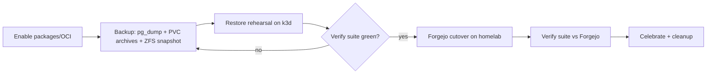

# Gitea Package Registry + Forgejo Migration Plan

- **Date**: 2026-07-21
- **Status**: draft
- **Resolves**: R02 in `docs/plans/RESEARCH.md` (GitLab vs Gitea -> Forgejo decision)
- **Depends on**: current homelab deploy of `irl-gitea` 0.2.0 (upstream gitea chart 10.6.0, image `gitea/gitea:1.22-rootless`)

## Why now

`gitea/gitea:1.22` is the **last version Forgejo supports in-place migration from**. Any Gitea upgrade past 1.22 permanently closes the drop-in Forgejo path. This plan sequences: enable the built-in OCI/package registry, prove our backups restore reliably (full rehearsal on a throwaway k3d cluster with a state-verification test suite), then execute the one-way Forgejo cutover and re-run the same suite against the migrated instance.

The registry work lands first because it is reversible and the backup/restore rehearsal then covers registry data too, so the Forgejo cutover is verified against the final shape of the instance.

## Current state (facts, verified 2026-07-21)

- Chart: `helm-charts/charts/irl-gitea` 0.2.0, dependency `gitea` 10.6.0 from `dl.gitea.com`, `appVersion: 1.22`.
- Values: `ansible/helm/gitea/values.yaml`, deployed via `ansible/playbooks/helm-deploy.yml --tags gitea`.
- DB: postgres database `gitea` on shared CNPG (`postgresql.irl.svc.cluster.local`), password in k8s secret `postgres-gitea`.
- Cache/session/queue: Valkey (`redis-master.irl.svc.cluster.local` DBs 0/1/2).
- Storage: `local-path` 10Gi PVC for `/data`, separate `gitea-lfs-pvc` (ZFS dataset) mounted at `/data/gitea/lfs`.
- Access: HTTP behind Caddy at `https://git.lab.infiniteroomlabs.cloud` (Caddy terminates TLS -> docker login works without new cert plumbing), SSH NodePort 30022.
- Memory limit 512Mi (watch this: registry blob pushes and Forgejo DB migrations both spike memory).

## Phase 1 -- Enable OCI + package registries in Gitea (est. 0.5 day)

Packages are on by default since Gitea 1.17 but we make the config explicit, size storage deliberately, and prove the flows.

1. In `ansible/helm/gitea/values.yaml` add under `gitea.config`:
   - `packages: { ENABLED: true }`
   - Set `packages.LIMIT_TOTAL_OWNER_SIZE` or per-type limits if we want guardrails (single-user instance: start unlimited, revisit).
2. Storage decision: package blobs default to `/data/packages` on the 10Gi `local-path` PVC. Container images will blow through 10Gi fast. **Chosen approach**: add a dedicated ZFS-backed PVC (mirror the LFS pattern: `gitea-packages-pvc` mounted at `/data/packages`), 50Gi to start. Alternative rejected for now: `STORAGE_TYPE: minio` against Garage S3 -- more moving parts during a migration window; revisit post-Forgejo.
3. Caddy check: confirm no request body size cap on the `git.lab` vhost (image layers are hundreds of MB) and that proxy buffering/timeouts tolerate slow blob uploads.
4. Bump memory limit to 1Gi for the duration of registry testing + later Forgejo migrations; re-evaluate after.
5. Deploy: `./ansible/run-ansible.sh playbook playbooks/helm-deploy.yml --tags gitea`.
6. Smoke tests (record commands + output in this doc's log section):
   - `docker login git.lab.infiniteroomlabs.cloud` with a Gitea access token (scope `write:package`).
   - Push + pull a small image (`docker pull alpine@sha256:... ; docker tag ... ; docker push`), verify it appears under the owner's Packages tab.
   - Push one non-OCI package type we will actually use (npm or generic) to prove the artifact side.

**Exit criteria**: OCI push/pull round-trip works from the laptop; package storage lands on the dedicated PVC; UI shows the packages.

## Phase 2 -- Backups worth trusting (est. 0.5 day)

Belt and suspenders; each artifact restorable independently:

1. **Logical DB**: `pg_dump -Fc` of the `gitea` database from the CNPG primary (exec or `kubectl port-forward`). This is the restore-rehearsal input.
2. **Data archives**: tar of `/data` (repos, packages, avatars, attachments) and of the LFS PVC, taken while Gitea is scaled to 0 replicas (short window; single user) so git + DB + blobs are consistent with the pg_dump taken in the same window.
3. **ZFS snapshot**: snapshot the datasets backing the PVCs at the same moment (fast rollback path for the cutover, distinct from the portable archives).
4. Store archives on the ZFS pool AND copy one full set off the node (laptop or Garage bucket) -- restore rehearsal must run from the portable copies, not the snapshots.
5. Script it: `scripts/gitea-backup.sh` with `usage` spec (scale down -> pg_dump -> tars -> zfs snapshot -> scale up -> manifest file with checksums). This becomes the standing backup tool, not a one-off.

**Exit criteria**: one command produces a timestamped, checksummed backup set; a second full set exists off-node.

## Phase 3 -- Restore rehearsal on local k3d (est. 1 day)

Throwaway cluster on the laptop; nothing touches the homelab.

1. `k3d cluster create gitea-restore-test` (k3d not currently installed locally -- install via mise/aqua).
2. Deploy plain `postgres:16` (matching CNPG major) + the same `irl-gitea` chart with a values overlay: local hostname, no Caddy (port-forward), bundled-style storage, same image tag `1.22`, redis swapped for memory adapters OR a tiny valkey pod (keep it faithful: tiny valkey pod, same DB indexes).
3. Restore: `pg_restore` the dump, untar `/data` + LFS into the PVCs, fix ownership (rootless image: uid 1000), start Gitea, run `gitea admin regenerate hooks` + `gitea admin regenerate keys` (paths changed hosts).
4. **State verification suite** -- new, reusable: `tests/gitea-state-verify/` (bash + jq against the Gitea API, token auth):
   - Inventory capture: users, orgs, teams, repos (incl. private), releases, issues + comments counts, labels, milestones, webhooks, deploy keys, user SSH/GPG keys, access tokens count, LFS objects, packages (incl. the Phase 1 OCI image), repo topics/stars/forks.
   - Capture runs against **production first** (baseline JSON), then against the restored instance; suite diffs the two and fails on any delta.
   - Content spot-checks: `git clone` every repo over HTTP from the restored instance, `git fsck` each, compare HEAD SHAs to baseline; `docker pull` the test image from the restored registry and compare digest.
5. Iterate Phases 2-3 until the suite passes twice in a row from freshly taken backups.
6. Keep the k3d cluster definition + overlay values in `tests/gitea-state-verify/` so the rehearsal is repeatable.

**Exit criteria**: verify suite green (zero diffs) on a restore performed only from the portable backup set, twice.

## Phase 4 -- Forgejo cutover (est. 0.5-1 day, maintenance window)

One-way door. No Forgejo -> Gitea path exists. Precondition: Phase 3 exit criteria met within the previous 7 days.

1. Announce window to self (single user -- but stop agents/CI touching Gitea).
2. Run `scripts/gitea-backup.sh` one final time; verify checksums; take the ZFS snapshot set.
3. Chart decision: switch the `irl-gitea` chart dependency from `gitea` (dl.gitea.com) to the **forgejo-helm chart** (`code.forgejo.org/forgejo-helm`) -- it is a fork of the same chart and values are near-identical. Rename chart to `irl-forgejo` (new dir, keep `irl-gitea` in git history), carry over our values with the image swapped. Rejected alternative: overriding `image.registry/repository` inside the gitea chart -- works for the first boot but leaves us on the wrong upstream long-term.
4. Migration ladder (each step: deploy, wait for auto DB migration to finish, check `/api/v1/version` + logs clean):
   - `codeberg.org/forgejo/forgejo:7.0-rootless` (accepts Gitea 1.22 data)
   - then sequential majors 7 -> 8 -> 9 -> 10 -> 11 (LTS) -> current stable. **Verify the current ladder against forgejo.org/docs release notes at execution time; do not skip majors.**
5. Re-run the full verification suite against the migrated instance using the pre-cutover production baseline JSON. Expected deltas: version string only. Any other delta = investigate before proceeding.
6. Re-run registry smoke tests (docker push/pull, npm/generic publish) -- Forgejo inherited the same package registry.
7. Confirm integrations: `tea` CLI, laptop git SSH remotes (host key unchanged), Caddy vhost, webhooks if any.
8. **Rollback path** (only before declaring success): scale to 0, roll back ZFS snapshots, redeploy old `irl-gitea` chart at `1.22`. Once new commits/packages land on Forgejo, rollback loses data -- declare success or roll back same-day.

**Exit criteria**: suite green vs baseline, registry round-trip green, `tea` + git remotes work.

## Phase 5 -- Aftercare + celebrate (est. 0.5 day)

1. Update `docs/plans/RESEARCH.md` R02: findings + decision -> Forgejo, link this plan.
2. Update references to the gitea chart/values in ansible inventories, `irl_services` dict, docs, and the homelab access guide; global CLAUDE.md Gitea section -> Forgejo.
3. Migrate private images off GHCR into the new registry (`crane copy` or pull/push); update compose/deploy references (jobops fork image et al.).
4. Add `scripts/gitea-backup.sh` (rename `forgejo-backup.sh`) to a cron/systemd timer on the node; Sanoid already snapshots the datasets -- confirm coverage of the new packages dataset.
5. Grafana: confirm the Forgejo pod lands on the existing scrape; add a packages-PVC usage panel.
6. Celebrate. (Suggested: push the first fully sovereign image and close the browser tab to GHCR.)

## Decision log

| Decision | Choice | Why |
|---|---|---|
| Registry engine | Gitea/Forgejo built-in | Already deployed, covers OCI + npm/PyPI/generic/etc.; Harbor deferred until scanning/proxy-cache is concretely wanted |
| Package storage | Dedicated ZFS PVC | 10Gi app PVC too small for images; S3/Garage deferred to reduce moving parts mid-migration |
| Order | Registry -> backup-verify -> Forgejo | Registry change is reversible; rehearsal then protects final instance shape; Forgejo door closes only after restore is proven |
| Forgejo chart | forgejo-helm (new `irl-forgejo` chart dir) | Maintained upstream for Forgejo; values-compatible fork of the gitea chart |
| Gitea version pin until cutover | Stay on 1.22 | Last version with in-place Forgejo migration; upgrading first would strand us on Gitea |

## Execution log

(append dated entries as phases run)
