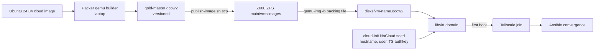

# Homelab Ubuntu VM Hosting: Gold Master Pipeline (Packer + KVM/libvirt)

**Date**: 2026-07-23
**Status**: Approved (brainstormed interactively; plan file executed same day)

## Problem

The homelab (HP Z600, Debian, 40GB RAM / 24 threads) runs k3s bare-metal with no virtualization layer. We want custom Ubuntu server VMs for: dev/build machines, lab/sandbox VMs, a future landing zone for services migrating off k3s, and -- explicitly -- building the Packer gold-master pipeline as a skill. Packer is a goal, not overhead.

## Decisions

| Decision | Choice | Why |
|----------|--------|-----|
| Hypervisor | KVM/libvirt alongside k3s on the Z600 | No reinstall, Ansible-managed like everything else. KubeVirt evaluated and deferred (see `2026-07-10-coder-agentic-workstations.md`); Proxmox remains unbuilt Phase 5 aspiration. |
| Image build | Packer QEMU builder, based on the Ubuntu 24.04 LTS cloud image | Same pipeline skills as ISO builds without subiquity friction. ISO autoinstall is a later add if ever needed. |
| Identity vs image | Image is generic; cloud-init does identity (hostname, user, Tailscale); Ansible converges after | Reuses the proven DO droplet pattern (`terraform/modules/do-droplet/templates/cloud-init.yaml.tftpl`). |
| VM lifecycle | Ansible `community.libvirt` (`ansible/playbooks/vms.yml`), driven by `irl_vms` dict in host_vars | TFC remote execution cannot reach the tailnet; "Ansible manages the homelab host" is the established split. Terraform-libvirt is a possible later upgrade. |
| Networking | libvirt default NAT + per-VM Tailscale join | Every VM is a first-class tailnet node; no bridge config; SSH like everything else. |
| Storage | ZFS dataset `main/vms` (`images/` gold masters, `disks/` per-VM qcow2 backed by gold master) | Sanoid already snapshots the pool; qcow2 backing files keep clones cheap. |
| Tailscale auth | Mint a **single-use, non-ephemeral pre-auth key per VM** at provision time via the Tailscale API using the existing `vault_tailscale_api_key` | No new long-lived secret to store or rotate; key is consumed at first boot. |
| Build host | Laptop (KVM accel, easy debug); artifact scp'd to Z600 via `packer/scripts/publish-image.sh` | Iteration speed. |

## Architecture

## Resource budget

`irl_vm_ram_budget_gb: 12` of the Z600's 40GB (4GB OS reserve, 8GB ZFS ARC cap, remainder k3s). First VM: `ubuntu-vm-01` at 4 vCPU / 8GB / 40GB disk.

## Gold master contents

Base packages (curl, jq, python3, ca-certificates), qemu-guest-agent, tailscale (installed, NOT joined), unattended-upgrades, then `cloud-init clean` so every clone re-runs first boot fresh. No secrets ever baked into the image.

## Out of scope (deliberately)

ISO/subiquity autoinstall, Terraform libvirt provider, bridged networking, VM-specific monitoring/backup (sanoid covers the pool), migrating any k3s service into a VM. Add when a real need appears.

## Artifacts

- `packer/ubuntu-24.04/ubuntu.pkr.hcl`, `packer/scripts/publish-image.sh`, `packer/README.md`
- `ansible/playbooks/libvirt.yml`, `ansible/playbooks/vms.yml`
- `ansible/templates/vm-cloud-init.yaml.j2`, `ansible/templates/vm-domain.xml.j2`
- `main/vms` entry in `irl_zfs_datasets`; `irl_vms` + `irl_vm_ram_budget_gb` in `host_vars/homelab.yml`
- `docs/runbooks/vm-provisioning.md`
