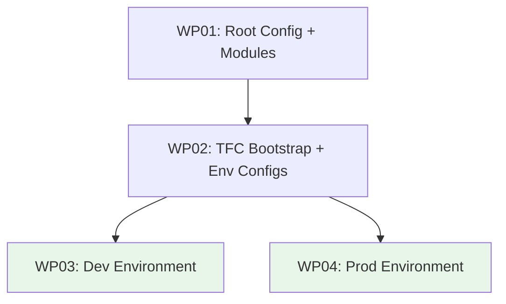

# Work Packages: Porkbun-to-Cloudflare Domain Onboarding

**Feature**: 001-porkbun-cloudflare-domain-onboarding
**Date**: 2026-02-24
**Inputs**: [spec.md](spec.md), [plan.md](plan.md), [data-model.md](data-model.md), [research.md](research.md)

## Overview

This feature scaffolds a greenfield Terragrunt + Terraform project with 3 reusable modules, a TFC workspace bootstrap layer, and per-environment wiring for dev and prod. The dependency chain is: root config -> modules -> TFC bootstrap -> environment resource groups.

**Total subtasks**: 18
**Work packages**: 4
**Parallelization**: WP03 and WP04 can run in parallel after WP01 + WP02 complete.

## Prerequisites

- Terraform >= 1.5 and Terragrunt >= 0.55 installed
- Terraform Cloud account with org `infinite-room-labs`
- Environment variables set: `CLOUDFLARE_API_TOKEN`, `CLOUDFLARE_ACCOUNT_ID`, `PORKBUN_API_KEY`, `PORKBUN_SECRET_KEY`, `TF_TOKEN_app_terraform_io`

---

## Phase 1: Setup & Foundation

### WP01 -- Root Configuration and Terraform Modules

**Prompt**: [tasks/WP01-root-config-and-modules.md](tasks/WP01-root-config-and-modules.md)
**Goal**: Create the root Terragrunt config (`root.hcl`) and all three reusable Terraform modules (`cloudflare-zone`, `porkbun-nameservers`, `tfc-workspace`), plus project-level `.gitignore`.
**Priority**: P1 (everything depends on this)
**Independent Test**: `terraform validate` passes in each module directory.
**Estimated prompt size**: ~400 lines

**Included subtasks**:
- [x] T001: Create `root.hcl` with TFC `generate` block, provider version constraints, workspace name derivation
- [x] T008: Create `modules/tfc-workspace/` (main.tf, variables.tf, outputs.tf) with `tfe_workspace` resource
- [x] T009: Create `modules/cloudflare-zone/` (main.tf, variables.tf, outputs.tf) with `cloudflare_zone` for_each
- [x] T010: Create `modules/porkbun-nameservers/` (main.tf, variables.tf, outputs.tf) with `porkbun_domain_nameservers` for_each
- [x] T016: Add `.gitignore` for Terraform/Terragrunt artifacts (`.terraform/`, `*.tfstate*`, `.terragrunt-cache/`)

**Implementation notes**:
- `root.hcl` derives workspace name from the directory path using `path_relative_to_include()`
- Modules are self-contained; each has `main.tf`, `variables.tf`, `outputs.tf`
- `cloudflare_zone` module outputs `nameservers_map` that feeds into `porkbun-nameservers` module
- All modules validated with `terraform validate` (no init needed for syntax check)

**Parallel opportunities**: T008, T009, T010 can be written in parallel (independent modules)
**Dependencies**: None
**Risks**: Cloudflare provider v5.17.0 uses `account.id` nested attribute syntax (not `account_id`); verify against provider docs

---

## Phase 2: Bootstrap

### WP02 -- TFC Workspace Bootstrap and Environment Configs

**Prompt**: [tasks/WP02-tfc-bootstrap-and-env-configs.md](tasks/WP02-tfc-bootstrap-and-env-configs.md)
**Goal**: Create the TFC workspace bootstrap layer (`environments/global/tfc/workspaces/`), environment config files (`env.hcl` for dev and prod), and a `.envrc` template for direnv.
**Priority**: P1 (environments depend on workspaces existing in TFC)
**Independent Test**: `terragrunt validate` passes in `environments/global/tfc/workspaces/`.
**Estimated prompt size**: ~350 lines

**Included subtasks**:
- [x] T011: Create `environments/global/tfc/workspaces/terragrunt.hcl` (bootstrap with local state, creates all 4 workspaces)
- [x] T002: Create `environments/dev/env.hcl` with environment name, placeholder domains list, `cloudflare_account_id` via `get_env()`
- [x] T003: Create `environments/prod/env.hcl` (mirror of dev with different domain list)
- [x] T018: Create `.envrc` template with required env var placeholders for direnv

**Implementation notes**:
- Bootstrap `terragrunt.hcl` does NOT include `root.hcl` (no TFC backend -- uses local state)
- Bootstrap directly uses `modules/tfc-workspace` module with `for_each` over workspace definitions
- Workspace list: `dev-cloudflare-zones`, `dev-porkbun-nameservers`, `prod-cloudflare-zones`, `prod-porkbun-nameservers`
- `env.hcl` files export `locals {}` block read by child `terragrunt.hcl` via `read_terragrunt_config()`

**Parallel opportunities**: T002 and T003 can be written in parallel
**Dependencies**: WP01 (needs `modules/tfc-workspace/` to exist)
**Risks**: Bootstrap must use local backend, NOT the generated TFC backend from `root.hcl`

---

## Phase 3: Environment Wiring (Parallelizable)

### WP03 -- Dev Environment Resource Groups

**Prompt**: [tasks/WP03-dev-environment-wiring.md](tasks/WP03-dev-environment-wiring.md)
**Goal**: Create all dev environment leaf `terragrunt.hcl` files and provider configs that wire the Cloudflare zone and Porkbun nameserver modules to the dev domain list.
**Priority**: P1 (core feature delivery for dev)
**Independent Test**: `terragrunt validate` passes in both `environments/dev/cloudflare/zones/` and `environments/dev/porkbun/nameservers/`.
**Estimated prompt size**: ~350 lines

**Included subtasks**:
- [x] T004: Create `environments/dev/cloudflare/provider.hcl` (Cloudflare provider block)
- [x] T005: Create `environments/dev/porkbun/provider.hcl` (Porkbun provider block)
- [x] T012: Create `environments/dev/cloudflare/zones/terragrunt.hcl` (includes root, reads env.hcl, sources cloudflare-zone module)
- [x] T013: Create `environments/dev/porkbun/nameservers/terragrunt.hcl` (includes root, reads env.hcl, depends on cloudflare zones, sources porkbun-nameservers module)
- [x] T017a: Verify `terragrunt run-all validate` passes for dev environment

**Implementation notes**:
- `provider.hcl` files use Terragrunt `generate` to create provider blocks (no credentials in code)
- `zones/terragrunt.hcl` passes `domains` and `cloudflare_account_id` from `env.hcl` locals
- `nameservers/terragrunt.hcl` declares `dependency` on `../../cloudflare/zones` and reads `nameservers_map` output
- Porkbun leaf wires `dependency.cloudflare_zones.outputs.nameservers_map` into module inputs

**Parallel opportunities**: T004+T012 and T005+T013 are independent provider/resource-group pairs
**Dependencies**: WP01 (modules), WP02 (env.hcl files)
**Risks**: `dependency` block `config_path` must use relative path from the Porkbun resource group to the Cloudflare resource group (`../../cloudflare/zones`)

---

### WP04 -- Prod Environment Resource Groups

**Prompt**: [tasks/WP04-prod-environment-wiring.md](tasks/WP04-prod-environment-wiring.md)
**Goal**: Create all prod environment leaf `terragrunt.hcl` files and provider configs, mirroring dev structure with prod-specific domain list.
**Priority**: P1 (core feature delivery for prod)
**Independent Test**: `terragrunt validate` passes in both `environments/prod/cloudflare/zones/` and `environments/prod/porkbun/nameservers/`.
**Estimated prompt size**: ~300 lines

**Included subtasks**:
- [x] T006: Create `environments/prod/cloudflare/provider.hcl` (Cloudflare provider block)
- [x] T007: Create `environments/prod/porkbun/provider.hcl` (Porkbun provider block)
- [x] T014: Create `environments/prod/cloudflare/zones/terragrunt.hcl` (mirror of dev zones leaf)
- [x] T015: Create `environments/prod/porkbun/nameservers/terragrunt.hcl` (mirror of dev nameservers leaf)
- [x] T017b: Verify `terragrunt run-all validate` passes for prod environment

**Implementation notes**:
- Structurally identical to WP03, differing only in directory paths and the domain list sourced from `environments/prod/env.hcl`
- Same `dependency` pattern: Porkbun depends on Cloudflare zones within the same environment
- Same `provider.hcl` generate blocks (providers are environment-agnostic, only credentials differ)

**Parallel opportunities**: Entire WP04 runs in parallel with WP03
**Dependencies**: WP01 (modules), WP02 (env.hcl files)
**Risks**: Copy-paste drift from dev -- ensure paths reference `prod/` not `dev/`

---

## Subtask Index

| ID | Description | Work Package | Priority | Parallel |
|----|-------------|-------------|----------|----------|
| T001 | Create `root.hcl` with TFC generate block and provider versions | WP01 | P1 | |
| T002 | Create `environments/dev/env.hcl` | WP02 | P1 | [P] |
| T003 | Create `environments/prod/env.hcl` | WP02 | P1 | [P] |
| T004 | Create `environments/dev/cloudflare/provider.hcl` | WP03 | P1 | [P] |
| T005 | Create `environments/dev/porkbun/provider.hcl` | WP03 | P1 | [P] |
| T006 | Create `environments/prod/cloudflare/provider.hcl` | WP04 | P1 | [P] |
| T007 | Create `environments/prod/porkbun/provider.hcl` | WP04 | P1 | [P] |
| T008 | Create `modules/tfc-workspace/` | WP01 | P1 | [P] |
| T009 | Create `modules/cloudflare-zone/` | WP01 | P1 | [P] |
| T010 | Create `modules/porkbun-nameservers/` | WP01 | P1 | [P] |
| T011 | Create `environments/global/tfc/workspaces/terragrunt.hcl` | WP02 | P1 | |
| T012 | Create `environments/dev/cloudflare/zones/terragrunt.hcl` | WP03 | P1 | [P] |
| T013 | Create `environments/dev/porkbun/nameservers/terragrunt.hcl` | WP03 | P1 | [P] |
| T014 | Create `environments/prod/cloudflare/zones/terragrunt.hcl` | WP04 | P1 | [P] |
| T015 | Create `environments/prod/porkbun/nameservers/terragrunt.hcl` | WP04 | P1 | [P] |
| T016 | Add `.gitignore` for Terraform/Terragrunt artifacts | WP01 | P1 | |
| T017a | Verify dev environment validates | WP03 | P1 | |
| T017b | Verify prod environment validates | WP04 | P1 | |
| T018 | Create `.envrc` template for direnv | WP02 | P2 | |

## Dependency Graph

> WP03 and WP04 (green) can run in parallel after WP02 completes.

## Implicit Coverage Notes

The following requirements are satisfied by Terraform/Terragrunt built-in behavior and require no dedicated tasks:

- **FR-008** (drift detection): `terragrunt plan` automatically detects and reports drift when zones or nameservers are modified outside Terraform. This is core Terraform behavior.
- **FR-009** (planned destruction with operator approval): Removing a domain from the `domains` list causes `terragrunt plan` to show a destruction plan. `terragrunt apply` requires interactive operator approval before executing destructive changes. This is Terraform's default behavior.
