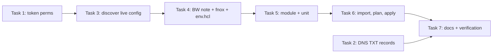

# Email Routing IaC + DMARC Client Reporting Implementation Plan

> **For agentic workers:** REQUIRED SUB-SKILL: Use superpowers:subagent-driven-development (recommended) or superpowers:executing-plans to implement this plan task-by-task. Steps use checkbox (`- [ ]`) syntax for tracking.

**Goal:** Bring infiniteroomlabs.com Cloudflare Email Routing under Terraform (importing the dashboard-created config untouched) and publish the DNS records that let any client point `rua=` at `clients-dmarc@infiniteroomlabs.com`.

**Architecture:** Three terragrunt units change: `global/cloudflare/tokens` (grant Email Routing permissions to the infra token), `prod/cloudflare/dns-records` (two TXT changes), and a new `prod/cloudflare/email-routing` unit backed by a new `cloudflare-email-routing` module. Live state is imported first, then exactly one new rule is created. Ordering is forced by permissions: the infra token cannot even *read* routing config until the tokens unit is applied.

**Tech Stack:** Terraform 1.12.1, Terragrunt 0.77.22, cloudflare provider ~> 5.17 (lock: 5.18.0), TFC state (`prod-*` workspaces), fnox/Bitwarden for env-var secrets, Cloudflare v4 REST API for discovery.

**Spec:** `docs/superpowers/specs/2026-08-22-email-routing-iac.md`

## Global Constraints

- Provider pinned `~> 5.17` by `terraform/root.hcl` `generate "providers"`. Do NOT add `required_providers` or a `provider` block to the new module; `prod/cloudflare/provider.hcl` generates `variable "bootstrap_api_token"` + `provider "cloudflare"` into every prod unit.
- Never CREATE a `cloudflare_email_routing_address` (verification-email loop). It is import-only.
- No behavioral change to existing routing: settings, catch-all, `wes@` rule are mirrored field-for-field from live. Any diff on an imported resource = config bug; fix config, never apply through.
- No `p=` policy change, no `ruf=`, no parsedmarc deployment, no client-zone changes.
- Repo is PUBLIC. The destination mailbox is personal data: it enters only via `get_env("IRL_EMAIL_ROUTING_DESTINATION", "")`, supplied by fnox from Bitwarden. Never hardcode it, never paste it into commits, never print token values.
- Expected total churn (anything beyond this is a defect -- stop): tokens 1 update; dns-records 1 create + 1 update; email-routing 4 imports then 1 create.
- Markdown: ASCII only (no smart quotes / em dashes / arrows -- `tests/hygiene/test_docs_consistency.py` enforces). No hard-wrapped prose.
- All secret-bearing commands run as `mise exec -- <relative>/scripts/with-secrets.sh <cmd>` from the unit dir (`mise exec` loads `CLOUDFLARE_ACCOUNT_ID` from `mise.toml [env]`; `with-secrets.sh` injects fnox secrets). Scratch data goes in `$SCRATCH` = the session scratchpad dir, never in the repo.

## Execution order and why



Task 2 is independent of Tasks 1/3-6 and can run any time.

---

### Task 1: Grant Email Routing permissions to the infra token (spec T5)

**Files:**
- Modify: `terraform/environments/global/cloudflare/tokens/terragrunt.hcl` (the `generate "main"` heredoc, locals + `permission_groups` list)
- Regenerated by terragrunt, tracked in git: `terraform/environments/global/cloudflare/tokens/main.tf`

**Interfaces:**
- Produces: infra token (`dependency.bootstrap_tokens.outputs.api_token`) able to read/write zone Email Routing rules and account Email Routing addresses. Tasks 3 and 6 depend on this.

- [ ] **Step 1: Discover the four permission-group UUIDs from the live API**

Run from repo root (token is never printed; only IDs/names):

```bash
mise exec -- ./scripts/with-secrets.sh bash -c '
  curl -s -H "Authorization: Bearer $CLOUDFLARE_BOOTSTRAP_API_TOKEN" \
    "https://api.cloudflare.com/client/v4/accounts/$CLOUDFLARE_ACCOUNT_ID/tokens/permission_groups" \
  | jq -r ".result[] | select(.name | test(\"Email Routing\")) | [.id, .name, (.scopes | join(\",\"))] | @tsv"'
```

Expected: four rows -- `Email Routing Rules Read` / `Email Routing Rules Write` (scope `com.cloudflare.api.account.zone`) and `Email Routing Addresses Read` / `Email Routing Addresses Write` (scope `com.cloudflare.api.account`).

If the response is a 403/`errors` array (bootstrap token lacks read on this endpoint), retry the same command against `https://api.cloudflare.com/client/v4/user/tokens/permission_groups`. If that also fails, use the infra token instead: run the curl inside `(cd terraform/environments/global/cloudflare/tokens && mise exec -- ../../../../../scripts/with-secrets.sh bash -c 'TOKEN=$(terragrunt output -raw api_token); curl -s -H "Authorization: Bearer $TOKEN" ...')`. Do not fall back to a gist.

- [ ] **Step 2: Add the locals and policy entries**

In `terraform/environments/global/cloudflare/tokens/terragrunt.hcl`, inside the heredoc `locals {}` block, after `perm_access_service_tokens_write`, add (substitute the UUIDs from Step 1; keep the comment format):

```hcl
      # Added for Email Routing IaC (prod/cloudflare/email-routing). UUIDs verified
      # against GET /accounts/{id}/tokens/permission_groups on 2026-08-22.
      perm_email_routing_rules_read      = "<uuid: Email Routing Rules Read>"
      perm_email_routing_rules_write     = "<uuid: Email Routing Rules Write>"
      perm_email_routing_addresses_read  = "<uuid: Email Routing Addresses Read>"
      perm_email_routing_addresses_write = "<uuid: Email Routing Addresses Write>"
```

In the `permission_groups = [...]` list, after `{ id = local.perm_access_service_tokens_write },` add:

```hcl
            { id = local.perm_email_routing_rules_read },
            { id = local.perm_email_routing_rules_write },
            { id = local.perm_email_routing_addresses_read },
            { id = local.perm_email_routing_addresses_write },
```

- [ ] **Step 3: Plan -- expect exactly 1 in-place update**

```bash
(cd terraform/environments/global/cloudflare/tokens && mise exec -- ../../../../../scripts/with-secrets.sh terragrunt plan)
```

Expected: `Plan: 0 to add, 1 to change, 0 to destroy.` on `cloudflare_account_token.infra` (policies only). Anything else -- stop. (Note: this unit's `backend.tf` is an untracked generated file pointing at Garage S3; `AWS_*` come from fnox. If init complains about the backend, that is a pre-existing repo issue -- report it, do not "fix" by re-initializing to a different backend.)

- [ ] **Step 4: Apply**

```bash
(cd terraform/environments/global/cloudflare/tokens && mise exec -- ../../../../../scripts/with-secrets.sh terragrunt apply -auto-approve)
```

Expected: `Apply complete! Resources: 0 added, 1 changed, 0 destroyed.` The token *value* does not rotate on a policy change, so downstream units are unaffected.

- [ ] **Step 5: Smoke-check the new permission**

```bash
ZONE_ID=$(cd terraform/environments/prod/cloudflare/zones && mise exec -- ../../../../../scripts/with-secrets.sh terragrunt output -json zone_ids | jq -r '."infiniteroomlabs.com"')
echo "ZONE_ID=$ZONE_ID" > "$SCRATCH/live.env"
(cd terraform/environments/global/cloudflare/tokens && mise exec -- ../../../../../scripts/with-secrets.sh bash -c "TOKEN=\$(terragrunt output -raw api_token); curl -s -H \"Authorization: Bearer \$TOKEN\" https://api.cloudflare.com/client/v4/zones/$ZONE_ID/email/routing | jq '.success, .result.enabled, .result.status'")
```

Expected: `true`, `true`, `"ready"`. (If `enabled` is false, Email Routing was never turned on -- stop and report; the spec assumes it is live.)

- [ ] **Step 6: Commit**

```bash
git add terraform/environments/global/cloudflare/tokens/terragrunt.hcl terraform/environments/global/cloudflare/tokens/main.tf
git commit -m "Grant infra token Email Routing rules + addresses permissions"
```

---

### Task 2: DMARC DNS records (spec T1)

**Files:**
- Modify: `terraform/environments/prod/env.hcl` (local `sendgrid_dns_records`)
- Modify: `terraform/environments/prod/cloudflare/dns-records/terragrunt.hcl:37` (`records = ...`)

**Interfaces:**
- Produces: `local.email_dns_records` (same `{name,type,content}` shape consumed by `modules/cloudflare-dns-records`). Resource keys are `"${type}-${name}"`, so the rename is churn-free.

- [ ] **Step 1: Rewrite the local in env.hcl**

Replace the whole `sendgrid_dns_records = [ ... ]` block with:

```hcl
  # ── DNS records for infiniteroomlabs.com (email) ───────────────────
  email_dns_records = [
    # SendGrid link branding
    { name = "url1041",       type = "CNAME", content = "sendgrid.net" },
    { name = "61558306",      type = "CNAME", content = "sendgrid.net" },
    { name = "em1988",        type = "CNAME", content = "u61558306.wl057.sendgrid.net" },

    # SendGrid domain auth
    { name = "url45",         type = "CNAME", content = "sendgrid.net" },
    { name = "em1794",        type = "CNAME", content = "u61558306.wl057.sendgrid.net" },

    # DKIM/DMARC (shared by both SendGrid setups). rua= collects our own
    # aggregate reports into the same mailbox as client reports.
    { name = "s1._domainkey", type = "CNAME", content = "s1.domainkey.u61558306.wl057.sendgrid.net" },
    { name = "s2._domainkey", type = "CNAME", content = "s2.domainkey.u61558306.wl057.sendgrid.net" },
    { name = "_dmarc",        type = "TXT",   content = "v=DMARC1; p=none; rua=mailto:clients-dmarc@infiniteroomlabs.com" },

    # DMARC client reporting (RFC 7489 section 7.1): authorizes any external
    # domain to send its aggregate reports to clients-dmarc@infiniteroomlabs.com.
    # See docs/dmarc-client-reporting.md.
    { name = "*._report._dmarc", type = "TXT", content = "v=DMARC1" },
  ]
```

- [ ] **Step 2: Update the unit reference**

In `terraform/environments/prod/cloudflare/dns-records/terragrunt.hcl` change
`records             = local.env_config.locals.sendgrid_dns_records`
to
`records             = local.env_config.locals.email_dns_records`.

- [ ] **Step 3: Plan -- expect 1 create + 1 update, zero SendGrid churn**

```bash
(cd terraform/environments/prod/cloudflare/dns-records && mise exec -- ../../../../../scripts/with-secrets.sh terragrunt plan)
```

Expected: `Plan: 1 to add, 1 to change, 0 to destroy.` -- add `cloudflare_dns_record.this["TXT-*._report._dmarc"]`, change `cloudflare_dns_record.this["TXT-_dmarc"]` (`content` only). Any CNAME in the plan = stop.

- [ ] **Step 4: Apply**

```bash
(cd terraform/environments/prod/cloudflare/dns-records && mise exec -- ../../../../../scripts/with-secrets.sh terragrunt apply -auto-approve)
```

- [ ] **Step 5: Verify resolution (allow ~1 min for propagation)**

```bash
dig +short TXT clientdomain.com._report._dmarc.infiniteroomlabs.com @1.1.1.1
dig +short TXT _dmarc.infiniteroomlabs.com @1.1.1.1
```

Expected: `"v=DMARC1"` and `"v=DMARC1; p=none; rua=mailto:clients-dmarc@infiniteroomlabs.com"`. (DNS wildcards match multi-label owners per RFC 4592, so the two-label client domain resolves.)

- [ ] **Step 6: Commit**

```bash
git add terraform/environments/prod/env.hcl terraform/environments/prod/cloudflare/dns-records/terragrunt.hcl
git commit -m "Add DMARC client-report authorization wildcard and own-domain rua"
```

---

### Task 3: Discover live Email Routing config (spec T4 part 1)

**Files:**
- Create (scratch, NOT in repo): `$SCRATCH/live.env`, `$SCRATCH/routing.json`, `$SCRATCH/addresses.json`

**Interfaces:**
- Consumes: `ZONE_ID` from `$SCRATCH/live.env` (Task 1 Step 5).
- Produces: `$SCRATCH/live.env` with `ZONE_ID`, `WES_RULE_ID`, `WES_RULE_NAME`, `WES_RULE_PRIORITY`, `WES_RULE_ENABLED`, `CATCHALL_NAME`, `CATCHALL_ENABLED`, `CATCHALL_ACTION_TYPE`, `CATCHALL_ACTION_VALUE`, `DEST_ID`, `DEST_EMAIL`. Tasks 4-6 read these.

- [ ] **Step 1: Dump rules, catch-all, and destination addresses**

```bash
source "$SCRATCH/live.env"
(cd terraform/environments/global/cloudflare/tokens && mise exec -- ../../../../../scripts/with-secrets.sh bash -c "
  TOKEN=\$(terragrunt output -raw api_token)
  H=\"Authorization: Bearer \$TOKEN\"
  API=https://api.cloudflare.com/client/v4
  curl -s -H \"\$H\" \$API/zones/$ZONE_ID/email/routing/rules            > $SCRATCH/routing.json
  curl -s -H \"\$H\" \$API/zones/$ZONE_ID/email/routing/rules/catch_all  > $SCRATCH/catchall.json
  curl -s -H \"\$H\" \$API/accounts/\$CLOUDFLARE_ACCOUNT_ID/email/routing/addresses > $SCRATCH/addresses.json
")
jq '.result' "$SCRATCH/routing.json" "$SCRATCH/catchall.json" "$SCRATCH/addresses.json"
```

Expected: `routing.json` has exactly one non-catch-all rule (matcher `to` = `wes@infiniteroomlabs.com`, action `forward`); `catchall.json` has one object; `addresses.json` has one verified address (`verified` non-null) equal to the `wes@` rule's forward value. **If any count differs from this, stop -- the spec's "expected churn" is wrong and needs re-scoping.**

- [ ] **Step 2: Record the values the HCL must mirror**

```bash
{
  echo "ZONE_ID=$ZONE_ID"
  jq -r '.result[] | select(.matchers[0].type=="literal") | "WES_RULE_ID=\(.id)\nWES_RULE_NAME=\(.name)\nWES_RULE_PRIORITY=\(.priority)\nWES_RULE_ENABLED=\(.enabled)"' "$SCRATCH/routing.json"
  jq -r '.result | "CATCHALL_NAME=\(.name)\nCATCHALL_ENABLED=\(.enabled)\nCATCHALL_ACTION_TYPE=\(.actions[0].type)\nCATCHALL_ACTION_VALUE=\(.actions[0].value // [] | join(","))"' "$SCRATCH/catchall.json"
  jq -r '.result[0] | "DEST_ID=\(.id)\nDEST_EMAIL=\(.email)"' "$SCRATCH/addresses.json"
} > "$SCRATCH/live.env"
cat "$SCRATCH/live.env"
```

Expected: every variable populated, no `null`. Note whether `WES_RULE_NAME` follows the dashboard pattern `Send to <email> rule.` -- the new rule's name in Task 5 mimics it.

---

### Task 4: Destination email via Bitwarden -> fnox -> env.hcl (spec T3 input)

**Files:**
- Modify: `fnox.toml` (new `[secrets]` entry)
- Modify: `terraform/environments/prod/env.hcl` (new local)
- External: Bitwarden secure note `email-routing-destination`

**Interfaces:**
- Produces: env var `IRL_EMAIL_ROUTING_DESTINATION` under `with-secrets.sh`; `local.email_routing_destination` in prod `env.hcl`.

- [ ] **Step 1: Create the Bitwarden secure note (same folder as `cloudflare-create-tokens`)**

Requires an unlocked vault (`./scripts/bw-unlock-prompt.sh` if not).

```bash
source "$SCRATCH/live.env"
FOLDER=$(bw get item cloudflare-create-tokens | jq -r .folderId)
bw get template item \
  | jq --arg f "$FOLDER" --arg n "$DEST_EMAIL" '.type=2 | .secureNote={type:0} | .login=null | .name="email-routing-destination" | .notes=$n | .folderId=$f' \
  | bw encode | bw create item >/dev/null && bw sync >/dev/null && echo created
```

Expected: `created`. Verify existence only: `bw get item email-routing-destination | jq -r .name` -> `email-routing-destination`.

- [ ] **Step 2: Declare it in fnox.toml**

Append under the `# ── Cloudflare ───` section, after `CLOUDFLARE_BOOTSTRAP_API_TOKEN`:

```toml
# Email Routing forward target (personal mailbox -- repo is public, so it is
# sourced here rather than hardcoded in env.hcl). Consumed by
# terraform/environments/prod/env.hcl via get_env.
IRL_EMAIL_ROUTING_DESTINATION = { provider = "bitwarden", value = "email-routing-destination/notes", description = "Cloudflare Email Routing destination address" }
```

- [ ] **Step 3: Verify injection (existence only, never print the value)**

```bash
mise exec -- ./scripts/with-secrets.sh bash -c 'test -n "$IRL_EMAIL_ROUTING_DESTINATION" && echo injected'
```

Expected: `injected`.

- [ ] **Step 4: Add the env.hcl local**

In `terraform/environments/prod/env.hcl`, after `cloudflare_account_id = get_env(...)`:

```hcl
  # Email Routing forward target. Personal mailbox -> never hardcoded (public
  # repo). Injected by fnox (IRL_EMAIL_ROUTING_DESTINATION) under with-secrets.sh.
  email_routing_destination = get_env("IRL_EMAIL_ROUTING_DESTINATION", "")
```

- [ ] **Step 5: Commit**

```bash
git add fnox.toml terraform/environments/prod/env.hcl
git commit -m "Wire Email Routing destination address through fnox"
```

---

### Task 5: Module + environment unit (spec T2 + T3)

**Files:**
- Create: `terraform/modules/cloudflare-email-routing/main.tf`
- Create: `terraform/modules/cloudflare-email-routing/variables.tf`
- Create: `terraform/modules/cloudflare-email-routing/outputs.tf`
- Create: `terraform/environments/prod/cloudflare/email-routing/terragrunt.hcl`

**Interfaces:**
- Consumes: `local.email_routing_destination` (Task 4), `$SCRATCH/live.env` values (Task 3) for `name`/`priority`/`enabled`/catch-all fields.
- Produces: resource addresses used by Task 6 imports: `cloudflare_email_routing_settings.this`, `cloudflare_email_routing_catch_all.this`, `cloudflare_email_routing_rule.this["wes@infiniteroomlabs.com"]`, `cloudflare_email_routing_rule.this["clients-dmarc@infiniteroomlabs.com"]`, `cloudflare_email_routing_address.destination`.

- [ ] **Step 1: variables.tf**

```hcl
variable "zone_id" {
  type        = string
  description = "Cloudflare zone ID whose Email Routing is managed here"
}

variable "account_id" {
  type        = string
  description = "Cloudflare account ID (destination addresses are account-scoped)"
}

variable "destination_email" {
  type        = string
  sensitive   = true
  description = "Verified destination address. IMPORT ONLY -- creating one triggers a verification-email loop."
}

variable "rules" {
  type = list(object({
    custom_address = string                 # full address, e.g. wes@example.com (matcher to/literal)
    destination    = string                 # forward target
    name           = string                 # mirror live value for imported rules
    priority       = optional(number, 0)
    enabled        = optional(bool, true)
  }))
  description = "Forwarding rules, keyed by custom_address"
}

variable "catch_all" {
  type = object({
    name         = string
    enabled      = optional(bool, true)
    action_type  = string                   # forward | drop | worker
    action_value = optional(list(string))   # forward targets; null for drop
  })
  description = "Catch-all rule, mirrored from live config"
}
```

- [ ] **Step 2: main.tf**

```hcl
# Email Routing for one zone. No provider/required_providers here: root.hcl pins
# the provider and prod/cloudflare/provider.hcl generates the provider block +
# bootstrap_api_token variable into this module at runtime.

# Zone-level on/off switch. 5.x exposes no settable fields; `enabled` is
# read-only, so this resource only makes sense imported.
resource "cloudflare_email_routing_settings" "this" {
  zone_id = var.zone_id

  lifecycle {
    prevent_destroy = true # destroy = disable routing for the zone
  }
}

# IMPORT ONLY. A create here fires Cloudflare's verification-email loop.
# Task 6 acceptance: plan must never show this resource as an add.
resource "cloudflare_email_routing_address" "destination" {
  account_id = var.account_id
  email      = var.destination_email

  lifecycle {
    prevent_destroy = true
  }
}

resource "cloudflare_email_routing_rule" "this" {
  for_each = { for r in var.rules : r.custom_address => r }

  zone_id  = var.zone_id
  name     = each.value.name
  enabled  = each.value.enabled
  priority = each.value.priority

  matchers = [{
    type  = "literal"
    field = "to"
    value = each.key
  }]

  actions = [{
    type  = "forward"
    value = [each.value.destination]
  }]
}

resource "cloudflare_email_routing_catch_all" "this" {
  zone_id = var.zone_id
  name    = var.catch_all.name
  enabled = var.catch_all.enabled

  matchers = [{ type = "all" }]

  actions = [{
    type  = var.catch_all.action_type
    value = var.catch_all.action_value
  }]
}
```

- [ ] **Step 3: outputs.tf**

```hcl
output "rule_ids" {
  value       = { for addr, r in cloudflare_email_routing_rule.this : addr => r.id }
  description = "Map of custom address to routing rule ID"
}

output "destination_address_id" {
  value       = cloudflare_email_routing_address.destination.id
  description = "Account-scoped destination address identifier"
}
```

- [ ] **Step 4: Environment unit**

Create `terraform/environments/prod/cloudflare/email-routing/terragrunt.hcl`. Replace the three `<...>` values with the literal strings from `$SCRATCH/live.env` (`WES_RULE_NAME`, `CATCHALL_NAME`, `CATCHALL_ACTION_TYPE`); set `priority`/`enabled`/`action_value` to the live values too (drop the lines only if they equal the defaults shown in variables.tf). If the catch-all forwards to the destination, use `action_value = [local.destination]`.

```hcl
include "root" {
  path   = find_in_parent_folders("root.hcl")
  expose = true
}

include "provider" {
  path   = find_in_parent_folders("provider.hcl")
  expose = true
}

locals {
  env_config  = read_terragrunt_config(find_in_parent_folders("env.hcl"))
  destination = local.env_config.locals.email_routing_destination
}

dependency "bootstrap_tokens" {
  config_path = "${get_repo_root()}/terraform/environments/global/cloudflare/tokens"

  mock_outputs = {
    api_token = ""
  }
  mock_outputs_allowed_terraform_commands = ["validate", "plan"]
}

dependency "prod_zones" {
  config_path = "${get_repo_root()}/terraform/environments/prod/cloudflare/zones"

  mock_outputs = {
    zone_ids = {
      "infiniteroomlabs.com" = "mock-zone-id"
    }
  }
  mock_outputs_allowed_terraform_commands = ["validate", "plan"]
}

terraform {
  source = "${get_repo_root()}/terraform/modules//cloudflare-email-routing"
}

# Dashboard-created state was imported 2026-08-22 (settings, destination
# address, wes@ rule, catch-all). Values below mirror live config exactly --
# dashboard edits from here on will show as drift.
inputs = {
  zone_id           = dependency.prod_zones.outputs.zone_ids["infiniteroomlabs.com"]
  account_id        = local.env_config.locals.cloudflare_account_id
  destination_email = local.destination

  rules = [
    {
      custom_address = "wes@infiniteroomlabs.com"
      destination    = local.destination
      name           = "<WES_RULE_NAME>"
      priority       = 0
      enabled        = true
    },
    {
      # Client DMARC aggregate reports (see docs/dmarc-client-reporting.md).
      custom_address = "clients-dmarc@infiniteroomlabs.com"
      destination    = local.destination
      name           = "Send to destination rule (client DMARC reports)."
      priority       = 1
      enabled        = true
    },
  ]

  catch_all = {
    name         = "<CATCHALL_NAME>"
    enabled      = true
    action_type  = "<CATCHALL_ACTION_TYPE>"
    action_value = null
  }

  bootstrap_api_token = dependency.bootstrap_tokens.outputs.api_token
}
```

- [ ] **Step 5: Format + validate (mock outputs, no state)**

```bash
terraform fmt -recursive terraform/modules/cloudflare-email-routing
(cd terraform/environments/prod/cloudflare/email-routing && mise exec -- ../../../../../scripts/with-secrets.sh terragrunt validate)
```

Expected: `Success! The configuration is valid.` (init runs automatically and creates TFC workspace `prod-cloudflare-email-routing`.)

- [ ] **Step 6: Match the TFC workspace execution mode to dns-records**

```bash
mise exec -- ./scripts/with-secrets.sh bash -c 'for w in prod-cloudflare-dns-records prod-cloudflare-email-routing; do printf "%s " "$w"; curl -s -H "Authorization: Bearer $TF_TOKEN_app_terraform_io" "https://app.terraform.io/api/v2/organizations/infinite-room-labs/workspaces/$w" | jq -r ".data.attributes[\"execution-mode\"] // .errors[0].status"; done'
```

Expected: both print the same mode (`local`). If `prod-cloudflare-email-routing` prints `remote`, set it to local (remote runs cannot see fnox-injected vars):

```bash
mise exec -- ./scripts/with-secrets.sh bash -c 'curl -s -X PATCH -H "Authorization: Bearer $TF_TOKEN_app_terraform_io" -H "Content-Type: application/vnd.api+json" "https://app.terraform.io/api/v2/organizations/infinite-room-labs/workspaces/prod-cloudflare-email-routing" -d "{\"data\":{\"type\":\"workspaces\",\"attributes\":{\"execution-mode\":\"local\"}}}" | jq -r ".data.attributes[\"execution-mode\"]"'
```

- [ ] **Step 7: Commit (no apply yet)**

```bash
git add terraform/modules/cloudflare-email-routing terraform/environments/prod/cloudflare/email-routing/terragrunt.hcl
git commit -m "Add cloudflare-email-routing module and prod unit (pre-import)"
```

---

### Task 6: Import live state, then create the clients-dmarc rule (spec T4 part 2)

**Files:** none in repo (state only), unless an import reveals a config mismatch -> fix `terragrunt.hcl` from Task 5 Step 4.

**Interfaces:**
- Consumes: `$SCRATCH/live.env` (Task 3), unit from Task 5.

- [ ] **Step 1: Import the four existing resources**

```bash
source "$SCRATCH/live.env"
cd terraform/environments/prod/cloudflare/email-routing
S="mise exec -- ../../../../../scripts/with-secrets.sh terragrunt"
$S import 'cloudflare_email_routing_settings.this' "$ZONE_ID"
$S import 'cloudflare_email_routing_catch_all.this' "$ZONE_ID"
$S import "cloudflare_email_routing_rule.this[\"wes@infiniteroomlabs.com\"]" "$ZONE_ID/$WES_RULE_ID"
$S import 'cloudflare_email_routing_address.destination' "$CLOUDFLARE_ACCOUNT_ID/$DEST_ID"
cd -
```

`$CLOUDFLARE_ACCOUNT_ID` must be set in the calling shell for the last line; if it is not (`mise` env not active), run that import as `mise exec -- bash -c '...'` so the variable resolves, or read it from `mise.toml [env]`. Expected: four `Import successful!` lines. Import IDs per provider 5.18 docs: settings `<zone_id>`, catch-all `<zone_id>`, rule `<zone_id>/<rule_id>`, address `<account_id>/<address_id>`.

- [ ] **Step 2: Plan -- acceptance gate: exactly ONE create**

```bash
(cd terraform/environments/prod/cloudflare/email-routing && mise exec -- ../../../../../scripts/with-secrets.sh terragrunt plan)
```

Expected: `Plan: 1 to add, 0 to change, 0 to destroy.` -- the add is `cloudflare_email_routing_rule.this["clients-dmarc@infiniteroomlabs.com"]`.

If any imported resource shows `~ update`: read the diff, change the corresponding literal in `terragrunt.hcl` (Task 5 Step 4) to the live value, re-plan. Repeat until clean. If `cloudflare_email_routing_address.destination` appears as `+ create`: the import failed or `DEST_EMAIL` differs from `IRL_EMAIL_ROUTING_DESTINATION` -- stop, fix, never apply.

- [ ] **Step 3: Apply**

```bash
(cd terraform/environments/prod/cloudflare/email-routing && mise exec -- ../../../../../scripts/with-secrets.sh terragrunt apply -auto-approve)
```

Expected: `Apply complete! Resources: 1 added, 0 changed, 0 destroyed.`

- [ ] **Step 4: Plans clean in all three units**

```bash
for u in global/cloudflare/tokens prod/cloudflare/dns-records prod/cloudflare/email-routing; do
  echo "== $u"; (cd "terraform/environments/$u" && mise exec -- ../../../../../scripts/with-secrets.sh terragrunt plan -detailed-exitcode >/dev/null 2>&1; echo "exit=$?")
done
```

Expected: `exit=0` for all three (2 = pending changes, 1 = error).

- [ ] **Step 5: Commit any config corrections from Step 2**

```bash
git add terraform/environments/prod/cloudflare/email-routing/terragrunt.hcl
git diff --cached --quiet || git commit -m "Align email-routing unit with imported live config"
```

---

### Task 7: Docs, research follow-up, final verification (spec T6 + Verification)

**Files:**
- Create: `docs/dmarc-client-reporting.md`
- Modify: `docs/plans/RESEARCH.md` (append `R18`)
- Modify: `README.md:23-26` ("I want to..." table, add one row)

- [ ] **Step 1: Write docs/dmarc-client-reporting.md**

```markdown
# DMARC client reporting

Any client domain can send its DMARC aggregate reports to `clients-dmarc@infiniteroomlabs.com` with no per-client change on our side.

## How it works

- `_dmarc.<client-domain>` carries `rua=mailto:clients-dmarc@infiniteroomlabs.com`.
- Receivers (Google, Microsoft, Yahoo, ...) check that infiniteroomlabs.com agrees to receive reports for that domain by looking up `<client-domain>._report._dmarc.infiniteroomlabs.com` TXT (RFC 7489 section 7.1).
- We publish the wildcard `*._report._dmarc.infiniteroomlabs.com TXT "v=DMARC1"`, which answers that lookup for every client domain at once.
- Cloudflare Email Routing forwards `clients-dmarc@` to the operator mailbox (same destination as `wes@`).

Our own `_dmarc.infiniteroomlabs.com` also sets `rua=mailto:clients-dmarc@infiniteroomlabs.com`; same-domain `rua` needs no authorization record. Policy stays `p=none`.

## Onboarding a client (one step)

Set, in the client's DNS:

```
_dmarc.<client-domain>  TXT  "v=DMARC1; p=none; rua=mailto:clients-dmarc@infiniteroomlabs.com"
```

Nothing else. Verify with `dig +short TXT <client-domain>._report._dmarc.infiniteroomlabs.com @1.1.1.1` -> `"v=DMARC1"`. Reports (zipped XML, daily per receiver) land in the destination mailbox.

## Where this lives in IaC

| Piece | Location |
|-------|----------|
| `*._report._dmarc` + `_dmarc` TXT | `terraform/environments/prod/env.hcl` (`email_dns_records`) via `prod/cloudflare/dns-records` |
| Email Routing (settings, destination address, `wes@`, `clients-dmarc@`, catch-all) | `terraform/modules/cloudflare-email-routing` via `prod/cloudflare/email-routing` |
| Token permissions | `terraform/environments/global/cloudflare/tokens` |
| Destination address | Bitwarden `email-routing-destination` -> fnox `IRL_EMAIL_ROUTING_DESTINATION` |

Email Routing is Terraform-managed as of 2026-08-22. Dashboard edits will show as drift on the next `terragrunt plan` in `prod/cloudflare/email-routing`.

The destination address resource is import-only: never let a plan create `cloudflare_email_routing_address` (it triggers a verification-email loop).

## Follow-up (not done)

Automated ingestion/parsing of the reports (parsedmarc or similar) is tracked as `R18` in `docs/plans/RESEARCH.md`. Today reports simply accumulate in the mailbox.
```

- [ ] **Step 2: Append R18 to docs/plans/RESEARCH.md**

After the `R17` entry (end of file), add:

```markdown

### R18: DMARC aggregate-report ingestion (parsedmarc or equivalent)

- **Status**: open
- **Roadmap link**: Client services (DMARC reporting pipeline; follows `docs/dmarc-client-reporting.md`, shipped 2026-08-22)
- **Key questions**:
  1. Pull reports from the destination mailbox (IMAP via gmail-ai-broker?) or re-route `clients-dmarc@` to an Email Worker that writes to R2/Garage?
  2. parsedmarc on k3s (homelab) with Grafana dashboards vs a hosted free tier (e.g. dmarcian/Postmark free DMARC digests) -- per-client separation requirements?
  3. Retention and how a client gets their own view (per-client Grafana folder? emailed weekly digest?).
- **Resources**:
  - [parsedmarc](https://github.com/domainaware/parsedmarc)
  - [RFC 7489 section 7.1 (external report authorization)](https://www.rfc-editor.org/rfc/rfc7489#section-7.1)
  - [Cloudflare Email Workers](https://developers.cloudflare.com/email-routing/email-workers/)
- **Findings**: _Pending._
- **Decision**: _Pending. Until resolved, reports accumulate unparsed in the destination mailbox._
```

- [ ] **Step 3: Add README row**

In `README.md`, after the line `| Add a DNS record | [DNS record SOP](ansible/docs/sops/add-dns-record.md) |`, add:

```markdown
| Onboard a client for DMARC reports | [DMARC client reporting](docs/dmarc-client-reporting.md) |
```

- [ ] **Step 4: Hygiene tests**

```bash
mise run test:hygiene
```

Expected: all pass (encoding + dead-ref checks over tracked markdown, including the new doc and the spec/plan under `docs/superpowers/`).

- [ ] **Step 5: Commit**

```bash
git add docs/dmarc-client-reporting.md docs/plans/RESEARCH.md README.md docs/superpowers/specs/2026-08-22-email-routing-iac.md docs/superpowers/plans/2026-08-22-email-routing-iac.md
git commit -m "Document DMARC client reporting and record parsedmarc follow-up"
```

- [ ] **Step 6: Behavioral verification (operator-in-the-loop)**

From any external mailbox send two messages: one to `clients-dmarc@infiniteroomlabs.com`, one to `wes@infiniteroomlabs.com`. Both must arrive at the destination mailbox within a couple of minutes. Report the result; `wes@` arriving is the behavioral invariant from the spec.

- [ ] **Step 7: Push (check remotes first -- repo dual-pushes to public GitHub)**

```bash
git remote -v
git push
```

---

## Parked (surfaced during planning, not in scope)

- `terraform/environments/global/cloudflare/tokens/backend.tf` is an untracked generated file pointing at Garage S3 while `root.hcl` generates TFC -- the tokens unit's backend config is not reproducible from git. Worth an ADR/commit later.
- `terraform/environments/global/tfc/workspaces` inputs list only 5 workspaces; `prod-cloudflare-dns-records`, `prod-cloudflare-tunnel*`, and now `prod-cloudflare-email-routing` are auto-created on init instead. Either backfill the list or document auto-create as the convention.

## Execution notes (2026-08-22)

- `cloudflare_email_routing_settings` was dropped from the module: `GET /zones/{id}/email/routing` answers 10000 for the infra token even with all four Email Routing permission groups (and also with `Email Routing Account Rules Read`, tried and reverted). The 5.x resource has no settable fields, so nothing is lost.
- Live had four dashboard forward rules (`hello@`, `admin@`, `contact@`, `wes@`), not one. All four were imported; 6 imports total, then exactly 1 create.
- The infra token is 53 chars (account-owned); verify with `/accounts/{id}/tokens/verify`, never truncate.
- After import the address `email` shows a marks-only in-place "update" (sensitive flag). Safe: provider `Update` is a no-op and `email` is `RequiresReplace`, so a real diff would plan as replace.
- dns-records needed one extra apply for an output-only refresh (`record_hostnames` became the FQDN after create).
- Bitwarden CLI `data.json` got corrupted during a secret resolution (concurrent `bw` calls); required a full `bw login`. Run `with-secrets.sh` invocations sequentially.
