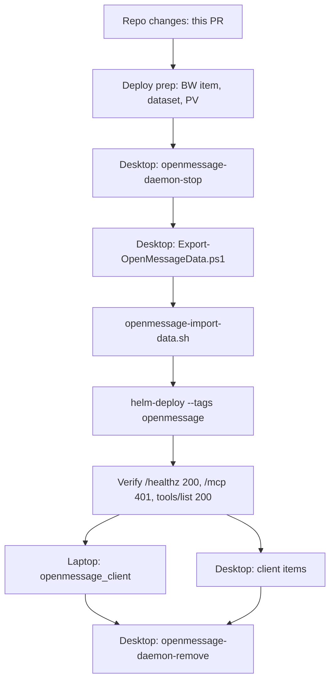

# Desktop IaC Layer + OpenMessage Client Cutover -- Implementation Plan

**Goal:** Give the Windows desktop a real IaC layer in this repo, with the OpenMessage client cutover as its first managed item, and give the laptop the matching client converge -- so that finishing the OpenMessage move to k3s is a sequence of repo tools rather than remembered PowerShell.

**Architecture:** Three layers, one target state. A new top-level `desktop/` directory holds a `pwsh` converge driven by `desktop.psd1` (Windows). `ansible/playbooks/tasks/openmessage_client.yml`, imported by the existing `laptop.yml`, holds the same target state for Linux. `scripts/openmessage-import-data.sh` plus `desktop/Export-OpenMessageData.ps1` carry the daemon's SQLite store and Google pairing credential from the desktop into the homelab PV, with the guards that step has always needed and never had.

**Tech Stack:** PowerShell 7 (`Import-PowerShellDataFile`, `ConvertFrom-Json -AsHashtable`, `Invoke-WebRequest -SkipHttpErrorCheck`), ansible-core (the existing laptop play, `connection: local`), bash + `usage` for the import script, fnox/Bitwarden for the control token, `openmessage mcp-bridge` from fork release `v0.2.9-remote.1`.

**Spec:** `docs/superpowers/specs/2026-09-29-desktop-iac-design.md`

**Depends on:** PR #17 (OpenMessage chart, values, dataset, PV, secret mapping, runbook) and the deploy sequence in `docs/plans/2026-09-25-openmessage-k3s-deployment.md` section 8.

## Global Constraints

- **The one-pod rule governs the whole sequence.** Exactly one OpenMessage may hold the Google Messages pairing. The desktop daemon must be Stopped before the cluster pod first starts, and it must stay installed-but-stopped until every client is verified on the cluster endpoint. Two daemons on one pairing can cost a re-pair from the phone.
- Nothing in this repo ever holds the control token. It is Bitwarden item `openmessage-control-token`, injected per-command as `$OPENMESSAGE_CONTROL_TOKEN`, written to a mode-0600 (Linux) / owner-only-ACL (Windows) file that `openmessage mcp-bridge` reads. No Claude config, on any machine, contains a bearer token after this.
- The repo is public. No user names, home directory paths, machine names or personal identifiers in committed files -- parametrize with `%USERPROFILE%`, `$HOME`, `ansible_user_dir`, inventory vars.
- Markdown is ASCII only, no hard-wrapped prose (`tests/hygiene/test_docs_consistency.py` enforces the encoding half).
- The desktop's OpenMessage data directory is never deleted by anything here. It is the rollback.
- Client and daemon should be on the same fork release. The tag appears in three places -- `desktop/desktop.psd1` `Version`, `openmessage_version` in `ansible/playbooks/laptop.yml`, and the digest comment in `ansible/helm/openmessage/values.yaml`. Nothing enforces agreement; bump them together.

## Execution order and why

The shape of it: the desktop daemon stops *before* anything starts in the cluster, its data moves while nothing is running at either end, and the service is only deleted after both machines' clients are proven against the cluster. The window between "stop" and "pod up" is the only safe time to move the data, and it is also the only window in which nobody can read their texts -- keep it short, but do not rush the checksums.

---

## Part 1: Repository changes (this PR)

### Task 1: The desktop layer

**Files:**
- Create: `desktop/README.md`, `desktop/desktop.psd1`, `desktop/Invoke-DesktopConverge.ps1`
- Create: `desktop/lib/Converge.psm1`
- Create: `desktop/lib/Items/OpenMessageClient.psm1`, `desktop/lib/Items/OpenMessageDaemon.psm1`
- Create: `docs/superpowers/specs/2026-09-29-desktop-iac-design.md`

**Interfaces:** `Invoke-ConvergeStep -Item -Name -Test -Set` is the contract every item obeys. Item handlers are `Invoke-<Thing>Item -Config <hashtable>` and are registered in `$ItemRegistry`.

- [x] **Step 1: Shared helpers.** `Invoke-ConvergeStep` (Test, then `ShouldProcess`, then Set, then **re-Test**), `Expand-ConvergePath` (`%VAR%` tokens, since `Import-PowerShellDataFile` cannot execute `$env:`), `Get-ReleaseChecksum` + `Get-VerifiedDownload`, `Test-OwnerOnlyAcl` / `Set-OwnerOnlyAcl`, `Write-TextFileNoBom`, `Get-StringSha256`, `Invoke-NativeCapture`, `Test-RemoteOpenMessageHealthy`.
- [x] **Step 2: Desired-state data.** `desktop.psd1` carries the release pin, URLs, binary/token/config paths, service name and the data-file list. No user names.
- [x] **Step 3: Client items.** Binary (checksum-verified, with a stamp recording the installed tag *and* the exe's own hash so a swapped binary reads as drift), token file (owner-only ACL, no-BOM write, digest comparison so the value is never printed), Claude Code (remove-then-add, because `claude mcp add` is not idempotent), Claude Desktop (merge with backup, never overwrite).
- [x] **Step 4: Retirement items.** `openmessage-daemon-stop` and `openmessage-daemon-remove`, neither in the default set. Remove refuses unless the service is Stopped and the cluster endpoint returns 200 on `/healthz` and 401 on `/mcp`.
- [x] **Step 5: Entry point.** `-Item`, `-ListItems`, `-WhatIf`, per-item failure isolation, summary, exit 1 on failure and exit 2 on drift-under-WhatIf.

**Verification:** `-WhatIf` on the desktop is the only real exercise; there is no Windows runner here. Recorded as a known limitation in `desktop/README.md`.

### Task 2: The laptop client

**Files:**
- Create: `ansible/playbooks/tasks/openmessage_client.yml`
- Modify: `ansible/playbooks/laptop.yml` (vars + `import_tasks`, tag `openmessage_client`)
- Modify: `fnox.toml` (`OPENMESSAGE_CONTROL_TOKEN`)

- [x] **Step 1: Binary.** Fetch the release `SHA256SUMS`, pull this platform's line, `get_url` the archive with `checksum: sha256:...`, extract to `~/.local/bin/openmessage`, stamp the installed tag in `~/.local/state/openmessage/client-version` so a tag bump reinstalls.
- [x] **Step 2: Token.** `~/.config/openmessage/token`, mode 0600, content from `$OPENMESSAGE_CONTROL_TOKEN`, `no_log: true`. Skipped when the variable is absent and the file exists; fails loudly when neither.
- [x] **Step 3: Claude Code.** `claude mcp get` to detect drift, remove-then-add to fix it, `argv` form so no shell quoting is involved.
- [x] **Step 4: Claude Desktop.** Slurp, `from_json`, `combine(recursive=true)`, write with `backup: true`. A malformed existing file fails the task rather than being replaced -- replacing it would discard every other MCP server.
- [x] **Step 5: Wire in.** `import_tasks` (not `include_tasks`): a static import propagates the tag to every task in the file.

**Verification:** `ansible-playbook --syntax-check playbooks/laptop.yml`. A real run needs the laptop.

### Task 3: Data migration and deploy wiring

**Files:**
- Create: `desktop/Export-OpenMessageData.ps1`, `scripts/openmessage-import-data.sh`
- Modify: `docs/plans/2026-09-25-openmessage-k3s-deployment.md` (section 8 steps 13-24)
- Modify: `ansible/docs/runbooks/openmessage-down.md`, `docs/homelab-access-guide.md`

- [x] **Step 1: Export.** Refuses while the service is not Stopped/Absent, refuses when a non-MCP `openmessage.exe` is running, copies all present WAL companions with the database, writes `SHA256SUMS` (coreutils format) and a `manifest.json` recording the observed service state.
- [x] **Step 2: Import.** Validates the manifest and the checksums locally, refuses unless the Deployment is at zero replicas with no pods, refuses to land on an existing `messages.db` without `--overwrite`, stages over SSH, verifies checksums on the far side *and* again in the final location, chowns 1000:1000, and does not start the pod. `--dry-run` runs every check.
- [x] **Step 3: Rewrite the deploy checklist.** Section 8 steps 13-24 now point at these tools instead of hand commands.

**Verification:** `shellcheck` clean on the import script. The export and the import both need their respective machines.

### Task 4: Documentation coherence

- [x] `CLAUDE.md`, `README.md`, `CONTRIBUTING.md`: `desktop/` in the repo-structure tables.
- [x] `ansible/docs/runbooks/openmessage-down.md`: client cutover and token rotation name the IaC, not hand commands.
- [x] `ansible/docs/runbooks/laptop-agentic-dr.md`: `openmessage_client` in the inventory, and the "three timers" count corrected.
- [x] `docs/homelab-access-guide.md`: the client section describes the bridge, not a raw header.
- [x] `CHANGELOG.md` under `## [Unreleased]`.

---

## Part 2: Apply sequence (human-supervised, nothing below is done)

This replaces steps 13-24 of `docs/plans/2026-09-25-openmessage-k3s-deployment.md` section 8. Steps 0-12 there (land the repo changes, publish the image, create the Bitwarden item, create the dataset and PV) are unchanged and must be done first.

### Prerequisites

- [ ] Bitwarden unlocked (`bw-unlock`, or `./scripts/bw-unlock-prompt.sh`), so `fnox`/`with-secrets.sh` can resolve `OPENMESSAGE_CONTROL_TOKEN`.
- [ ] The Bitwarden item `openmessage-control-token` exists and has been synced into the cluster Secret (`mise run secrets:sync`). Client and cluster read the same item; if they diverge, every client gets a 401.
- [ ] `git pull` on the desktop and the laptop, so both have this branch.
- [ ] Decide whether `fnox` will be installed on the desktop. If not, the `bw get password` path in `desktop/README.md` is the fallback -- no other change is needed.

### Stop the desktop daemon

- [ ] On the desktop, elevated:
      `pwsh -File .\Invoke-DesktopConverge.ps1 -Item openmessage-daemon-stop -WhatIf`
      then the same without `-WhatIf`.
      Confirms Stopped and StartupType Manual. From here until the pod is up, **no OpenMessage is running anywhere**; that is intentional and is the only safe window for the next two steps.

### Move the data

- [ ] `pwsh -File .\Export-OpenMessageData.ps1` on the desktop. Note the bundle path it prints.
- [ ] Get the bundle to a tailnet host with `kubectl` and SSH to the homelab (the laptop, or the agent-box). Any copy method; the checksums are verified at the far end regardless.
- [ ] `./scripts/openmessage-import-data.sh --from <bundle> --dry-run`, read the output, then run it for real.

### Deploy and verify the cluster

- [ ] `cd ansible/ && uv run ansible-playbook playbooks/helm-deploy.yml --tags openmessage`
- [ ] `uv run ansible-playbook playbooks/helm-deploy.yml --tags coredns`
- [ ] `kubectl -n irl logs -f deploy/openmessage` -- pairing state appears only in the logs. Expect a resumed session, not a pairing prompt. A pairing prompt means the import did not land; stop and re-check before doing anything else.
- [ ] From a tailnet host: `/healthz` returns 200, `/mcp` without a token returns 401, `/mcp` with the token returns a tool list. Confirm the 401 before pointing any client at it.
- [ ] `cd tests/ && uv run pytest -m "smoke or hygiene"`

### Cut the clients over, one machine at a time

- [ ] Laptop: `cd ansible/ && ../scripts/with-secrets.sh uv run ansible-playbook playbooks/laptop.yml --tags openmessage_client --check` then without `--check`.
- [ ] Laptop: restart Claude Desktop; in a fresh Claude Code session call `get_status` and `list_conversations`.
- [ ] Desktop: `fnox exec -- pwsh -File .\Invoke-DesktopConverge.ps1 -WhatIf`, then without `-WhatIf`.
- [ ] Desktop: restart Claude Desktop; verify the same two calls.

### Retire the desktop service

- [ ] Only once both machines work: on the desktop, elevated,
      `pwsh -File .\Invoke-DesktopConverge.ps1 -Item openmessage-daemon-remove`.
      It will refuse if the cluster endpoint does not pass its health gate. That refusal is the feature; do not work around it.
- [ ] Leave the desktop data directory in place. It is the rollback, and it costs nothing.

### Rollback, at any point before the remove

Scale the cluster pod to zero (`kubectl scale -n irl deploy/openmessage --replicas=0`), wait for the pod to be gone, then `Start-Service OpenMessage` on the desktop and re-run the desktop client items with the local stdio command restored by hand. The desktop data directory is untouched by everything above. **Never run both.**

## Open questions for the reviewer

1. **Is `fnox` going on the desktop?** The design does not require it -- the converge only reads an environment variable -- but having it means the desktop uses the same secret lane as everything else. If yes, that is a separate small change (install via mise, point at the same global `~/.config/fnox/config.toml`).
2. **Should `desktop/` grow a second item soon?** The layer is built for it, but one subject is thin evidence that the item contract is right. The first genuinely different item (something with a Windows registry key, or a scheduled task) is where the abstraction gets tested.
3. **Windows CI.** Nothing here is executed by CI. A `windows-latest` job running PSScriptAnalyzer and a few Pester tests over the pure functions (`Expand-ConvergePath`, the SHA256SUMS parser, the MCP-entry comparison) would be cheap and would catch the class of bug that `-WhatIf` cannot.
