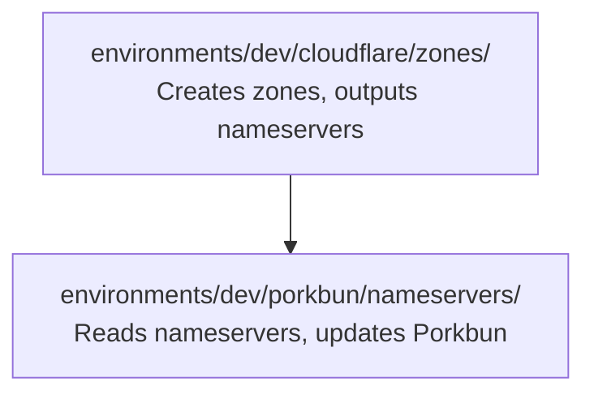

# WP03: Dev Environment Resource Groups

## Implementation Command

```bash
spec-kitty implement WP03 --base WP02
```

Depends on WP01 (modules) and WP02 (env.hcl configs). Can run in parallel with WP04.

## Objectives & Success Criteria

**Objective**: Wire up the dev environment by creating provider configs and leaf `terragrunt.hcl` files for Cloudflare zones and Porkbun nameservers resource groups.

**Success criteria**:
- [ ] `environments/dev/cloudflare/provider.hcl` generates the Cloudflare provider block
- [ ] `environments/dev/porkbun/provider.hcl` generates the Porkbun provider block
- [ ] `environments/dev/cloudflare/zones/terragrunt.hcl` includes root, reads env.hcl, and sources the cloudflare-zone module
- [ ] `environments/dev/porkbun/nameservers/terragrunt.hcl` includes root, reads env.hcl, declares dependency on cloudflare zones, and sources the porkbun-nameservers module
- [ ] `terragrunt run-all validate` passes from `environments/dev/`

## Context & Constraints

**Architecture recap**: Each leaf `terragrunt.hcl` does three things:
1. Includes `root.hcl` (gets TFC backend + provider versions)
2. Reads `env.hcl` from parent (gets environment, domains, account_id)
3. Sources a module from `modules/` and passes inputs

**Dependency chain within dev**:


The Porkbun resource group declares a Terragrunt `dependency` on the Cloudflare zones resource group and reads its `nameservers_map` output.

**Provider config approach**: `provider.hcl` files use Terragrunt `generate` blocks to create provider configuration. Credentials come from environment variables automatically (both providers support env var auth with zero config).

## Subtasks & Detailed Guidance

### T004: Create `environments/dev/cloudflare/provider.hcl`

**Purpose**: Generate the Cloudflare provider block for all Cloudflare resource groups in the dev environment.

**File**: `environments/dev/cloudflare/provider.hcl` (~15 lines)

**Steps**:

1. Create the directory and file:
   ```hcl
   # Cloudflare provider configuration
   # Auth via CLOUDFLARE_API_TOKEN environment variable (no config needed)

   generate "cloudflare_provider" {
     path      = "provider-cloudflare.tf"
     if_exists = "overwrite_terragrunt"
     contents  = <<-EOF
       provider "cloudflare" {
         # API token sourced from CLOUDFLARE_API_TOKEN env var automatically
       }
     EOF
   }
   ```

   The Cloudflare provider reads `CLOUDFLARE_API_TOKEN` from the environment with zero configuration. The empty provider block just declares that this provider is used.

**Validation**:
- [ ] File uses `generate` to create a provider block
- [ ] No credentials or tokens in the file
- [ ] Provider block is empty (credentials from env vars)

---

### T005: Create `environments/dev/porkbun/provider.hcl`

**Purpose**: Generate the Porkbun provider block for all Porkbun resource groups in the dev environment.

**File**: `environments/dev/porkbun/provider.hcl` (~15 lines)

**Steps**:

1. Create the directory and file:
   ```hcl
   # Porkbun provider configuration
   # Auth via PORKBUN_API_KEY and PORKBUN_SECRET_KEY environment variables

   generate "porkbun_provider" {
     path      = "provider-porkbun.tf"
     if_exists = "overwrite_terragrunt"
     contents  = <<-EOF
       provider "porkbun" {
         # API key and secret sourced from PORKBUN_API_KEY and
         # PORKBUN_SECRET_KEY env vars automatically
       }
     EOF
   }
   ```

**Validation**:
- [ ] Same `generate` pattern as Cloudflare provider
- [ ] No credentials in the file

---

### T012: Create `environments/dev/cloudflare/zones/terragrunt.hcl`

**Purpose**: Leaf config that creates Cloudflare zones for all dev domains. This is the first resource group that gets applied in the dev environment.

**File**: `environments/dev/cloudflare/zones/terragrunt.hcl` (~30 lines)

**Steps**:

1. Create the directory and file:
   ```hcl
   include "root" {
     path   = find_in_parent_folders("root.hcl")
     expose = true
   }

   include "provider" {
     path   = find_in_parent_folders("provider.hcl")
     expose = true
   }

   locals {
     env_config = read_terragrunt_config(find_in_parent_folders("env.hcl"))
   }

   terraform {
     source = "${get_repo_root()}/modules//cloudflare-zone"
   }

   inputs = {
     account_id = local.env_config.locals.cloudflare_account_id
     domains    = local.env_config.locals.domains
   }
   ```

**Key points**:
- `include "root"` brings in the TFC backend `generate` block (workspace: `dev-cloudflare-zones`)
- `include "provider"` brings in the Cloudflare provider `generate` block
- `read_terragrunt_config()` reads `env.hcl` to get `domains` and `cloudflare_account_id`
- `terraform { source }` points to the `cloudflare-zone` module using `get_repo_root()` with double-slash (`//`) to mark the module boundary
- `inputs` passes the env config values into the module's variables

**Validation**:
- [ ] Includes both `root.hcl` and `provider.hcl`
- [ ] Reads `env.hcl` via `read_terragrunt_config(find_in_parent_folders("env.hcl"))`
- [ ] Sources `modules/cloudflare-zone` via `get_repo_root()`
- [ ] Passes `account_id` and `domains` from env config
- [ ] `terragrunt validate` passes (requires `CLOUDFLARE_ACCOUNT_ID` env var to be set, even if empty)

**Edge cases**:
- If `domains` is an empty list, no resources are created (safe default)
- `find_in_parent_folders("env.hcl")` traverses up to find `environments/dev/env.hcl`

---

### T013: Create `environments/dev/porkbun/nameservers/terragrunt.hcl`

**Purpose**: Leaf config that updates Porkbun nameservers for dev domains. Depends on the Cloudflare zones resource group to read assigned nameservers.

**File**: `environments/dev/porkbun/nameservers/terragrunt.hcl` (~50 lines)

**Steps**:

1. Create the directory and file:
   ```hcl
   include "root" {
     path   = find_in_parent_folders("root.hcl")
     expose = true
   }

   include "provider" {
     path   = find_in_parent_folders("provider.hcl")
     expose = true
   }

   locals {
     env_config = read_terragrunt_config(find_in_parent_folders("env.hcl"))
   }

   dependency "cloudflare_zones" {
     config_path = "../../cloudflare/zones"

     # Mock outputs for `terragrunt validate` and `terragrunt plan` before zones exist
     mock_outputs = {
       nameservers_map = {}
     }
     mock_outputs_allowed_terraform_commands = ["validate", "plan"]
   }

   terraform {
     source = "${get_repo_root()}/modules//porkbun-nameservers"
   }

   inputs = {
     domain_nameservers = {
       for domain, nameservers in dependency.cloudflare_zones.outputs.nameservers_map : domain => {
         nameservers = toset(nameservers)
       }
     }
   }
   ```

**Key points**:
- `dependency "cloudflare_zones"` declares the cross-resource-group dependency
- `config_path = "../../cloudflare/zones"` is the relative path from `environments/dev/porkbun/nameservers/` to `environments/dev/cloudflare/zones/`
- `mock_outputs` allows `terragrunt validate` and `terragrunt plan` to work before zones are actually created
- The `inputs` block transforms the `nameservers_map` (map of domain -> list of NS) into the format expected by the `porkbun-nameservers` module (map of domain -> object with `nameservers` set)
- `toset()` converts the list from Cloudflare output to a set for Porkbun

**Validation**:
- [ ] Includes `root.hcl` and `provider.hcl`
- [ ] Declares `dependency` on `../../cloudflare/zones`
- [ ] `mock_outputs` provides empty map for validate/plan commands
- [ ] `inputs` transforms `nameservers_map` output into `domain_nameservers` input format
- [ ] `toset()` conversion from list (Cloudflare) to set (Porkbun)
- [ ] `terragrunt validate` passes with mock outputs

**Edge cases**:
- If no zones exist yet, `mock_outputs` returns empty map -- no Porkbun resources created
- If Cloudflare assigns new nameservers (zone recreation), next apply picks up new values automatically
- `terragrunt run-all apply` from `environments/dev/` will apply zones first, then nameservers (dependency ordering)

---

### T017a: Verify Dev Environment Validation

**Purpose**: Run validation across the entire dev environment to confirm all configs are syntactically correct and properly wired.

**Steps**:

1. From the repository root, run:
   ```bash
   cd environments/dev && terragrunt run-all validate
   ```

2. Expected behavior:
   - Terragrunt discovers both resource groups: `cloudflare/zones` and `porkbun/nameservers`
   - Each resource group initializes (downloads providers, generates backend.tf and providers.tf)
   - `terraform validate` passes in each
   - No errors from dependency resolution (mock outputs cover the Porkbun dependency)

3. If validation fails, check:
   - Are all `find_in_parent_folders()` calls finding the right files?
   - Is the `CLOUDFLARE_ACCOUNT_ID` env var set (can be empty string for validate)?
   - Do provider versions resolve correctly?

**Validation**:
- [ ] `terragrunt run-all validate` exits with code 0
- [ ] Both resource groups are discovered and validated
- [ ] No HCL syntax errors or missing variable errors

---

## Risks & Mitigations

| Risk | Mitigation |
|------|------------|
| `dependency` config_path is wrong (relative path error) | Path is `../../cloudflare/zones` from `porkbun/nameservers/` -- count the directory levels carefully |
| `mock_outputs` schema doesn't match real outputs | Schema mirrors `modules/cloudflare-zone/outputs.tf` -- keep in sync |
| `find_in_parent_folders()` finds wrong file | Each file has a unique name (`root.hcl`, `env.hcl`, `provider.hcl`) -- no ambiguity |
| `toset()` conversion fails | `toset()` on a list of strings is always safe |

## Review Guidance

**Reviewer should verify**:
1. Both leaf `terragrunt.hcl` files include `root.hcl` AND their respective `provider.hcl`
2. `env.hcl` is read correctly via `read_terragrunt_config()`
3. Dependency path (`../../cloudflare/zones`) is correct relative to `porkbun/nameservers/`
4. Mock outputs match the real module output schema
5. Input transformation correctly maps `nameservers_map` -> `domain_nameservers`
6. `terragrunt run-all validate` passes

## Activity Log

- 2026-02-24: WP created by planner
