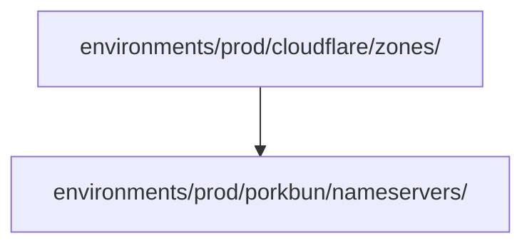

# WP04: Prod Environment Resource Groups

## Implementation Command

```bash
spec-kitty implement WP04 --base WP02
```

Depends on WP01 (modules) and WP02 (env.hcl configs). Can run in parallel with WP03.

## Objectives & Success Criteria

**Objective**: Wire up the prod environment by creating provider configs and leaf `terragrunt.hcl` files for Cloudflare zones and Porkbun nameservers resource groups. Structurally mirrors dev (WP03) with prod-specific paths.

**Success criteria**:
- [ ] `environments/prod/cloudflare/provider.hcl` generates the Cloudflare provider block
- [ ] `environments/prod/porkbun/provider.hcl` generates the Porkbun provider block
- [ ] `environments/prod/cloudflare/zones/terragrunt.hcl` includes root, reads env.hcl, sources cloudflare-zone module
- [ ] `environments/prod/porkbun/nameservers/terragrunt.hcl` includes root, reads env.hcl, declares dependency on cloudflare zones, sources porkbun-nameservers module
- [ ] `terragrunt run-all validate` passes from `environments/prod/`

## Context & Constraints

**This WP mirrors WP03 (dev) exactly**, with these differences:
- All paths under `environments/prod/` instead of `environments/dev/`
- Reads `environments/prod/env.hcl` (which has `environment = "prod"` and its own domain list)
- TFC workspaces: `prod-cloudflare-zones` and `prod-porkbun-nameservers`

**Important**: If you have already implemented WP03, use its files as reference. The file contents are structurally identical -- only the directory location differs. Terragrunt's `find_in_parent_folders()` and `path_relative_to_include()` handle the path differences automatically.

**Dependency chain within prod**:


## Subtasks & Detailed Guidance

### T006: Create `environments/prod/cloudflare/provider.hcl`

**Purpose**: Generate the Cloudflare provider block for all Cloudflare resource groups in the prod environment.

**File**: `environments/prod/cloudflare/provider.hcl` (~15 lines)

**Steps**:

1. Create the directory and file:
   ```hcl
   # Cloudflare provider configuration
   # Auth via CLOUDFLARE_API_TOKEN environment variable (no config needed)

   generate "cloudflare_provider" {
     path      = "provider-cloudflare.tf"
     if_exists = "overwrite_terragrunt"
     contents  = <<-EOF
       provider "cloudflare" {
         # API token sourced from CLOUDFLARE_API_TOKEN env var automatically
       }
     EOF
   }
   ```

**Validation**:
- [ ] Identical content to `environments/dev/cloudflare/provider.hcl`
- [ ] No credentials in the file

---

### T007: Create `environments/prod/porkbun/provider.hcl`

**Purpose**: Generate the Porkbun provider block for all Porkbun resource groups in the prod environment.

**File**: `environments/prod/porkbun/provider.hcl` (~15 lines)

**Steps**:

1. Create the directory and file:
   ```hcl
   # Porkbun provider configuration
   # Auth via PORKBUN_API_KEY and PORKBUN_SECRET_KEY environment variables

   generate "porkbun_provider" {
     path      = "provider-porkbun.tf"
     if_exists = "overwrite_terragrunt"
     contents  = <<-EOF
       provider "porkbun" {
         # API key and secret sourced from PORKBUN_API_KEY and
         # PORKBUN_SECRET_KEY env vars automatically
       }
     EOF
   }
   ```

**Validation**:
- [ ] Identical content to `environments/dev/porkbun/provider.hcl`
- [ ] No credentials in the file

---

### T014: Create `environments/prod/cloudflare/zones/terragrunt.hcl`

**Purpose**: Leaf config that creates Cloudflare zones for all prod domains.

**File**: `environments/prod/cloudflare/zones/terragrunt.hcl` (~30 lines)

**Steps**:

1. Create the directory and file:
   ```hcl
   include "root" {
     path   = find_in_parent_folders("root.hcl")
     expose = true
   }

   include "provider" {
     path   = find_in_parent_folders("provider.hcl")
     expose = true
   }

   locals {
     env_config = read_terragrunt_config(find_in_parent_folders("env.hcl"))
   }

   terraform {
     source = "${get_repo_root()}/modules//cloudflare-zone"
   }

   inputs = {
     account_id = local.env_config.locals.cloudflare_account_id
     domains    = local.env_config.locals.domains
   }
   ```

**Key verification**: This file is identical in content to the dev version (`T012`). The difference is location: it sits under `environments/prod/` so `find_in_parent_folders("env.hcl")` finds `environments/prod/env.hcl` (with prod domain list), and `path_relative_to_include()` in `root.hcl` produces `prod-cloudflare-zones` as the workspace name.

**Validation**:
- [ ] Content matches `environments/dev/cloudflare/zones/terragrunt.hcl`
- [ ] Located at `environments/prod/cloudflare/zones/terragrunt.hcl`
- [ ] Will use TFC workspace `prod-cloudflare-zones` (derived from path)
- [ ] Will read domains from `environments/prod/env.hcl`

---

### T015: Create `environments/prod/porkbun/nameservers/terragrunt.hcl`

**Purpose**: Leaf config that updates Porkbun nameservers for prod domains. Depends on the prod Cloudflare zones resource group.

**File**: `environments/prod/porkbun/nameservers/terragrunt.hcl` (~50 lines)

**Steps**:

1. Create the directory and file:
   ```hcl
   include "root" {
     path   = find_in_parent_folders("root.hcl")
     expose = true
   }

   include "provider" {
     path   = find_in_parent_folders("provider.hcl")
     expose = true
   }

   locals {
     env_config = read_terragrunt_config(find_in_parent_folders("env.hcl"))
   }

   dependency "cloudflare_zones" {
     config_path = "../../cloudflare/zones"

     # Mock outputs for `terragrunt validate` and `terragrunt plan` before zones exist
     mock_outputs = {
       nameservers_map = {}
     }
     mock_outputs_allowed_terraform_commands = ["validate", "plan"]
   }

   terraform {
     source = "${get_repo_root()}/modules//porkbun-nameservers"
   }

   inputs = {
     domain_nameservers = {
       for domain, nameservers in dependency.cloudflare_zones.outputs.nameservers_map : domain => {
         nameservers = toset(nameservers)
       }
     }
   }
   ```

**Key verification**: Content is identical to the dev version (`T013`). The `dependency` path `../../cloudflare/zones` is the same relative path because both environments have the same internal structure.

**Validation**:
- [ ] Content matches `environments/dev/porkbun/nameservers/terragrunt.hcl`
- [ ] `dependency` path `../../cloudflare/zones` resolves to `environments/prod/cloudflare/zones/`
- [ ] Will use TFC workspace `prod-porkbun-nameservers`
- [ ] Mock outputs match the real module output schema
- [ ] `toset()` conversion present

---

### T017b: Verify Prod Environment Validation

**Purpose**: Run validation across the entire prod environment.

**Steps**:

1. From the repository root, run:
   ```bash
   cd environments/prod && terragrunt run-all validate
   ```

2. Expected behavior:
   - Both resource groups discovered: `cloudflare/zones` and `porkbun/nameservers`
   - `terraform validate` passes in each
   - Dependency resolution succeeds (mock outputs for Porkbun)

3. If validation fails, compare with dev environment results from T017a -- any difference indicates a prod-specific issue (likely a path error).

**Validation**:
- [ ] `terragrunt run-all validate` exits with code 0
- [ ] Both resource groups validated
- [ ] No path errors or missing variable errors

---

## Risks & Mitigations

| Risk | Mitigation |
|------|------------|
| Copy-paste drift from dev (wrong paths) | All path-dependent logic uses `find_in_parent_folders()` and `path_relative_to_include()` -- identical file content works correctly in both environments |
| Prod applied accidentally during development | Domain lists start empty; `terragrunt apply` with empty list creates nothing |
| State isolation not working | Workspace names differ (`prod-*` vs `dev-*`); each has its own TFC workspace |

## Review Guidance

**Reviewer should verify**:
1. All files are structurally identical to their dev counterparts (WP03)
2. Files are located under `environments/prod/`, not `environments/dev/`
3. No dev-specific paths or values leaked into prod files
4. `terragrunt run-all validate` passes for prod
5. Workspace names would resolve to `prod-cloudflare-zones` and `prod-porkbun-nameservers`

## Activity Log

- 2026-02-24: WP created by planner
